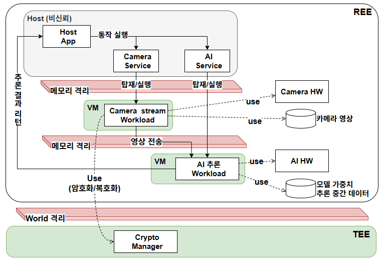
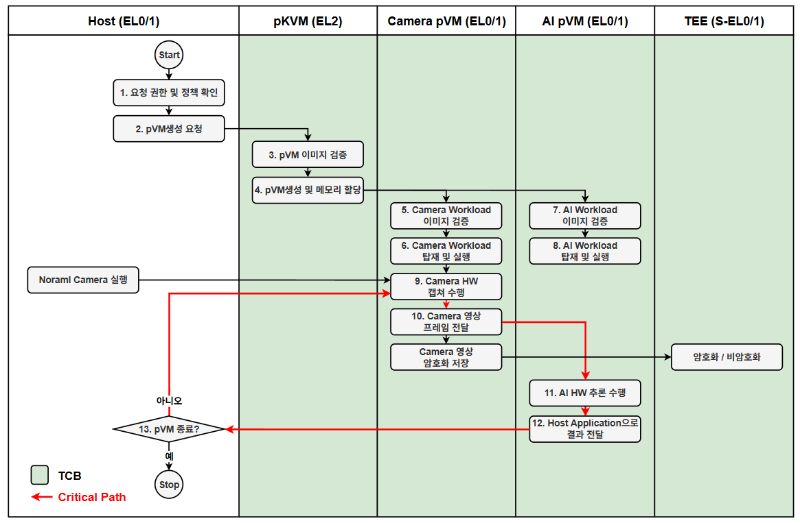

# pKVM Protected VM PoC

이 저장소는 Linux v6.18에 pKVM 패치를 적용하고, QEMU에서 protected VM(pVM) 기반의 신뢰
실행 환경을 단계적으로 검증하는 PoC다. 최종적으로는 비신뢰 Host로부터 카메라 영상과 AI
모델/추론 데이터를 격리하면서, 두 pVM이 각자 할당받은 장치로 영상 추론 파이프라인을
수행하는 것을 목표로 한다.

장치 할당과 DMA 격리는 D-9 결정에 따라 S2MPU를 에뮬레이션하는 QEMU 환경에서 검증한다.
실물 USB 카메라와 discrete NVIDIA GPU를 사용하는 검증은 이 PoC의 범위에서 제외했다.

## 프로젝트 목표

- **재현 가능한 pKVM 기반선 구축**: Linux kernel v6.18과 pKVM 패치를 통합하고,
  QEMU에서 커널 부팅, EL2 초기화, pVM 생성/실행 및 protected memory 격리를 검증한다.
- **Secure World 공존 검증**: pKVM이 동작하는 Normal World와 OP-TEE Secure OS를 함께
  구성하고, pVM 실행 중에도 OP-TEE의 암호화/복호화 서비스를 사용할 수 있음을 확인한다.
- **장치의 안전한 할당**: 카메라 역할 장치와 추론 역할 장치를 Camera pVM과 AI pVM에
  각각 할당하고, 장치 소유권과 DMA 접근 범위가 Host 및 다른 pVM과 분리되는지 확인한다.
- **격리된 AI 파이프라인 구현**: Camera pVM이 수집한 프레임을 Host가 읽을 수 없는
  DMA-BUF에 저장하고, EL2-mediated export/import로 AI pVM에 새로운 local FD를 만들어
  버퍼를 복사하지 않고 처리한 뒤 추론 결과만 Host Application에 반환한다.
- **동적 pVM 수명주기 검증**: Host 요청의 권한과 정책을 확인한 뒤 pVM 이미지를 검증하고,
  Camera/AI pVM의 생성, 모니터링, 장애 격리, 종료 및 자원 회수를 일관되게 수행한다.

## 목표 구성

| 구성 요소 | 역할 |
|---|---|
| QEMU | pKVM과 OP-TEE 통합 전 단계의 재현 가능한 기능 검증 환경 |
| Linux kernel v6.18 + pKVM | EL2에서 Host와 pVM, pVM 상호 간 메모리 및 실행 경계 제공 |
| OP-TEE | Secure World에서 카메라 영상의 암호화/복호화 등 보안 서비스 제공 |
| 카메라 역할 장치 | Camera pVM에 할당되는 영상 입력 장치 |
| 추론 역할 장치 | AI pVM에 할당되는 추론 담당 장치 |
| Camera pVM / AI pVM | 카메라 캡처와 AI 추론을 분리하여 최소 권한으로 실행하는 보호 Workload |

QEMU는 pKVM 부팅과 격리 동작을 확인하는 기능 검증 환경이다. 장치 할당과 DMA 격리는
`virt,iommu=smmuv3`로 S2MPU를 에뮬레이션하는 QEMU 환경에서 판정하며, 두 역할 장치도
에뮬레이션 장치를 사용한다. 실물 하드웨어에서의 기밀성은 이 PoC에서 주장하지 않는다.

## Reference Scenario

비신뢰 Host의 요청으로 Camera pVM과 AI pVM을 동적으로 생성한다. Camera pVM은 USB
카메라로 프레임을 캡처하고, pKVM이 보호하는 DMA-BUF를 AI pVM에 zero-copy 방식으로
export/import한다. AI pVM은 NVIDIA GPU로 추론을 수행하며, 민감한 영상과 모델 중간 데이터 대신
추론 결과만 Host에 전달한다. 암호화/복호화가 필요한 데이터는 OP-TEE의 Crypto Manager를
통해 처리한다.





세부 설계는 [pVM 수명주기 관리](docs/concepts/vm-management.png),
[장치 직접 할당과 소유권 전환](docs/concepts/hw-sharing-by-arbiter.png),
[프레임 버퍼 zero-copy 소유권 이전](docs/concepts/zero-copy-buffer-sharing.png)을 기준으로 한다.

### 성공 조건

1. Linux v6.18 + pKVM 커널과 OP-TEE가 동일 시스템에서 초기화되고 각각 정상 동작한다.
2. Camera pVM과 AI pVM을 동시에 생성/실행하며 Host와 각 pVM의 메모리 접근을 격리한다.
3. 카메라 역할 장치와 추론 역할 장치의 직접 할당, 회수 및 배타적 소유권 전환을 검증한다.
4. 카메라 프레임을 Host에 노출하지 않고 Camera pVM에서 AI pVM으로 zero-copy 전달한다.
5. AI pVM이 CPU 경로로 추론을 완료하고 허용된 추론 결과만 Host Application에 반환한다.
6. pVM 종료 후 장치, 메모리 및 vCPU 자원이 안전하게 회수된다.

### 판정 기준

성공 조건 3의 두 역할 장치는 QEMU 에뮬레이션 장치다. Reference Scenario의 USB 카메라가
카메라 역할 장치에, NVIDIA GPU가 추론 역할 장치에 대응한다. 판정 대상은 장치 할당 경로,
배타적 소유권 전환, DMA 격리, 회수와 재할당이 성립하는지다.

성공 조건 5는 Reference Scenario의 GPU 추론을 AI pVM 안의 CPU 추론으로 대체한 것이다.
판정 대상은 데이터 보호 경계와 결과 반환 경로가 성립하는지다.

실제 USB 카메라의 캡처 동작과 NVIDIA GPU 가속 추론은 이 PoC에서 검증하지 않는다.

이 대체 판정은 D-9 결정에 따른 것이다. 근거는 [하드웨어 후보
조사](docs/phase-08/hardware-candidates.md)에 있다. 실장치 검증은 후속 과제로 분리했다.

## 문서 구조

- [전체 수행 계획](docs/PLAN.md): 목표, Phase 순서, 완료 조건, 현재 상태와 남은 작업
- `docs/phase-00` ~ `docs/phase-11`: Phase별 절차, 완료 조건, 결과와 한계
- [Phase 07 C VM 관리 프레임워크](docs/phase-07/userspace-vm-framework-design.md): public API,
  controller, VM runner와 private KVM backend 설계 및 완료 조건
- [Phase 08 장치 할당·DMA 격리 결과](docs/phase-08/README.md): PV IOMMU, QEMU edu 두 장치,
  Host/non-owner 차단, pVM 간 DMA share/revoke 및 teardown/reassignment 실측
- [Phase 08 validation evidence](docs/phase-08/validation-results.md): 재현 명령, 필수 marker,
  소스 모듈 변경과 검증 범위/한계
- [Phase 09 EL2 DMA-BUF channel 설계](docs/phase-09/el2-dmabuf-channel-design.md): Host runtime
  relay 없는 FD-passing abstraction, C application API/예제와 전체 sequence
- [Phase 09 검증 How-to](docs/phase-09/VERIFICATION.md): flat guest EL2 primitive 회귀부터
  Linux guest 통합까지 처음 실행하는 개발자를 위한 명령 단위 재현 절차
- [Phase 09-b 사용자 공간 통신 계획](docs/phase-09-b/README.md): Host↔Camera command,
  Camera↔AI protected DMA-BUF와 별도 size/format metadata channel, AI↔Host allowlist result를
  하나의 end-to-end session으로 묶는 구현·검증 계획
- [work 디렉터리 안내](work/README.md): 소스와 빌드 산출물 관리 규칙

위 성공 조건 6개는 수행 계획의 목표 ID 및 Phase에 매핑되어 있다. 매핑표는
[전체 수행 계획](docs/PLAN.md)의 1.3절에 있다.

## 작업 디렉터리

```text
work/
├── src/
│   ├── pkvm-linux/       Linux v6.18 + pKVM 패치 소스 트리 (submodule)
│   └── tools/
│       ├── analysis/     패치 집합 분석 도구
│       ├── qemu/         protected 부팅 실행 도구
│       ├── pvm/          pVM selftest 실행 도구
│       └── pvm-framework/ Phase 07 C 기반 VM 관리 프레임워크
└── build/
    ├── analysis/         커밋 집계/분류 결과
    ├── pkvm-full-clang/  clang 커널 빌드 산출물
    ├── pkvm-qemu/        부팅용 initramfs와 콘솔 로그
    ├── pkvm-pvm/         pVM selftest 산출물과 콘솔 로그
    └── pvm-framework/    C framework binaries, guest image와 E-1 검증 로그
```

Phase 05 이후의 도구와 산출물은 각 Phase 문서에 명시한 경로에 추가한다.

`work/src/tools`의 프로젝트 도구는 Git으로 관리한다. 커널 소스 트리는 submodule로 두어
커밋 SHA만 기록한다. 빌드 산출물은 재생성 가능하므로 Git에서 제외한다. 모든 명령은 별도
언급이 없으면 저장소 루트에서 실행한다.

저장 공간 정책에 따라 커널 검증 입력은 `pkvm-full-clang`만 유지하며 삭제한
`pkvm-full-gcc`를 복구하거나 gcc kernel 교차 검증을 수행하지 않는다.

저장소를 처음 받을 때는 submodule을 partial clone으로 초기화한다. 커널 트리가 5.6GB를
넘는다.

```bash
git clone git@github.com:boram1288/poc-p.git
cd poc-p
git submodule update --init --filter=blob:none work/src/pkvm-linux
```
