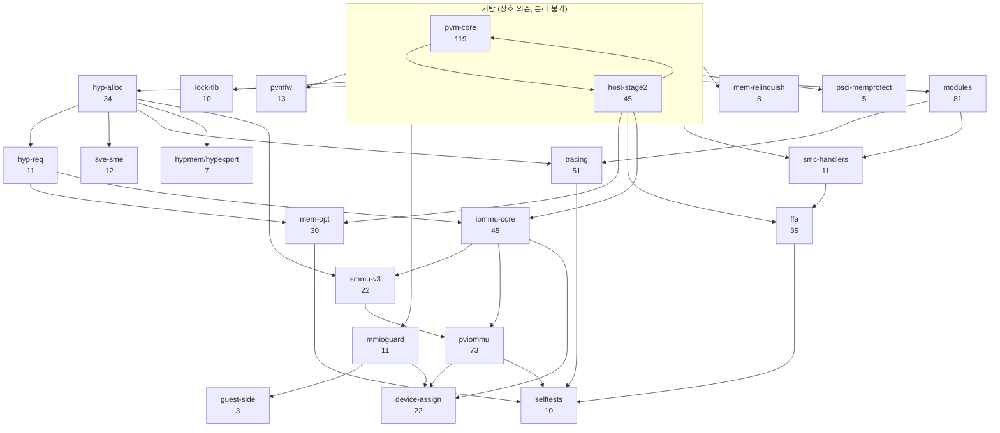
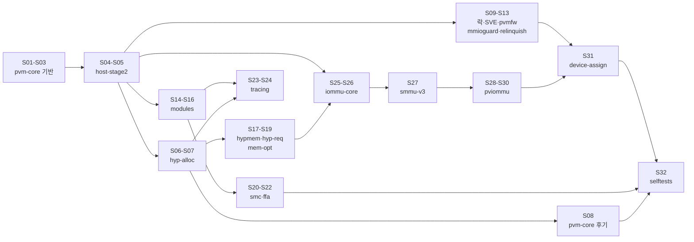

# 6.18 pKVM 머지 대상 토픽 분류와 스택 순서

작성 기준: 2026-08-07. 대상 저장소 `work/src/pkvm-linux`, 기준 브랜치 `origin/for-android/pkvm-mainline-6.18` (tip `b3b90af8`).
입력 집합은 `work/build/analysis/all_raw.txt`의 858커밋이다.

> 이 문서는 최종 정제 전의 660커밋 토픽 분석 기록이다. 이후 역방향 2건을 제외해 경로 기반
> 규모를 658로 확정했다. 현재 수치는 [커널 버전 및 패치 소스 조사](pkvm-kernel-version.md)를 따른다.

## 1. 요약

- `pkvm-6.18-*` 태그는 없다. 그러나 `pkvm-7.1-*` 태그 40개가 원격에 실재하며, 이번에 로컬로 받았다.
  이 태그들은 **선형 스택**을 이루고, 각 태그가 하나의 토픽 배치를 가리킨다. 즉 상류 투고용 토픽 분할의 정답지가 이미 저장소에 있다.
- 858커밋을 **26개 토픽**으로 분류했다. 이 중 머지 대상은 660커밋이고,
  나머지는 `ack-only` 152커밋(defconfig/BUILD.bazel/TEST_MAPPING 등 상류에 없는 파일)과
  `non-pkvm` 46커밋(uid_sys_stats, dma-buf, USB gadget 등 pKVM 무관 Android 캐리오버)이다.
  `미분류`는 1커밋뿐이다.
- 초기 673커밋 집계와는 13커밋 차이가 났다. 원인은 3장에 기록했다.
- 토픽 의존 그래프는 단일 사슬이 아니라 **2개 트랙**이다. 코어 pKVM 트랙(486커밋)과 IOMMU 트랙(162커밋)이며,
  IOMMU 트랙은 `pkvm-7.1-*` 스택에 **전혀 포함되지 않는다**. 상류 투고 계획에서 별도로 다뤄야 한다.
- 충돌 위험 핵심 3파일은 토픽 분리가 사실상 불가능한 수준으로 얽혀 있다.
  세 파일 모두 16~17개 토픽이 건드리고, 평균 연속 구간 길이가 1.6~1.9커밋이다.
  제안 순서로 재배열하면 `mem_protect.c` 109커밋 중 95커밋(87%)이 위치를 바꿔야 한다.
- `origin/for-android/pkvm-master-6.18`은 뼈대로 쓸 수 없다.
  mainline과 순서가 사실상 동일하고(Spearman rho 0.9997), 858 중 370커밋만 담고 있으며 IOMMU 트랙 전체가 빠져 있다.
- 최종 분할안은 **32시리즈**다. 코어 24, IOMMU 7, 검증 1이다.

## 2. 1단계: 태그 확인 결과

`git ls-remote --tags origin | grep pkvm`으로 확인했다. `pkvm-6.18-*`는 0개, `pkvm-7.1-*`는 40개다.
40개를 `--filter=blob:none`으로 로컬에 받았고, `git merge-base --is-ancestor`로 조상 관계를 전수 검사했다.

결과: `pkvm-7.1-base`부터 `pkvm-7.1-audit-fixes`까지 38개 태그가 **완전한 선형 사슬**을 이룬다.
`pkvm-7.1-modtracing-v1`만 `pkvm-7.1-thp-infra` 위의 별도 가지다(12커밋).
`pkvm-7.1-gki`와 `pkvm-7.1-sidefixes`는 같은 커밋을 가리킨다.

스택 규모는 다음과 같다.

- `pkvm-7.1-base` 아래 pKVM 구간: 72커밋 (`710592cb`~`a3b98ca1`, 그 아래는 `Merge tag 'v7.1' into android-mainline`)
- `pkvm-7.1-base..pkvm-7.1-audit-fixes`: 292커밋
- `modtracing-v1` 가지: 12커밋
- 합계 **376커밋**

토픽 순서는 아래와 같다(태그 이름 그대로, 스택 아래에서 위로).

```
base -> pvm-core -> tlbi -> sme -> rwlock -> pvmfw -> sve-donate -> mondebug
  -> mmioguard -> mmio-autoenroll -> mem-relinquish -> psci-memprotect
  -> modules-core -> modules-perms -> fgt -> getleaf -> modprot -> modlock -> modearly
  -> hypmem -> coalesce -> hypexport -> smchandlers -> pinpage -> c089817range -> smctrng
  -> cma -> buddyrace -> sve -> spine-complete -> postsnap
  -> ffa-foundation -> hyp-req -> ffa-backhalf -> ffa-blockb -> sidefixes
  -> thp-infra -> audit-fixes -> (modtracing-v1)
```

주의할 점이 둘 있다.

첫째, 태그 범위는 **순수한 단일 토픽이 아니다**. 예를 들어 `pkvm-7.1-smctrng` 구간 18커밋 안에는
`Add missing icache sync before pKVM module loading` 같은 무관한 수정이 섞여 있다.
태그는 "이 작업 창에서 적용된 배치"이지 "이 토픽의 커밋 전부"가 아니다.
그래서 분류에서는 태그를 최우선이 아니라 규칙 다음의 보조 근거로 썼다.

둘째, base 구간 72커밋의 제목은 `ANDROID:` 접두어가 제거되고 상류 투고용으로 재작성돼 있다.
접두어를 벗겨 정규화하면 대응이 붙지만, 문구 자체가 바뀐 경우도 있다.

## 3. 2단계: 토픽 분류

### 3.1 방법

스크립트로 처리했다. 재현 스크립트는 `work/src/tools/analysis/classify.py`다.

1. 858커밋 각각의 제목과 변경 경로를 뽑았다(`git log --no-walk --name-only --stdin`, 4357행).
2. 접두어(`ANDROID:`, `BACKPORT:`, `SQUASH:` 등)를 벗긴 정규화 제목으로 7.1 스택 376커밋과 대조했다.
   완전 일치 239건, 유사도 0.88 이상 근사 일치 12건, 합계 251건이 붙었다.
3. 나머지는 (제목 정규식 -> 경로 정규식) 순의 우선순위 규칙표로 분류했다. 규칙에 안 맞으면 7.1 태그를 참조하고,
   그래도 안 되면 경로 기반 폴백을 적용했다.
4. 변경 경로가 전부 ACK 전용 파일이면 `ack-only`, 경로와 제목 어디에도 KVM/IOMMU 신호가 없으면 `non-pkvm`으로 뺐다.

### 3.2 결과

| 토픽 | 커밋수 | 최초 | 최종 | master 포함 | 7.1 스택 대응 |
|---|---:|---|---|---:|---|
| `pvm-core` | 119 | 2021-06-21 | 2026-03-18 | 90 | base, pvm-core, mondebug |
| `host-stage2` | 45 | 2021-06-21 | 2026-03-18 | 28 | (base에 흡수) |
| `hyp-alloc` | 34 | 2022-06-27 | 2026-03-23 | 23 | base, buddyrace |
| `lock-tlb` | 10 | 2022-02-09 | 2026-03-02 | 8 | tlbi, rwlock, fgt |
| `sve-sme` | 12 | 2023-01-26 | 2025-11-05 | 12 | sme, sve, sve-donate |
| `pvmfw` | 13 | 2021-12-09 | 2025-10-07 | 13 | pvmfw |
| `mmioguard` | 11 | 2021-06-21 | 2025-01-28 | 11 | mmioguard, mmio-autoenroll |
| `guest-side` | 3 | 2024-12-18 | 2025-11-14 | 2 | (없음) |
| `mem-relinquish` | 8 | 2022-05-26 | 2025-12-16 | 6 | mem-relinquish |
| `psci-memprotect` | 5 | 2022-03-25 | 2026-03-17 | 4 | psci-memprotect |
| `modules` | 81 | 2022-09-19 | 2026-02-18 | 65 | modules-core/perms, getleaf, modprot, modlock, modearly |
| `hypmem-hypexport` | 7 | 2022-08-18 | 2025-10-10 | 7 | hypmem, hypexport |
| `mem-opt` | 30 | 2022-08-10 | 2026-03-27 | 21 | coalesce, pinpage, c089817range, cma, thp-infra |
| `smc-handlers` | 11 | 2022-01-05 | 2026-01-12 | 3 | smchandlers, smctrng |
| `hyp-req` | 11 | 2023-07-06 | 2026-03-18 | 6 | hyp-req |
| `ffa` | 35 | 2022-03-04 | 2026-01-16 | 29 | ffa-foundation/backhalf/blockb |
| `tracing` | 51 | 2022-10-18 | 2026-03-23 | 40 | base, modtracing-v1 |
| `iommu-core` | 45 | 2023-11-13 | 2026-03-26 | 1 | 없음 |
| `smmu-v3` | 22 | 2022-02-11 | 2026-04-08 | 0 | 없음 |
| `pviommu` | 73 | 2023-04-06 | 2026-04-09 | 0 | 없음 |
| `device-assign` | 22 | 2023-08-02 | 2026-03-23 | 0 | 없음 |
| `selftests` | 10 | 2023-06-08 | 2026-03-02 | 0 | base |
| `kvm-generic` | 1 | 2025-09-18 | 2025-09-18 | 0 | 없음 |
| `미분류` | 1 | 2025-10-06 | 2025-10-06 | 0 | - |
| `ack-only` | 152 | 2021-02-24 | 2025-10-29 | 0 | - |
| `non-pkvm` | 46 | 2019-10-02 | 2026-03-10 | 1 | - |

머지 대상 = 858 - 152(`ack-only`) - 46(`non-pkvm`) = **660커밋**.

### 3.3 문서 8.1절 673커밋과의 차이

13커밋 차이가 난다. 이번 집계에서 `non-pkvm`으로 뺀 46커밋이 원인으로 보인다.
`ANDROID: uid_sys_stats: ...` 계열 10커밋, `ANDROID: dma-buf: ...` 계열 12커밋,
`ANDROID: mm: Memory health driver` / `ANDROID: dm-bow: remove dm-bow` / `ANDROID: usb: gadget: ...` 등이다.
이들은 T3/T5 경로 필터에는 걸리지만 pKVM과 무관하다.
기존 673 집계는 이 중 일부만 걸러냈을 가능성이 높다. 확정하려면 673 목록 자체를 받아 대조해야 한다.
이 단계에서는 660을 얻었다. 후속 파일 단위 검토에서 `CONFIG_CFI_CLANG` 개명과 DMA ops
vendor hook 2건을 추가로 제외해 최종 규모를 658로 확정했다. 따라서 660과 673은 중간 집계로만
해석한다.

### 3.4 미분류

규칙이 하나도 안 붙은 커밋은 1건이다.

- `35ec97b1af6e` `ANDROID: treewide: rename CONFIG_CFI_CLANG to CONFIG_CFI`
  성격: 전 트리 config 심볼 이름 변경. 변경 경로가 `arch/*/configs/*_defconfig` 3개뿐이라 실질은 `ack-only`에 가깝다.
  다만 `treewide` 성격이라 다른 트리 부분에도 영향이 있을 수 있어 억지로 배정하지 않았다.

분류 근거가 약해 별도로 봐야 하는 그룹은 아래 두 개다. 토픽 이름은 붙였지만 신뢰도가 낮다.

- `host-stage2` 45커밋. 제목에 토픽 신호가 없고 `nvhe/mem_protect.c` 또는 `nvhe/setup.c`를 건드린다는 이유만으로 묶였다.
  기능 단위가 아니라 **파일 단위 잔여 버킷**이다. 2021-06부터 2026-03까지 전 기간에 흩어져 있다.
  독립 시리즈로 세우기보다 다른 토픽에 분산 배치해야 할 후보다.
- `pvm-core` 119커밋. 보호 VM 코어 전반을 담는 광역 버킷이다.
  `per-CPU shared page for pKVM hyp requests`(`hyp-req`가 맞음),
  `Resurrect struct kvm_pinned_page`(`mem-opt`가 맞음) 같은 오배정이 눈으로 확인된다. 수동 재검토가 필요하다.

## 4. 3단계: 토픽 의존 순서

### 4.1 그래프



### 4.2 근거

간선마다 근거 커밋을 붙였다. 근거는 "후행 토픽의 커밋이 선행 토픽이 도입한 심볼·자료구조를 쓴다"로 잡았고,
제목에 심볼명이 드러나는 커밋을 골랐다.

| 간선 | 근거 커밋 | 설명 |
|---|---|---|
| `hyp-alloc` -> `hyp-req` | `fa3dec6e84ac` Raise HYP_REQ to topup vCPU memcache | HYP_REQ가 hyp 할당자 topup을 요청한다 |
| `hyp-alloc` -> `sve-sme` | `e73e739da9c5` Use hyp_alloc for pVMs SVE state | pVM SVE 상태를 `hyp_alloc()`으로 잡는다 |
| `hyp-alloc` -> `tracing` | `be06fb229ed7` Use hyp_alloc for hyp tracing internal struct | 트레이싱 내부 구조체를 `hyp_alloc()`으로 잡는다 |
| `hyp-alloc` -> `smmu-v3` | `abe2dbc4cf7c` iommu/arm-smmu-v3-kvm: Use hyp_alloc() for data | SMMUv3 드라이버 데이터를 `hyp_alloc()`으로 잡는다 |
| `hyp-alloc` -> `hypmem/hypexport` | `d77863a245a4` Add order to kvm_hyp_memcache | memcache 자료구조 확장 |
| `hyp-req` -> `mem-opt` | `698d3a45f613` Add hyp request SPLIT / `39b0ca2a6a45`(7.1) Raise PKVM_HYP_REQ_SPLIT on guest fault | THP 분할이 HYP_REQ 채널을 쓴다 |
| `hyp-req` -> `iommu-core` | `14df86cf1929` Add hyp IOMMU requests | IOMMU가 hyp request 프레임워크를 쓴다 |
| `modules` -> `tracing` | `baa928e2706b` Allow trace_hyp_printk() in pKVM modules, `9a9bb98bcc96` Add Ftrace to pKVM modules | 모듈 로더 위에 트레이싱을 얹는다 |
| `modules` -> `smc-handlers` | `e4bd25070e56` Allow 16 host_smc handlers | 모듈이 등록하는 host_smc 핸들러 슬롯 확장 |
| `기반` -> `lock-tlb` | `45f427214078` Convert pKVM 'vm_table_lock' to an rwlock | pvm-core의 vm_table 락을 교체한다 |
| `기반` -> `pvmfw` | `30c1c58d39cf` Always unmap the pvmfw region at stage-2 | 호스트 stage-2 소유권 위에서 동작한다 |
| `host-stage2` -> `iommu-core` | `9f5f69d95b85` Introduce kvm_iommu_ops host_stage2_idmap_complete | 호스트 stage-2 idmap 훅에 걸린다 |
| `iommu-core` -> `smmu-v3` -> `pviommu` | `arm-smmu-v3-kvm-pv` 드라이버가 `arm-smmu-v3-kvm` 위에 올라간다 | 경로 계층이 그대로 의존 방향 |
| `mmioguard` -> `device-assign` | `4621dce621a3` Map MMIO donation as device at EL2 | 장치 MMIO 기증이 MMIO guard 상태 위에 붙는다 |
| `smc-handlers` -> `ffa` | FF-A는 SMCCC 호출 규약 위에 정의된다 | `pkvm-7.1` 스택도 smchandlers를 ffa보다 아래에 둔다 |

### 4.3 순서 확정이 어려운 지점

- **`pvm-core` <-> `host-stage2` 순환.** 둘 다 2021-06-21에 같이 시작하고 서로의 심볼을 쓴다.
  보호 VM 진입/이탈 경로가 호스트 stage-2 소유권 판정을 부르고, 소유권 코드가 `pkvm_hyp_vm` 상태를 본다.
  두 토픽은 하나의 기반 시리즈로 합쳐야 한다.
- **`hyp-alloc`이 `pvm-core`의 앞뒤에 모두 걸린다.** 초기 pvm-core는 memcache 기반이었고,
  나중에 `eda84647ce2b` Use hyp_alloc for pKVM VM hyp structures가 hyp_alloc으로 갈아탄다.
  즉 pvm-core 초기분 -> hyp-alloc -> pvm-core 후기분 순서가 강제된다. pvm-core를 분할해야만 위상 정렬이 성립한다.
- **`hyp-req`가 `hyp-alloc`과 상호 참조한다.** `10a1a025d3b6` Use kvm_hyp_req smccc encoding for hyp_alloc은
  반대 방향(hyp-req -> hyp-alloc)이다. 2026-01의 후기 리팩터링이라 hyp-alloc 후기분으로 밀어야 한다.
- **`modules`와 `smc-handlers`가 양방향이다.** `b5090a9bcc1c` Export pkvm_enable_smc_forwarding()는
  SMC 포워딩을 모듈에 노출한다. 모듈 -> SMC, SMC -> 모듈이 둘 다 있다.

## 5. 4단계: 충돌 위험 핵심 3파일

세 파일 모두 전체 토픽의 3분의 2 이상이 건드린다. 요약은 아래와 같다.

| 파일 | 커밋수 | 건드리는 토픽 수 | 연속 구간(런) 수 | 평균 런 길이 | 제안 순서 대비 역행 커밋 |
|---|---:|---:|---:|---:|---|
| `arch/arm64/kvm/hyp/nvhe/mem_protect.c` | 109 | 17 | 70 | 1.56 | 95 (87%) |
| `arch/arm64/kvm/pkvm.c` | 104 | 16 | 56 | 1.86 | 65 (63%) |
| `arch/arm64/kvm/hyp/nvhe/hyp-main.c` | 91 | 17 | 49 | 1.86 | 67 (74%) |

세 파일의 합집합은 251커밋이다. 합집합을 시간순으로 놓았을 때 서로 교차하는(A...B...A 형태) 토픽 쌍은 **143쌍**이다.
사실상 모든 토픽 쌍이 이 세 파일에서 교차한다.

해석은 이렇다. 어떤 토픽 순서를 잡아도 이 세 파일은 시리즈 경계를 넘나든다.
토픽 단위 재배열은 곧 이 세 파일에 대한 대규모 수동 충돌 해소를 의미한다.
`mem_protect.c`가 가장 나쁘다. 평균 1.56커밋마다 토픽이 바뀐다.

여러 파일을 동시에 건드리는 커밋은 44개다. 셋 모두 건드리는 커밋은 9개다.

| SHA | 날짜 | 토픽 | 제목 |
|---|---|---|---|
| `b55e2390a033` | 2025-03-17 | pvm-core | Introduce hypercall for host-to-guest donations |
| `f972533f5048` | 2025-03-17 | pvm-core | Introduce hypercalls to reclaim guest memory |
| `874cc083d496` | 2025-07-09 | mem-relinquish | Implement MEM_RELINQUISH SMCCC hypercall |
| `0b0ad1d4ced3` | 2022-11-18 | modules | pKVM module loading before deprivilege |
| `ce776af7269b` | 2024-02-26 | hyp-alloc | Rename pKVM memcache to stage2_ |
| `809e13b752dd` | 2025-05-22 | mem-opt | Add host_split_guest for pKVM |
| `a17da90c2d61` | 2024-04-03 | mem-opt | Huge page support for pKVM guest memory reclaim |
| `cb8686a81ecb` | 2025-01-21 | mem-opt | Introduce __pkvm_host_donate_guest_sglist |
| `f1a2590e4b83` | 2024-09-27 | ffa | On guest exit ask Trustzone to relinquish the borrowed pages |

이 9개가 토픽 분리를 가장 어렵게 만드는 지점이다.
셋 다 "호스트-게스트 메모리 이전"이라는 한 가지 동작을 EL1 진입점(`pkvm.c`), HVC 디스패치(`hyp-main.c`),
소유권 판정(`mem_protect.c`) 세 곳에 동시에 심는다. 쪼갤 수 없는 원자 단위로 봐야 한다.

전체 순서표는 부록 B에 있다.

## 6. 5단계: master 브랜치 검증

`origin/for-android/pkvm-master-6.18` (tip `aa5bfcdf56e4`, 2025-11-03)을 제목 정규화로 대조했다.

- 858커밋 중 master에 존재: **370커밋**. 없음: 488커밋.
- 공통 370커밋의 순서 상관: **Spearman rho = 0.9997**. 68265개 쌍 중 역전은 51쌍뿐이다.
- 토픽 런 수: mainline 순서 178, master 순서 179. 사실상 동일하다.

결론: **master는 뼈대로 쓸 수 없다.** 이유는 둘이다.

첫째, master의 선형 순서는 mainline의 선형 순서와 같다. 토픽별로 묶인 브랜치가 아니라
같은 시간순 이력의 더 오래된 스냅샷이다. 재배열 정보가 없다.

둘째, 커버리지가 부족하다. master에 없는 488커밋 중 362커밋은 master tip(2025-11-03)보다 앞선 커밋인데도 없다.
그 내역은 아래와 같다.

| 토픽 | master 미포함(2025-11-03 이전) |
|---|---:|
| ack-only | 152 |
| pviommu | 56 |
| non-pkvm | 44 |
| iommu-core | 26 |
| smmu-v3 | 18 |
| device-assign | 15 |
| 기타 | 51 |

즉 master는 **IOMMU 트랙 전체와 ACK/GKI 잡음을 의도적으로 뺀 브랜치**다.
`grep -ci pviommu`가 master 로그에서 0건, mainline에서 23건이다.
master의 `ANDROID:` IOMMU 커밋은 `759bbbdea6d6` Add hyp IOMMU requests 하나뿐이다.

master에 없는 커밋의 배치안은 이렇다.

- IOMMU 트랙 162커밋: master 순서에 끼워 넣지 말고 별도 트랙으로 뒤에 붙인다(9장 시리즈 S25~S31).
  근거는 4.1절 그래프다. IOMMU 트랙은 `host-stage2`와 `hyp-req`에만 의존하고, 코어 트랙의 나머지에는 의존하지 않는다.
- 2025-11-05 이후 126커밋: 각자 토픽의 마지막 시리즈 꼬리에 붙인다. 대부분 후속 수정이다.
- `ack-only` 152 + `non-pkvm` 46: 투고 대상이 아니다.

따라서 뼈대로 삼을 것은 master가 아니라 **`pkvm-7.1-*` 태그 스택**이다.
그쪽이 실제 토픽 재배열의 결과물이고, 코어 트랙 순서를 그대로 준용할 수 있다.

## 7. 6단계: 시리즈 분할안

시리즈 크기는 상류 관행에 맞춰 25~30패치를 상한으로 잡았다. 큰 토픽은 시간순으로 쪼갰다.

### 7.1 트랙 A: 코어 pKVM (24시리즈, 486커밋)

| # | 시리즈 | 커밋 | 토픽 | 선행 시리즈 |
|---:|---|---:|---|---|
| S01 | pvm-core-a 보호 VM 기반 인프라 | 30 | pvm-core | - |
| S02 | pvm-core-b 게스트 상태 격리 | 30 | pvm-core | S01 |
| S03 | pvm-core-c stage-2/빌드 정리 | 30 | pvm-core | S02 |
| S04 | host-stage2-a 소유권 코어 | 23 | host-stage2 | S01 |
| S05 | host-stage2-b 소유권 확장 | 22 | host-stage2 | S04 |
| S06 | hyp-alloc-a 힙 할당자 도입 | 17 | hyp-alloc | S03, S05 |
| S07 | hyp-alloc-b 할당자 확장·수정 | 17 | hyp-alloc | S06 |
| S08 | pvm-core-d 후기 수정 | 29 | pvm-core | S07 |
| S09 | lock-tlb 락·TLB·FGT | 10 | lock-tlb | S03 |
| S10 | sve-sme | 12 | sve-sme | S07 |
| S11 | pvmfw | 13 | pvmfw | S05 |
| S12 | mmioguard + guest-side | 14 | mmioguard, guest-side | S05 |
| S13 | mem-relinquish + psci-memprotect | 13 | mem-relinquish, psci-memprotect | S05 |
| S14 | modules-a 로더 기반 | 27 | modules | S05 |
| S15 | modules-b 권한·보호 | 27 | modules | S14 |
| S16 | modules-c 조기 로딩·정리 | 27 | modules | S15 |
| S17 | hypmem/hypexport | 7 | hypmem-hypexport | S07 |
| S18 | hyp-req | 11 | hyp-req | S07 |
| S19 | mem-opt CMA·pin·coalesce·THP | 30 | mem-opt | S18 |
| S20 | smc-handlers | 11 | smc-handlers | S16 |
| S21 | ffa-a 기반 | 18 | ffa | S20 |
| S22 | ffa-b 후반 | 17 | ffa | S21 |
| S23 | tracing-a hyp 이벤트·tracefs | 26 | tracing | S07, S16 |
| S24 | tracing-b EL2 Ftrace | 25 | tracing | S23 |

### 7.2 트랙 B: IOMMU (7시리즈, 162커밋)

| # | 시리즈 | 커밋 | 토픽 | 선행 시리즈 |
|---:|---|---:|---|---|
| S25 | iommu-core-a hyp IOMMU 프레임워크 | 23 | iommu-core | S05, S18 |
| S26 | iommu-core-b 도메인·소유권 | 22 | iommu-core | S25 |
| S27 | smmu-v3 | 22 | smmu-v3 | S26, S07 |
| S28 | pviommu-a SMMUv3 PV 드라이버 | 25 | pviommu | S27 |
| S29 | pviommu-b PV 도메인·SG | 25 | pviommu | S28 |
| S30 | pviommu-c 게스트 HVC·pviommu 드라이버 | 23 | pviommu | S29 |
| S31 | device-assign 장치 할당·VFIO | 22 | device-assign | S12, S30 |

### 7.3 트랙 C: 검증 (1시리즈, 12커밋)

| # | 시리즈 | 커밋 | 토픽 | 선행 시리즈 |
|---:|---|---:|---|---|
| S32 | selftests | 12 | selftests, kvm-generic, 미분류 | 전부 |

### 7.4 투고 순서와 트랙 간 관계



트랙 A의 S01~S07이 임계 경로다. 이 7개 시리즈 168커밋이 들어가기 전에는 나머지가 성립하지 않는다.
트랙 B는 S05와 S18만 끝나면 트랙 A와 병렬로 투고할 수 있다.

## 8. 남은 불확실성

1. **673 대 660.** 13커밋 차이를 해소하지 못했다. 기존 673 목록을 받아 이번 660과 SHA 단위로 대조해야 한다.
2. **`host-stage2` 45커밋의 재배치.** 파일 단위 잔여 버킷이라 그대로 시리즈가 되지 않는다.
   커밋 본문을 읽고 다른 토픽으로 분산해야 한다.
3. **`pvm-core` 119커밋의 정밀 분할.** 시간순 4등분은 임시안이다. 실제로는 심볼 의존을 봐야 한다.
   특히 S01~S03의 경계는 `pkvm_hyp_vm` / `pkvm_hyp_vcpu` 도입 시점을 기준으로 다시 잡아야 한다.
4. **7.1 태그 범위의 잡음.** 태그 구간에 무관한 수정이 섞여 있어, 태그를 그대로 시리즈 경계로 쓸 수는 없다.
   본 문서는 태그 순서만 준용하고 구성원은 규칙으로 재산정했다.
5. **심볼 수준 의존 검증 미완.** 4.2절 근거는 커밋 제목에 심볼명이 드러난 경우로 한정했다.
   저장소가 `--filter=blob:none`이라 `git log -S`로 심볼 도입 시점을 전수 추적하려면 blob을 대량으로 받아야 한다.
   전수 검증은 하지 않았다.
6. **7.1 스택은 376커밋, 6.18 대상은 660커밋.** 7.1 스택에 대응이 없는 409커밋이 있다.
   대부분 IOMMU 트랙과 2025-11 이후 커밋이다. 이들의 토픽 배치는 7.1의 검증을 받지 못한 자체 판단이다.

## 부록 A: 토픽별 커밋 목록

### pvm-core (119커밋)

- `a0d64832f711` 2022-04-25 ANDROID: KVM: arm64: Move pstate reset value definitions to kvm_arm.h
- `2431a2554703` 2022-04-25 ANDROID: KVM: arm64: Move some kvm_psci functions to a shared header
- `f081fc8332f7` 2022-04-25 ANDROID: KVM: arm64: Refactor reset_mpidr() to extract its computation
- `918fe1d2a2ac` 2022-04-25 ANDROID: KVM: arm64: Refactor kvm_vcpu_enable_ptrauth() for hyp use
- `969013db3052` 2023-06-30 ANDROID: KVM: arm64: Add atomics-based checking refcount implementation at EL2
- `e5dcb31481e4` 2022-03-22 ANDROID: KVM: arm64: Refactor enter_exception64()
- `250955afcea0` 2022-06-11 ANDROID: KVM: arm64: Add PC_UPDATE_REQ flags covering all PC updates
- `b547543840a3` 2022-06-11 ANDROID: KVM: arm64: Add vcpu flag copy primitive
- `b55e2390a033` 2025-03-17 ANDROID: KVM: arm64: Introduce hypercall for host-to-guest donations
- `f972533f5048` 2025-03-17 ANDROID: KVM: arm64: Introduce hypercalls to reclaim guest memory
- `3acb0b7a8b79` 2025-03-17 ANDROID: KVM: arm64: Handle pVM stage-2 page-tables at EL2
- `e6370760c64b` 2025-07-02 ANDROID: KVM: arm64: Make vcpu_{read,write}_sys_reg available to HYP code
- `c54349e67aad` 2022-04-14 ANDROID: KVM: arm64: Add the {flush,sync}_hyp_vgic_state() primitives
- `de0f294191c4` 2022-04-20 ANDROID: KVM: arm64: Add the {flush,sync}_hyp_timer_state() primitives
- `469fe54e115c` 2022-05-09 ANDROID: KVM: arm64: Add current host and hyp vCPU lookup primitive
- `13d580a38011` 2022-05-09 ANDROID: KVM: arm64: Add hyp per_cpu variable to track current physical cpu number
- `ef99fa6bb85f` 2022-09-30 ANDROID: KVM: arm64: Ensure that TLBs and I-cache are private to each vcpu
- `76cf9515c23d` 2022-06-11 ANDROID: KVM: arm64: Introduce per-EC entry/exit handlers
- `c34185dd10f9` 2022-04-25 ANDROID: KVM: arm64: Introduce lazy-ish state sync for non-protected VMs
- `149bf9d8a5ca` 2024-07-09 ANDROID: KVM: arm64: Reduce host/hyp vcpu state copying
- `a1e3fa89ad29` 2022-04-25 ANDROID: KVM: arm64: Reset sysregs for protected VMs
- `794eb47b9ff3` 2022-04-27 ANDROID: KVM: arm64: Add EL2 entry/exit handlers for pKVM guests
- `2edbcdc07eda` 2022-04-26 ANDROID: KVM: arm64: Move vgic state between host and hypervisor vcpu structures
- `f07a07514e2d` 2022-05-11 ANDROID: KVM: arm64: Factor out vcpu_reset code for core registers and PSCI
- `d0e233d1615a` 2022-04-27 ANDROID: KVM: arm64: Initialize hypervisor vm state at EL2
- `099203753f0a` 2022-04-26 ANDROID: KVM: arm64: Add HVC handling for protected guests at EL2
- `1b4e4b9be40c` 2022-03-29 ANDROID: KVM: arm64: Expose memory sharing hypercalls to protected guests
- `4ede2e06c1c6` 2022-04-25 ANDROID: KVM: arm64: Trap debug break and watch from guest
- `df3f29430f88` 2022-04-20 ANDROID: KVM: arm64: Skip __kvm_adjust_pc() for protected vcpus
- `cfcf17b78ea8` 2022-04-25 ANDROID: KVM: arm64: Introduce KVM_VM_TYPE_ARM_PROTECTED machine type for PVMs
- `13838d636b96` 2022-04-21 ANDROID: Documentation: KVM: Add some documentation for Protected KVM on arm64
- `153ca86216ff` 2022-04-07 ANDROID: KVM: arm64: Do not allow memslot changes after first VM run under pKVM
- `60cd858c6172` 2022-05-06 ANDROID: KVM: arm64: Disallow dirty logging and RO memslots with pKVM
- `9d5e0d0a964a` 2023-03-24 ANDROID: KVM: arm64: Track sanitized system value of ID_AA64ZFR0_EL1 at hyp
- `5ae433639585` 2025-11-05 ANDROID: KVM: arm64: Fix Trace Buffer trapping for protected VMs
- `e599bdf4ab20` 2025-06-27 ANDROID: KVM: arm64: Fix Trace Buffer trap polarity for protected VMs
- `af577c0228a1` 2025-09-05 ANDROID: KVM: arm64: Fix MTE flag initialization for protected VMs
- `6e61fd65f572` 2021-10-12 ANDROID: KVM: arm64: Introduce helper to calculate fault IPA offset
- `c3799cb3b98f` 2025-11-10 ANDROID: KVM: arm64: Include VM type when checking VM capabilities in pKVM
- `c0776dc88a4d` 2025-11-10 ANDROID: KVM: arm64: Do not allow KVM_CAP_ARM_MTE for any guest in pKVM
- `9b417c87909c` 2025-11-14 ANDROID: KVM: arm64: Track KVM IOCTLs and their associated KVM caps
- `f748ef54f66a` 2025-11-10 ANDROID: KVM: arm64: Check whether a VM IOCTL is allowed in pKVM
- `425d65da407b` 2023-03-31 ANDROID: KVM: arm64: Prevent host from managing timer offsets for protected VMs
- `b40eccef82e4` 2023-01-25 ANDROID: KVM: arm64: Unallocated/Unhandled/Hidden sysreg access in pKVM
- `bbf618ad2c27` 2023-01-25 ANDROID: KVM: arm64: Mark ID registers as hidden in pKVM
- `73274e6904c3` 2023-12-08 ANDROID: KVM: arm64: Mark PAuth as a restricted feature for protected VMs
- `50a3c4183917` 2024-07-15 ANDROID: KVM: arm64: selectively save/restore sysregs for non-protected VMs
- `f45703ded30b` 2022-10-24 ANDROID: KVM: arm64: Ignore length of 0 in kvm_flush_dcache_to_poc()
- `36fdf42532cd` 2024-09-09 ANDROID: KVM: arm64: initialize feature id registers in KVM for pkvm
- `9ecd1a3ddd4f` 2022-11-08 ANDROID: KVM: arm64: Flush the vcpu iflags for non-protected VMs
- `56b6eb1871c9` 2025-09-19 ANDROID: KVM: arm64: trust host for non-protected ID registers
- `402fa97a8a26` 2025-04-02 ANDROID: KVM: arm64: Mark KVM_CAP_ONE_REG as supported for protected VMs
- `99275f7403dd` 2025-04-02 ANDROID: KVM: arm64: Check supported VCPU features for protected VMs
- `a26828ca6720` 2024-11-12 ANDROID: KVM: arm64: Enable MOPS for protected VMs
- `1c341d343ea7` 2025-07-14 ANDROID: KVM: arm64: Allow APA3 for protected VMs
- `e36599070d96` 2022-11-08 ANDROID: KVM: arm64: Monitor Debug support only for non-protected guests
- `d60b484c063b` 2025-02-04 ANDROID: arm64: head.S: Do not trap access to MPAMSM_EL1
- `aecb97b6259c` 2024-10-18 ANDROID: KVM: arm64: Don't run a protected VCPU if it isn't runnable
- `e5c2917becaf` 2024-10-18 ANDROID: KVM: arm64: Remove MP state tracking from EL2
- `a16089d77f9d` 2024-05-16 ANDROID: KVM: arm64: BUG on failure to drop host privileges
- `0d4e2e75ebb9` 2021-06-21 ANDROID: KVM: arm64: Plumb MMIO checking into the fault handling
- `d73480a1b4b7` 2023-01-24 ANDROID: KVM: arm64: Consistent hypercall naming in documentation
- `52820b3c1e83` 2022-09-09 ANDROID: KVM: arm64: Move gen-hyprel into a tool directory
- `3b8b12d6cbcb` 2023-11-29 ANDROID: KVM: arm64: Refactor nvhe Makefile
- `b5aa8a06abbe` 2023-03-22 ANDROID: KVM: arm64: Introduce kvm_pgtable_stage2_reclaim_leaves
- `b6948ea94f16` 2023-04-03 ANDROID: KVM: arm64: Move kvm_pte_follow() to header
- `dedb05240e72` 2024-03-18 ANDROID: KVM: arm64: Fix missing trace event for nVHE dyn HVCs
- `1da0a5cbde17` 2023-07-03 ANDROID: KVM: arm64: Filter-out non-kernel addresses in kern_hyp_va
- `97b5bf8a6911` 2023-09-11 ANDROID: KVM: arm64: Move hyp_vm refcount out of the vmemmap
- `6384f9675a31` 2025-07-18 ANDROID: KVM: arm64: Consolidate teardown_mc and stage2_teardown_mc
- `280061962517` 2023-12-12 ANDROID: KVM: arm64: move __activate_traps_hfgxtr out of __activate_traps_common
- `976501db3d17` 2023-12-12 ANDROID: KVM: arm64: move __deactivate_traps_hfgxtr out of __deactivate_traps_common
- `056e95da4aa2` 2025-11-03 ANDROID: KVM: arm64: Trap access to ALLINT if FEAT_NMI not supported by the guest
- `d972a66a876e` 2025-09-05 ANDROID: KVM: arm64: Share feature checking logic with nVHE
- `cf961d8fe3b9` 2022-10-26 ANDROID: KVM: arm64: Add protected_shared_mem statistic
- `820fa6badfb9` 2022-12-08 ANDROID: KVM: arm64: Move kvm_pte_table to the common header
- `aa8ef6391655` 2024-08-27 ANDROID: KVM: arm64: Disallow kvm_pgtable_stage2_unmap on host S2
- `ef258f7626c5` 2024-11-08 ANDROID: KVM: arm64: Fix KVM_PTE_LEAF_ATTR_LO for LPA2
- `411eca49ef65` 2024-02-29 ANDROID: KVM: arm64: Fix races when cheking hyp_vm->id_dying
- `575865e71664` 2023-10-30 ANDROID: KVM: arm64: Fix KVM_HOST_S2_DEFAULT_MMIO_PTE encoding
- `5171481cc911` 2024-12-12 ANDROID: KVM: arm64: Mark vcpu as invalid on unhandleable trap
- `3d628db52f6e` 2025-02-11 ANDROID: KVM: arm64: Only re-paint "warm reset" SYSTEM_RESET2 PSCI calls
- `076f684805ff` 2025-02-17 ANDROID: KVM: arm64: Ensure vCPU is initialised before publication
- `9775d93d567e` 2024-05-01 ANDROID: KVM: arm64: Fix missing KVM stats accounting
- `ff9ce577cac9` 2024-10-01 ANDROID: KVM: arm64: Provide caches_clean_inval_pou_macro at EL2
- `8765527b3df1` 2025-02-18 ANDROID: KVM: arm64: add CONFIG_KVM guard
- `1e379a52de4c` 2025-05-14 ANDROID: KVM: arm64: Drop struct pkvm_mapping from KMI
- `8c7b9be1662c` 2025-05-23 ANDROID: KVM: arm64: IWYU for hyp-constants.c.
- `c48b28edb649` 2025-02-21 ANDROID: KVM: arm64: Add PKVM_DISABLE_STAGE2_ON_PANIC
- `62c0dcbb2efe` 2025-02-21 ANDROID: KVM: arm64: NVHE_EL2_DEBUG to PKVM_DEBUG menuconfig
- `e5ae466c50d2` 2025-09-16 ANDROID: KVM: arm64: Check PGD alignment when creating a pVM
- `9934e83cd22d` 2024-12-10 ANDROID: KVM: arm64: Add protected VM ptdump support
- `2805f3247335` 2023-02-14 ANDROID: KVM: arm64: Support pVM memory sharing with the hypervisor
- `9446bfefed97` 2025-06-13 ANDROID: KVM: Don't release the VM memory after it is given to the hyp
- `8e6420225a1c` 2025-10-27 ANDROID: KVM: arm64: Show the name of non page-aligned protected regions
- `0602f8a98ecc` 2025-05-22 ANDROID: KVM: arm64: Disallow #include trace.h for pKVM.
- `0469832be7e8` 2025-11-12 ANDROID: KVM: arm64: Fix accesses to VMs in the VM Table in hyp
- `f3c79f686aaa` 2025-11-11 ANDROID: arm64: Disable MTE at EL1 and EL0 when not supported or disabled
- `766be8881385` 2025-11-11 ANDROID: KVM: arm64: Disable Memory Tagging for all guests if not supported
- `a205c3eddd61` 2025-11-27 ANDROID: KVM: arm64: Drop unused sections from hypervisor
- `cb217fbf3609` 2025-11-28 ANDROID: KVM: arm64: Fixes to tearing down RESERVED VMs
- `a555ab2088ad` 2025-10-20 ANDROID: KVM: arm64: Remove -ENOMEM handling for p-guest memshare
- `7c1524e4d7fc` 2025-10-20 ANDROID: KVM: arm64: Remove -E2BIG handling in the p-guest dying path
- `d14d301d24cd` 2025-12-07 ANDROID: KVM: arm64: Don't fortify nvhe files
- `80e8a5252d57` 2024-07-08 ANDROID: KVM: arm64: Map MMIO in guest abort path
- `aa0f1474125d` 2026-01-05 ANDROID: KVM: arm64: Support 16k page granule for protected guests
- `d833601fdcb3` 2025-10-22 ANDROID: KVM: arm64: Export kvm_nvhe alias of alt_cb_patch_nops
- `a24779b02966` 2025-12-04 ANDROID: KVM: arm64: Enable memslot ops for non-protected guest
- `e4860bc10fdc` 2025-10-10 ANDROID: KVM: arm64: Allow run-time memslot changes
- `b5090a9bcc1c` 2025-10-28 ANDROID: KVM: arm64: Export pkvm_enable_smc_forwarding()
- `532f88120fce` 2026-01-16 ANDROID: KVM: arm64: Fix function when tracing isn't configured
- `232596bce46d` 2026-01-21 ANDROID: KVM: arm64: Remove duplicate PAGE_MASK usage
- `e5560a5d1539` 2026-01-21 ANDROID: KVM: arm64: Correctly count the number of pages reclaimed
- `58984c4a74c0` 2026-02-04 ANDROID: KVM: arm64: Disable GCS traps for the host in pKVM
- `1a3ec3e7d576` 2026-02-20 ANDROID: KVM: arm64: Use $(obj) for nVHE compilation rules
- `c4ac1dcf27b0` 2026-03-01 ANDROID: KVM: arm64: Expose PIE and POE in ID_AA64MMFR3_EL1
- `a20e80fe8461` 2026-03-16 ANDROID: KVM: arm64: Fix pkvm_unmap_module_sections() for missing sections
- `b483dde742c8` 2025-11-14 ANDROID: KVM: arm64: KVM_GET_ONE_REG/KVM_SET_ONE_REG for p-guests
- `440e49d40a7a` 2026-03-18 ANDROID: KVM: arm64: Add kvm-arm.host_s2 cmdline knob

### host-stage2 (45커밋)

- `2eef07c86539` 2025-03-17 ANDROID: KVM: arm64: Introduce helpers for guest-to-host sharing
- `550d00eb7380` 2022-03-22 ANDROID: KVM: arm64: Inject SIGSEGV on illegal accesses
- `4686d50311f6` 2024-04-10 ANDROID: KVM: arm64: Set address as invalid if __get_fault_info() fails
- `593a9d868cef` 2025-07-03 ANDROID: KVM: arm64: Make hyp_poison_page() available as helper
- `cab6ed6f012c` 2021-06-21 ANDROID: BACKPORT: KVM: arm64: Turn kvm_pgtable_stage2_set_owner into kvm_pgtable_stage2_annotate
- `7b064b219b63` 2024-02-15 ANDROID: KVM: arm64: Gather the stage-2 invalid-pte definitions
- `f5239309e03d` 2022-10-25 ANDROID: BACKPORT: KVM: arm64: Introduce PKVM_PAGE_RESTRICTED_PROT
- `48352ac74c7f` 2022-11-24 ANDROID: KVM: arm64: Introduce default_host_prot()
- `38bec700a682` 2022-12-12 ANDROID: KVM: arm64: Introduce concept of pKVM moveable regions
- `76340466e625` 2022-12-12 ANDROID: KVM: arm64: Specify stage-2-protected regions in DT
- `65b42a937365` 2023-03-22 ANDROID: KVM: arm64: Don't recycle non-default PTEs
- `e893c96e435b` 2023-04-03 ANDROID: KVM: arm64: Fix the host ownership later
- `5c31cefb8c99` 2023-04-03 ANDROID: KVM: arm64: Pre-populate host stage2
- `d8cd01853a2c` 2023-04-03 ANDROID: KVM: arm64: Pin host stage-2 tables
- `0a3d1bacab9b` 2023-05-11 ANDROID: KVM: arm64: Always unmap protected regions from the host
- `22a64983b53f` 2023-02-07 ANDROID: KVM: arm64: Allow setting {P,U}XN in stage-2 PTEs
- `f864bab0285b` 2023-10-12 ANDROID: KVM: arm64: Allow setting device attr in stage-2 PTEs
- `961f09836752` 2023-09-07 ANDROID: KVM: arm64: Instantiate a heap allocator for the pKVM hyp
- `75f254f50e7d` 2023-06-13 ANDROID: KVM: arm64: Introduce PTE management callbacks
- `0c77db5f88e5` 2023-08-16 ANDROID: KVM: arm64: Add a MMIO flag for pKVM page state
- `9d654267eeb7` 2025-08-26 ANDROID: KVM: arm64: Add size argument to hyp_poison_page
- `4621dce621a3` 2023-04-18 ANDROID: KVM: arm64: Map MMIO donation as device at EL2
- `7b2802c54abf` 2025-01-31 ANDROID: KVM: arm64: Handle hyp s1 allocation failures gracefully
- `7704ed74b535` 2025-01-30 ANDROID: KVM: arm64: Configure size of pKVM linear map on the cmdline
- `877616c68f1a` 2025-02-21 ANDROID: KVM: arm64: Add PKVM_STRICT_CHECKS
- `3263912402fb` 2024-12-11 ANDROID: KVM: arm64: Add host stage-2 ptdump support
- `3e391f5f7995` 2025-08-26 ANDROID: KVM: Prevent memory sharing outside of the RAM regions
- `1684eab95e68` 2025-10-07 ANDROID: KVM: arm64: Update the page state in the vmemmap on guest_un|share_hyp
- `7896b3388c82` 2025-07-24 ANDROID: KVM: arm64: Allow donation to hyp with prot
- `870db61e2e30` 2025-09-18 ANDROID: KVM: arm64: Support MMIO host/hyp donation
- `f79cfc0c5f8e` 2024-12-12 ANDROID: KVM: arm64: Add __pkvm_{use, unuse}_dma()
- `55f8237583cf` 2025-11-11 ANDROID: KVM: arm64: Prevent donation of non-memory regions to the guest
- `8585f9fe499b` 2025-12-18 ANDROID: KVM: arm64: Remove stale TODO
- `e4e9c70b7af7` 2025-12-19 ANDROID: KVM: arm64: Avoid hyp_vmemmap dereference for MMIO addresses
- `8b537f746ca3` 2025-12-19 ANDROID: KVM: arm64: Fix GCC warning in pkvm_get_guest_pa_request()
- `3d9c71a80f88` 2026-01-15 ANDROID: KVM: Rework host <-> hyp donations functions
- `578b45b5bfb5` 2026-02-06 ANDROID: KVM: arm64: Remove page ownership check in host_stage2_adjust_range
- `4421c1854bad` 2026-01-21 ANDROID: KVM: arm64: Attempt to reclaim host stage-2 memory
- `f8f85cd3d34f` 2026-01-16 ANDROID: KVM: arm64: Use a separated pool for host MMIO mappings
- `b0617314212d` 2026-01-20 ANDROID: KVM: arm64: Make the host stage-2 pool reclaimable
- `f0f57a27785e` 2026-01-13 ANDROID: KVM: arm64: Remove WARN in pkvm_get_guest_pa_request
- `f892665792b7` 2026-03-18 ANDROID: KVM: arm64: host_stage2_idmap_locked() to return -ENOMEMHOSTS2
- `c4f6801c9e4b` 2026-03-17 ANDROID: KVM: arm64: Add host_set_page_state_flags
- `46a47dabde09` 2026-03-18 ANDROID: KVM: arm64: __host_stage2_set_owner_locked ret allowlist
- `445975525975` 2026-03-11 ANDROID: KVM: arm64: Add __host_stage2_set_owner_complete()

### hyp-alloc (34커밋)

- `95d873927e4a` 2023-06-30 ANDROID: KVM: arm64: Use atomic refcount helpers for 'struct hyp_page::refcount'
- `dff01f213fff` 2023-06-30 ANDROID: KVM: arm64: Remove locking from EL2 allocation fast-paths
- `e8aad1a476ab` 2022-06-27 ANDROID: KVM: arm64: Add mapping removal interface for nVHE hyp
- `25d3903bdfaa` 2023-04-25 ANDROID: KVM: arm64: Add __pkvm_private_range_pa for the pKVM hyp
- `9e32541766af` 2023-04-25 ANDROID: KVM: arm64: Add __hyp_allocator_map for the pKVM hyp
- `76fe18f04c82` 2023-04-25 ANDROID: KVM: arm64: Add a heap allocator for the pKVM hyp
- `038b42ff9ec2` 2024-02-19 ANDROID: KVM: arm64: Allow to read missing donations for pKVM heap alloc
- `f0a65137fda6` 2023-06-16 ANDROID: KVM: arm64: Register a shrinker for the pKVM heap allocator
- `eda84647ce2b` 2023-09-11 ANDROID: KVM: arm64: Use hyp_alloc for pKVM VM hyp structures
- `ce776af7269b` 2024-02-26 ANDROID: KVM: arm64: Rename pKVM memcache to stage2_
- `49dcf5a2f451` 2024-02-26 ANDROID: KVM: arm64: Do not KERNEL_ACCOUNT hyp alloc memory
- `165740b1cb52` 2023-05-12 ANDROID: KVM: arm64: Introduce hyp_alloc_account for the pKVM hyp
- `6aa093fc88d5` 2025-10-24 ANDROID: KVM: arm64: use prepare_mmu_memcache() in pkvm_mem_abort()
- `cb71554b111c` 2023-10-03 ANDROID: KVM: arm64: Add unified interface to topup/reclaim hyp allocators
- `de0471646e4f` 2023-11-07 ANDROID: KVM: arm64: Fixes for buddy allocator
- `b10adceab734` 2023-06-19 ANDROID: KVM: arm64: Allow hyp_pool to be initialized without pages
- `6e4805c4e842` 2023-10-04 ANDROID: KVM: arm64: Add function to query free pages
- `6d55e30198d5` 2024-02-27 ANDROID: KVM: arm64: Add {refill,reclaim}_hyp_pool
- `b24ca4ed5249` 2024-04-13 ANDROID: KVM: arm64: Restore memcache representation
- `aacbeda66d77` 2024-11-15 ANDROID: KVM: Do not memset hyp_page from reclaim_hyp_pool()
- `04f4fc59ae22` 2025-02-14 ANDROID: KVM: arm64: Check for host provided order in refill_hyp_pool()
- `87bf3961b323` 2025-01-30 ANDROID: SQUASH: ANDROID: KVM: arm64: Fix hyp_pool::free_pages
- `a164c5cf9e7d` 2025-08-28 ANDROID: KVM: Fix ToCToU issue when admitting pages in memcache
- `86c5ffd89488` 2024-12-12 ANDROID: KVM: arm64: Add function to topup generic allocator
- `4710322b9dfc` 2025-09-10 ANDROID: KVM: Fix error path of allocator topup
- `cd59e230cc11` 2025-12-15 ANDROID: KVM: arm64: Add mising memcache refill in host_split_guest
- `77e1412f9301` 2026-01-16 ANDROID: KVM: arm64: Expose the number of hypervisor heaps to the kernel
- `67239ff96e45` 2026-01-16 ANDROID: KVM: arm64: Reclaim from one heap at a time
- `4f2d921c76ed` 2026-02-05 ANDROID: KVM: arm64: Fix error path in pkvm_alloc_private_va_range
- `a07dcdf59f54` 2026-01-16 ANDROID: KVM: arm64: Add hyp_pool_owned()
- `d0d1ba766efe` 2026-01-27 ANDROID: KVM: arm64: Propagate admit_host_page error
- `bfe4dd980939` 2026-01-21 ANDROID: KVM: arm64: Export pkvm_host_stage2_topup()
- `c847c0ad98fa` 2026-03-17 ANDROID: KVM: arm64: Respect nr_pages in reclaim_hyp_pool()
- `b882c90a8696` 2026-03-23 ANDROID: kvm: arm64: Fix hyp_pool_reclaim()

### lock-tlb (10커밋)

- `e7feb6420066` 2022-03-10 ANDROID: KVM: arm64: Introduce hyp_rwlock_t
- `f5aa206cc661` 2022-02-09 ANDROID: KVM: arm64: Don't expose TLBI hypercalls after de-privilege
- `45f427214078` 2023-06-30 ANDROID: KVM: arm64: Convert pKVM 'vm_table_lock' to an rwlock
- `ee48580b19b7` 2023-07-03 ANDROID: KVM: arm64: Rename 'struct pkvm_hyp_vm::lock' to 'pgtable_lock'
- `0a01182ba200` 2023-07-03 ANDROID: KVM: arm64: Introduce new spinlock for hypervisor VM vCPUs[] array
- `7d76e46fcb8a` 2023-12-12 ANDROID: KVM: arm64: speacialize and move __activate_traps_hcrx out of __activate_traps_common
- `9ca986fe5380` 2024-11-11 ANDROID: KVM: arm64: Initialize HCRX_EL2 traps in pKVM
- `c7fef1fa3550` 2023-12-14 ANDROID: KVM: arm64: activate FGT trapping for pvms
- `8494bb026e92` 2025-12-04 ANDROID: KVM: arm64: Update fgt state for non-protected VMs on vCPU load
- `0db72ba395c2` 2026-03-02 ANDROID: KVM: arm64: Load the fgt bits for every initialized vcpu at EL2

### sve-sme (12커밋)

- `54cc413bca21` 2025-11-05 ANDROID: KVM: arm64: Do not support SVE for protected guests
- `82dbcb589842` 2024-04-17 ANDROID: KVM: arm64: Handle save/restore of fpsimd state in protected mode
- `3f8f565eff22` 2024-09-12 ANDROID: KVM: arm64: Constrain the host to the maximum shared SVE VL with pKVM
- `bf28c9ab3c22` 2024-02-07 ANDROID: KVM: arm64: Track SVE state in the hypervisor vcpu structure
- `b700cb21c177` 2023-03-22 ANDROID: KVM: arm64: Factor out memory allocation of vcpu SVE state creation
- `5332b781c423` 2023-01-26 ANDROID: KVM: arm64: Ensure that SME is trapped if not supported in pKVM
- `f8e31a2d80a3` 2023-03-23 ANDROID: KVM: arm64: Store maximum virtualizable vector length at hyp
- `c27105dc06c9` 2023-03-23 ANDROID: KVM: arm64: Donate memory for the guest SVE state for protected VMs
- `12e0abaf3d49` 2025-07-14 ANDROID: KVM: arm64: Enable SVE for protected guests
- `e73e739da9c5` 2024-02-19 ANDROID: KVM: arm64: Use hyp_alloc for pVMs SVE state
- `f2c62fed188a` 2024-12-12 ANDROID: KVM: arm64: Do not clear the SVE feature bit on failure
- `db5742ea6b27` 2025-05-01 ANDROID: KVM: arm64: Eagerly restore host ZCR_EL2 after vcpu run in pKVM

### pvmfw (13커밋)

- `2991e0818034` 2023-04-18 ANDROID: KVM: arm64: Parse reserved-memory node for pkvm guest firmware region
- `09ba9e1fae0d` 2021-12-09 ANDROID: KVM: arm64: Unmap PVM firmware from host stage-2 during de-privilege
- `67f34a2405d6` 2022-02-24 ANDROID: KVM: arm64: Clear pvmfw pages on clean host shutdown
- `1429445bc68c` 2021-12-09 ANDROID: KVM: arm64: Copy pvmfw into guest pages during donation from the host
- `b59646301ec6` 2021-12-09 ANDROID: KVM: arm64: Reset primary vCPU according to PVM firmware boot protocol
- `0dd1d84716d9` 2021-12-09 ANDROID: KVM: arm64: Introduce KVM_CAP_ARM_PROTECTED_VM to set/query PVM firmware
- `b0fdc7d4618b` 2024-05-08 ANDROID: KVM: arm64: Fix clearing pvm firmware on init failure
- `d9158b3d59ef` 2024-10-22 ANDROID: KVM: arm64: Comment on unmap PVM firmware from host stage-2 during de-privilege
- `6ae5a22d2693` 2025-03-05 ANDROID: KVM: arm64: Fix loading pvmfw into a protected VM
- `11c6eafe53a8` 2025-04-11 ANDROID: KVM: arm64: Unset pvmfw_{addr,size} when clearing
- `30c1c58d39cf` 2025-06-23 ANDROID: KVM: arm64: Always unmap the pvmfw region at stage-2
- `89be5db9fa32` 2025-10-07 ANDROID: KVM: arm64: Allow pvmfw loading in the middle of a region
- `1ada2a39fa1e` 2025-07-23 ANDROID: KVM: arm64: Don't copy pvmfw pages more than once

### mmioguard (11커밋)

- `2eaf57cb577f` 2021-06-21 ANDROID: KVM: arm64: Define MMIO guard hypercalls
- `230dbae6487e` 2022-01-06 ANDROID: KVM: arm64: Introduce KVM_ARCH_FLAG_MMIO_GUARD flag
- `621d463cad81` 2022-01-06 ANDROID: KVM: arm64: pkvm: Add MMIO guard infrastructure
- `a451bd7d74d7` 2021-06-21 ANDROID: KVM: arm64: pkvm: Wire MMIO guard hypercalls
- `8ea21f497f62` 2021-07-05 ANDROID: KVM: arm64: Add some documentation for the MMIO guard feature
- `2d2bc047f57b` 2022-04-21 ANDROID: arm64: Auto-enroll MMIO guard on protected vms
- `579050e50cbf` 2023-01-24 ANDROID: KVM: arm64: Fix MMIO guard documentation
- `d724555becac` 2023-01-24 ANDROID: KVM: arm64: Include MMIO guard and memory relinquish in top-level hypercalls doc
- `767264e7ab71` 2024-12-09 ANDROID: KVM: arm64: Ignore MMIO guard unmap HVCs
- `5b9ea5c3f0fd` 2025-01-08 ANDROID: KVM: arm64: Add a range to the guest MMIO guard hypercalls
- `f6fe739bf723` 2025-01-28 ANDROID: KVM: arm64: Fix MMIO guard alignment for guests

### guest-side (3커밋)

- `bbb9f515c808` 2025-01-21 ANDROID: ARM64: virtio_balloon: Disable balloon with warning if granule too large
- `86912b2d682e` 2024-12-18 ANDROID: KVM: arm64: Allow the pVM guest to boot with different granule
- `8b57d4a8a6ec` 2025-11-14 ANDROID: drivers/virt: pkvm: Add PM driver for pKVM devices

### mem-relinquish (8커밋)

- `874cc083d496` 2025-07-09 ANDROID: KVM: arm64: Implement MEM_RELINQUISH SMCCC hypercall
- `18c642f859c2` 2022-05-26 ANDROID: KVM: Define mem_relinquish interface for releasing memory to a hypervisor.
- `b3ecc76abe69` 2025-03-11 ANDROID: virtio_balloon: Replace generic mem_relinquish api with a driver-specific alternative
- `31943817bb3d` 2025-05-09 ANDROID: KVM: arm64: Fix relinquish filtering
- `f8478d5b9e73` 2025-03-13 ANDROID: KVM: arm64: Prevent relinquish for p-guest huge-mappings
- `5a224663b147` 2025-07-28 ANDROID: KVM: arm64: poison/account relinquished pages after unmap
- `bef12fbf273e` 2025-08-26 ANDROID: KVM: arm64: Don't relinquish MMIO
- `ffa618ab916c` 2025-12-16 ANDROID: KVM: arm64: support no poison variant of memrelinquish hvc

### psci-memprotect (5커밋)

- `c590d0bbabbd` 2022-04-26 ANDROID: KVM: arm64: Handle PSCI for protected VMs in EL2
- `22f9659f80cc` 2022-03-25 ANDROID: BACKPORT: KVM: arm64: Use PSCI MEM_PROTECT to zap guest pages on reset
- `306f98a46144` 2025-01-28 ANDROID: KVM: arm64: mem range overflow checks for pKVM mem_protect
- `d13aeb1e2b88` 2025-09-12 ANDROID: KVM: arm64: size overflow checks for mem_protect HVCs
- `0542aa62945a` 2026-03-17 ANDROID: KVM: arm64: Add PSCI_MEM_PROTECT to host_set_page_state_flags

### modules (81커밋)

- `b70161e82782` 2022-10-06 ANDROID: KVM: arm64: Allow loading modules to the pKVM hypervisor
- `c93df4b79f91` 2022-12-07 ANDROID: KVM: arm64: Include .note.gnu.property in .hyp.rodata
- `c3492dc81e48` 2022-09-19 ANDROID: KVM: arm64: Expose __pkvm_create_private_mapping to pKVM modules
- `08183730eb1c` 2022-09-19 ANDROID: KVM: arm64: Add serial framework for pKVM
- `4ebaa25a9d9f` 2023-12-07 ANDROID: KVM: arm64: Expose hyp_put* helpers to pKVM modules
- `e54d19930191` 2022-11-25 ANDROID: KVM: arm64: Return a token for a pKVM module registration
- `0bfbf2524746` 2022-09-27 ANDROID: KVM: arm64: Add support for custom hypercall registration
- `dd18a8e8c02d` 2022-11-24 ANDROID: KVM: arm64: Block module loading based on cmdline or HVC
- `9e3c03f85ff2` 2023-01-05 ANDROID: KVM: arm64: Resolve hyp module addresses using ELF sections
- `46bbadc8fcda` 2022-10-26 ANDROID: KVM: arm64: Expose hyp fixmap helpers in module_ops
- `fbc5928d734c` 2022-10-26 ANDROID: KVM: arm64: Expose kvm_flush_dcache_to_poc() in module_ops
- `d1a35a6d14ff` 2022-10-25 ANDROID: KVM: arm64: Add a permission fault handler
- `1ea2ef51b4d0` 2022-12-07 ANDROID: KVM: arm64: Allow SMC handling from pKVM modules
- `4b430faee7ee` 2022-12-07 ANDROID: KVM: arm64: Allow handling illegal aborts from pKVM modules
- `4c05264ec9f1` 2022-12-07 ANDROID: KVM: arm64: Notify pKVM modules of PSCI events
- `a5793ef4dc14` 2022-12-07 ANDROID: KVM: arm64: Allow trap handling from pKVM modules
- `3de4098e6339` 2022-12-23 ANDROID: KVM: arm64: Expose linear map APIs to pKVM modules
- `cc476b23911d` 2022-12-23 ANDROID: KVM: arm64: Introduce a hyp panic module notifier
- `b287e67faa75` 2022-12-09 ANDROID: KVM: arm64: Add helper for pKVM modules addr conversion
- `43004a5645c0` 2022-12-09 ANDROID: arm64: kvm: Add new module functions used by s2mpu.
- `b1295d9dd0ae` 2023-03-02 ANDROID: KVM: arm64: Expose host_{un}share_hyp() to modules
- `cd16d39ec91a` 2023-01-17 ANDROID: KVM: arm64: Expose hyp_va to modules
- `25ad52b2b913` 2023-02-03 ANDROID: KVM: arm64: Allow tweaking HCR_EL2 from modules
- `99cf27e56efb` 2023-02-03 ANDROID: KVM: arm64: Allow tweaking HFGWTR_EL2 from modules
- `7994ecbf22e0` 2023-01-04 ANDROID: KVM: arm64: Expose pKVM module mm APIs in module_ops
- `32f454a04f42` 2023-01-04 ANDROID: KVM: arm64: Sanity check the input to pKVM module mm APIs
- `d88dfb0f41ca` 2023-01-06 ANDROID: KVM: arm64: Expose get_leaf to pKVM modules
- `b1565a601b3a` 2023-01-30 ANDROID: KVM: arm64: Introduce module-owned pages
- `7806775a2bcc` 2023-01-30 ANDROID: BACKPORT: KVM: arm64: Let modules specify arbitrary permissions for host pages
- `8d28108506df` 2023-06-07 ANDROID: KVM: arm64: Restrict host-to-hyp MMIO donations
- `36fb9e166126` 2023-01-06 ANDROID: KVM: arm64: Rework pKVM module locking
- `0b0ad1d4ced3` 2022-11-18 ANDROID: KVM: arm64: pKVM module loading before deprivilege
- `4eadcf48eb8a` 2023-04-06 ANDROID: KVM: arm64: Add a custom module path for pKVM module loading
- `dfde63cb5c33` 2023-04-11 ANDROID: KVM: arm64: Add a fallback for pKVM module loading
- `962c0583dd6e` 2023-02-21 ANDROID: KVM: arm64: Deprecate late pKVM module loading
- `669005431c13` 2023-02-14 ANDROID: KVM: arm64: Support missing pKVM module sections
- `61fc475df4c6` 2023-02-22 ANDROID: KVM: arm64: Addr sanity check for pKVM HVC registration
- `5ed847c7449e` 2023-01-06 ANDROID: KVM: arm64: Allow skipping module page donation
- `0381838242c4` 2024-03-08 ANDROID: KVM: arm64: Fix missing mask for custom hypercall handling
- `9d7e1bd4b0b4` 2023-04-06 ANDROID: KVM: arm64: Handle permission issue while loading pKVM module
- `fc06fb44e5fb` 2023-11-07 ANDROID: KVM: arm64: pkvm_module_ops documentation
- `add2b709c2b4` 2023-11-09 ANDROID: KVM: arm64: Add pKVM module register_unmask_serror
- `fa152e5e848e` 2024-04-15 ANDROID: KVM: Allow 16 host_perm_fault handlers
- `5ff3ff556029` 2024-05-31 ANDROID: KVM: arm64: Enforce type check for pkvm_register_el2_call()
- `313f2af3da00` 2024-09-11 ANDROID: KVM: arm64: Add missing icache sync before pKVM module loading
- `a4919909415e` 2023-02-10 ANDROID: KVM: arm64: Decode pKVM module tracing section
- `37679a8f398e` 2024-07-11 ANDROID: KVM: arm64: Define MODULE for pKVM module
- `54e6af3ce0da` 2024-07-05 ANDROID: KVM: arm64: Allow to export pKVM module symbols
- `ad080490a1cd` 2024-02-07 ANDROID: KVM: arm64: Optimise module_change_host_page_prot
- `aa9cf931047b` 2024-08-27 ANDROID: KVM: arm64: Fix hyp module base address in pkvm_el2_mod_va()
- `d77513c843f9` 2024-02-22 ANDROID: KVM: arm64: Add __pkvm_module_{memcpy,memset}()
- `1d8bbd5a4b7a` 2024-09-24 ANDROID: KVM: arm64: Pass pkvm_el2_module struct to hypervisor
- `92618233fb1d` 2024-09-24 ANDROID: KVM: arm64: Automate pKVM module event registration
- `e94acb86236b` 2024-12-06 ANDROID: KVM: arm64: Rework pKVM module fault handler
- `e4bd25070e56` 2025-01-14 ANDROID: KVM: arm64: Allow 16 host_smc handlers
- `297556a6c893` 2025-05-08 ANDROID: KVM: arm64: Redirect modprobe to /dev/kmsg
- `ed6bdd3183d4` 2025-01-24 ANDROID: KVM: arm64: Refine pKVM module kmemleak scanned areas
- `ab0020bb1ae8` 2024-04-04 ANDROID: KVM: arm64: wait_for_initramfs for pKVM module loading procfs
- `86d6057af0d6` 2024-10-01 ANDROID: KVM: arm64: Add EL2 ELF for patchable_function_entries to pKVM modules
- `2bd146280d47` 2025-05-12 ANDROID: KVM: arm64: Add smc64 trap handling for protected guests
- `5c15e3ffea48` 2025-10-30 ANDROID: KVM: arm64: Add a helper to convert kern VA into a pKVM mod VA
- `2625f47caccc` 2025-10-30 ANDROID: KVM: arm64: Fix kern to mod VA for pKVM module symbols reloc
- `6d03e70f1596` 2025-10-30 ANDROID: KVM: arm64: sync_icache_alias for pKVM module symbols reloc
- `8ada2f57856d` 2025-10-09 ANDROID: KVM: arm64: Expose unmap_module_page to modules
- `34418933450d` 2025-11-03 ANDROID: KVM: arm64: Remove token from pKVM module registration path
- `ce157d29f9a3` 2023-03-13 ANDROID: KVM: arm64: Allow post-freeze backports to pKVM
- `b5dd82557fa2` 2025-05-21 ANDROID: KVM: arm64: allow nvhe/trace.h for in-tree/DDK pKVM modules
- `427be10d5556` 2025-04-24 ANDROID: KVM: arm64: Exposes fixblock_map to pKVM modules
- `54a8e7e137b0` 2025-10-08 ANDROID: KVM: arm64: Fix pKVM module symbols import
- `b938098e1147` 2025-11-18 ANDROID: KVM: arm64: Add hyp_smp_processor_id() to module ops
- `916e408f1268` 2024-07-08 ANDROID: KVM: arm64: devices: Add reset handler for devices
- `1b80df4f03f1` 2025-06-24 ANDROID: KVM: arm64: Add TRNG handling for protected guests
- `ce21a90efe7e` 2025-12-22 ANDROID: KVM: arm64: Use path variable for modules
- `b6fca4d64b1f` 2025-05-08 ANDROID: KVM: arm64: Add __pkvm_host_donate_sglist_hyp
- `0c8467aa158c` 2025-10-24 ANDROID: KVM: arm64: hypervisor PA-VA conversions as inline functions accessible for hypervisor modules
- `f7cb2f09cf06` 2025-10-24 ANDROID: KVM: arm64: Remove obsolete pkvm module ops callbacks
- `5f443cfe9f3e` 2025-10-23 ANDROID: KVM: arm64: Allow memcache topup from guest SMC handler
- `c236c861d22d` 2025-10-23 ANDROID: KVM: arm64: Enable MODULE_OWNED pages to be shared with a guest
- `e91f58887b35` 2026-02-11 ANDROID: KVM: arm64: Add SMCCCv1.2 call module API
- `1af5bd6abb79` 2026-02-18 ANDROID: KVM: arm64: Dedicated hyp VA space for pKVM modules
- `f5cc6cc09ea8` 2025-11-14 ANDROID: KVM: arm64: power_lock for pKVM modules

### hypmem-hypexport (7커밋)

- `fdc420c9072f` 2023-07-03 ANDROID: KVM: arm64: Add protected_hyp_mem VM statistic
- `a9d9b74c125b` 2022-08-18 ANDROID: virtio_balloon: Do not translate reported pages through DMA API
- `9ba2f31c1537` 2022-11-17 ANDROID: virtio_balloon: Do not clear VIRTIO_F_ACCESS_PLATFORM
- `d77863a245a4` 2023-05-22 ANDROID: KVM: arm64: Add order to kvm_hyp_memcache
- `f92ff4fd5ae8` 2023-04-03 ANDROID: KVM: arm64: Restrict pKVM hyp exports
- `484afbfe72bc` 2022-12-13 ANDROID: KVM: arm64: Add support for non-cacheable mappings
- `9c76acf337f1` 2025-10-10 ANDROID: KVM: arm64: Fix kvm_hyp_memcache::mapping leak

### mem-opt (30커밋)

- `ffd97775f141` 2022-08-10 ANDROID: KVM: arm64: Split stage2_put_pte function
- `0507c6b62841` 2023-07-26 ANDROID: KVM: arm64: Coalesce host stage2 entries on ownership reclaim
- `1b68d0643e90` 2024-04-18 ANDROID: KVM: arm64: Eagerly coalesce host page tables
- `80d16354b051` 2024-02-07 ANDROID: KVM: arm64: Prefault entries when splitting a block mapping
- `5df4150f8a60` 2024-02-08 ANDROID: KVM: arm64: Skip prefaulting ptes which will be modified later
- `206a76207ba8` 2024-04-12 ANDROID: KVM: arm64: Fix prefaulting when breaking PUD blocks
- `060093e4473b` 2025-07-21 ANDROID: KVM: arm64: Resurrect struct kvm_pinned_page
- `76b15065d7de` 2025-07-21 ANDROID: KVM: arm64: Introduce range-based guest faults
- `873a8524fd83` 2024-02-29 ANDROID: KVM: arm64: Add a range to the guest share/unshare hypercalls
- `b37cd8ae4d41` 2024-07-02 ANDROID: KVM: arm64: Add documentation for range-based guest HVCs
- `5531ac4ac7d5` 2024-12-12 ANDROID: KVM: Add guest support for range-based hypercalls
- `809e13b752dd` 2025-05-22 ANDROID: KVM: arm64: Add host_split_guest for pKVM
- `3135636bd080` 2025-05-22 ANDROID: KVM: arm64: Allow relinqush for p-guest with huge-mappings
- `5a5eee831df0` 2024-04-08 ANDROID: KVM: arm64: Always prefault entries when splitting a block
- `d7967154909b` 2025-02-03 ANDROID: KVM: arm64: Fix prefaulting when breaking PMD blocks
- `0d123d230301` 2024-03-27 ANDROID: KVM: arm64: Add a range to __pkvm_host_donate_guest
- `a17da90c2d61` 2024-04-03 ANDROID: KVM: arm64: Huge page support for pKVM guest memory reclaim
- `a2888de512f0` 2024-04-03 ANDROID: KVM: arm64: THP support for pKVM guests
- `cb8686a81ecb` 2025-01-21 ANDROID: KVM: arm64: Introduce __pkvm_host_donate_guest_sglist
- `6c983053933a` 2025-01-21 ANDROID: KVM: arm64: Use host_donate_guest sglist version
- `46845b537061` 2025-01-21 ANDROID: KVM: arm64: Introduce kvm-arm.protected_prefault parameter
- `6fbbc172dcfe` 2025-10-20 ANDROID: KVM: arm64: Fix pins for split requests on last-level mappings
- `d857bf0617c6` 2025-10-20 ANDROID: KVM: arm64: Do not silently split p-guest huge-mappings
- `2090fb928ecd` 2025-10-21 ANDROID: KVM: arm64: Remove KVM_PGTABLE_S2_PREFAULT_BLOCK
- `ea52dfa75b60` 2024-10-14 ANDROID: KVM: arm64: Add __pkvm_hyp_donate_guest()
- `f33e07cbf025` 2025-12-03 ANDROID: KVM: arm64: Fix guest_share_host() with block-aligned range
- `772571026fe9` 2025-09-11 ANDROID: KVM: arm64: Store pfn in struct pkvm_pinned_page
- `47531955a826` 2025-09-18 ANDROID: KVM: arm64: Accept DMA-BUF mappings to back pVMs
- `95652a3f9229` 2026-01-20 ANDROID: KVM: arm64: Back the host stage-2 memory pool by a CMA region
- `8dca09c0d081` 2026-03-27 ANDROID: KVM: arm64: Remove pKVM host stage-2 CMA lock

### smc-handlers (11커밋)

- `ee9121bc7172` 2023-12-28 ANDROID: misc: pkvm_smc: Add pKVM SMC filter driver
- `bddf46c99280` 2023-12-28 ANDROID: misc: pkvm_smc: Add an allow list for SMCs
- `50fc346894f6` 2024-04-10 ANDROID: misc: pkvm_smc: Trace denied SMCs.
- `9815b007745b` 2024-04-10 ANDROID: misc: pkvm_smc: Add permissive option
- `8140088acbb5` 2025-04-09 ANDROID: virtio_balloon: sysfs-configurable option bail_on_out_of_puff
- `9d7f4dc9c2b6` 2022-01-05 ANDROID: KVM: arm64: relay entropy requests from protected guests directly to secure
- `0fe73f9c76da` 2024-09-16 ANDROID: KVM: arm64: Bump the version of supported smccc conduit to 1.2
- `fcb766572966` 2024-12-12 ANDROID: KVM: arm64: Add macro for SMCCC call with all returns
- `57115be4478a` 2023-04-10 ANDROID: KVM: arm64: Add getters for SMCCC args 4-6
- `88608834ae84` 2024-07-08 ANDROID: KVM: arm64: Document ARM_SMCCC_KVM_FUNC_DEV_REQ_MMIO
- `0deea53b329b` 2026-01-12 ANDROID: KVM: arm64: Allow SMCCC_FILTER for p-guests

### hyp-req (11커밋)

- `36f343cb3643` 2023-09-07 ANDROID: KVM: arm64: per-CPU shared page for pKVM hyp requests
- `e93935d812ad` 2023-07-06 ANDROID: KVM: arm64: Handle mem HYP_REQ in the host
- `fa3dec6e84ac` 2023-10-16 ANDROID: KVM: arm64: Raise HYP_REQ to topup vCPU memcache
- `bfd4740e5f05` 2024-02-20 ANDROID: KVM: arm64: Encode hyp requests in HVC return
- `bd2dde5c1dc3` 2023-08-16 ANDROID: KVM: arm64: Handle pKVM map HYP_REQ in the host
- `698d3a45f613` 2025-05-22 ANDROID: KVM: arm64: Add hyp request SPLIT
- `10a1a025d3b6` 2026-01-19 ANDROID: KVM: arm64: Use kvm_hyp_req smccc encoding for hyp_alloc
- `14c919686267` 2026-01-19 ANDROID: KVM: arm64: Add kvm_hyp_req for host stage-2
- `494138689ced` 2026-01-19 ANDROID: KVM: arm64: Raise MEM_HOST_S2 hyp_req
- `2bacd93f8474` 2026-03-13 ANDROID: KVM: arm64: Raise MEM_HOST_S2 hyp_req for p-guest HVCs
- `378c649746df` 2026-03-18 ANDROID: KVM: arm64: Add kvm_handle_hyp_req event

### ffa (35커밋)

- `fc1ea6275c1c` 2022-07-18 ANDROID: KVM: arm64: Increase size of FF-A buffer
- `543f79ee2014` 2022-03-04 ANDROID: KVM: arm64: Relax SMCCC version check during FF-A proxy init
- `ed969e3050d4` 2025-01-29 ANDROID: KVM: arm64: Support pVM memory sharing with Trustzone(FF-A)
- `dbc21bd11327` 2023-02-14 ANDROID: KVM: arm64: Pass the hyp_vcpu as an argument to the FF-A handlers
- `91fd9ae38ccb` 2023-02-14 ANDROID: KVM: arm64: Use the hypervisor lock for FF-A transactions
- `9c249ecf7ec0` 2023-02-14 ANDROID: KVM: arm64: Support multiple FF-A partition buffers
- `d76964851f8a` 2024-10-17 ANDROID: KVM: arm64: Handle guest FF-A map call
- `05f8ca1d56cd` 2023-02-16 ANDROID: KVM: arm64: Handle guest FF-A unmap call
- `250e787d6644` 2024-07-25 ANDROID: KVM: arm64: Handle guest FF-A share/lend/reclaim
- `75b80a491fe6` 2024-08-16 ANDROID: KVM: arm64: Handle guest FF-A ID_GET call
- `25d723b79f4c` 2024-09-30 ANDROID: KVM: arm64: Handle guest FF-A partition info get
- `81ef46600019` 2024-08-06 ANDROID: KVM: arm64: Paint the guest IPAs with PAs for FF-A sharing
- `deacaf65b628` 2024-08-06 ANDROID: KVM: arm64: Paint the reclaimed PAs with IPAs for FFA_MEM_RECLAIM
- `f1a2590e4b83` 2024-09-27 ANDROID: KVM: On guest exit ask Trustzone to relinquish the borrowed pages
- `52e2090050b9` 2024-11-07 ANDROID: KVM: arm64: Introduce KVM_CAP_ARM_PROTECTED_VM_FLAGS_SET_FFA uapi
- `bac7ff505ad9` 2024-12-05 ANDROID: KVM: Support FF-A handling for pVMs using the hvc conduit
- `142bb8e1ba37` 2025-04-10 ANDROID: KVM: Send FFA_RX_RELEASE with the hyp buffers lock held
- `2f9459dae740` 2024-12-18 ANDROID: KVM: arm64: Support direct messages for protected guests
- `1e69ff05d6e6` 2024-09-30 ANDROID: KVM: Send VM availability FF-A direct messages to Trustzone
- `3e9237d85b82` 2025-06-04 ANDROID: KVM: arm64: Use the correct handle during ff-a transfer
- `6c6fef2252a7` 2024-07-12 ANDROID: KVM: arm64: Unmap host stage-2 memory on FF-A lend
- `75195491b5bf` 2025-08-08 ANDROID: KVM: Verify the constituents offset in the guest FF-A
- `5d386cb61551` 2025-09-23 ANDROID: KVM: arm64: Prevent the host from reclaiming guest FF-A memory
- `531dfb0667f6` 2025-09-22 ANDROID: KVM: arm64: Reland split the host ffa handle store
- `98134c27f6c1` 2025-10-06 ANDROID: KVM: arm64: Handle -ENOENT as a retry in the guest FF-A proxy code
- `520c7dfa91bf` 2025-10-09 ANDROID: KVM: arm64: Retry guest ff-a sharing with the faulted pages
- `da20b6e56142` 2025-10-10 ANDROID: KVM: arm64: Fix return code for guest FF-A version
- `0921d75cf4c0` 2025-06-18 ANDROID: KVM: arm64: Use SMCCC 1.2 to notify vm availability
- `c77feb1bbd21` 2025-04-26 ANDROID: KVM: arm64: Don't use a smaller FF-A version than the hyp
- `7fe7dc11059c` 2025-05-02 ANDROID: KVM: arm64: Support FFA_MSG_SEND_DIRECT_REQ2 in guest handler
- `76016cbf5569` 2025-10-30 ANDROID: KVM: Prevent the guest from talking FF-A too early
- `736c737f9791` 2025-11-06 ANDROID: KVM: arm64: Emit split request on mem_protect -E2BIG
- `e5f72655811c` 2025-11-21 ANDROID: KVM: arm64: Remove vCPU memcache -ENOMEM handling for p-guest FF-A
- `9eb2d8bebe3a` 2025-05-02 ANDROID: KVM: arm64: Add SMCCC 1.2 calls to hyp events
- `3df52067fe1f` 2026-01-16 ANDROID: KVM: arm64: Allow FFA_MEM_* to no-map regions

### tracing (51커밋)

- `fff39dd655d6` 2022-10-18 ANDROID: KVM: arm64: add support for early enablement nVHE hyp events
- `be36f592d8ff` 2022-11-28 ANDROID: KVM: arm64: Add format file for hyp events
- `098e6751ca22` 2023-02-02 ANDROID: KVM: arm64: Add header_page userspace descriptor for hyp tracing
- `489e27619ee6` 2022-11-02 ANDROID: KVM: arm64: Add EL2 wakeup cause hyp events
- `91da1825b652` 2023-08-07 ANDROID: KVM: arm64: trace_hyp_printk()
- `33803bec5357` 2023-08-01 ANDROID: KVM: arm64: add hyp_trace_printk to redirect hyp tracing to printk
- `fffaeb4a8972` 2024-01-24 ANDROID: KVM: arm64: Allow registration of pKVM module hyp events
- `04e54cf82f69` 2024-03-06 ANDROID: KVM: arm64: Move nvhe trace related files into nvhe/trace/
- `7881559633c4` 2023-02-10 ANDROID: KVM: arm64: Enable in-pKVM-module in-hyp event tracing
- `880e01a3a16c` 2024-07-09 ANDROID: KVM: arm64: Use ID for __hyp_printk hyp_event
- `0537f32c1742` 2024-08-12 ANDROID: KVM: arm64: Generic table handling for hyp_event
- `baa928e2706b` 2024-07-11 ANDROID: KVM: arm64: Allow trace_hyp_printk() in pKVM modules
- `5951f47c4644` 2024-10-02 ANDROID: KVM: arm64: Allow enabling pKVM modules hyp event at boot
- `b78fdaaefffc` 2023-09-18 ANDROID: KVM: arm64: Symbolize pKVM modules EL2 stack trace
- `be06fb229ed7` 2023-07-17 ANDROID: KVM: arm64: Use hyp_alloc for hyp tracing internal struct
- `c794b2d98233` 2024-04-08 ANDROID: KVM: arm64: Add psci_mem_protect hyp event
- `1599fce29f6f` 2024-12-24 ANDROID: KVM: arm64: Fix pKVM modules stacktrace in init
- `274de12406d0` 2025-01-23 ANDROID: KVM: arm64: Fix div type in hyp_trace clock
- `3fa4ae0fc31c` 2024-10-01 ANDROID: KVM: arm64: Fix hyp events ELF section order
- `aea02c555956` 2025-02-11 ANDROID: KVM: arm64: Fix reset for hyp tracefs
- `186c012ef538` 2024-10-01 ANDROID: KVM: arm64: Nop padding for ftrace support in the pKVM hyp
- `945ece5e4e29` 2024-10-01 ANDROID: KVM: arm64: Add Ftrace trampolines for pKVM hyp
- `b6cfb8f6af07` 2024-10-01 ANDROID: KVM: arm64: Add Ftrace patching for pKVM hyp
- `2c9743dc34b9` 2024-10-01 ANDROID: KVM: arm64: Add func/func_ret pKVM hyp events
- `d0173a6d8db0` 2024-10-01 ANDROID: KVM: arm64: HVCs to filter Ftrace for pKVM hyp
- `a6d55095f0b2` 2024-10-01 ANDROID: KVM: arm64: Add set_ftrace_filter for pKVM hyp
- `3c5cdc141d9a` 2024-10-01 ANDROID: KVM: arm64: Carveout in pKVM module text for Ftrace tramp
- `9a9bb98bcc96` 2024-10-01 ANDROID: KVM: arm64: Add Ftrace to pKVM modules
- `b60b47931888` 2024-10-01 ANDROID: KVM: arm64: Add ftrace to kselftest for hyp tracefs
- `675bae19d26a` 2025-05-15 ANDROID: KVM: Fix func filter HVC for pKVM Ftrace
- `6c8737b85880` 2025-05-22 ANDROID: KVM: arm64: Move pKVM module for headers to its own dir.
- `0c5e74808263` 2025-01-24 ANDROID: KVM: arm64: Add PKVM_DUMP_TRACE_ON_PANIC
- `faf6cdaff46d` 2025-02-17 ANDROID: KVM: arm64: PROTECTED_NVHE_TESTING to PKVM_SELFTESTS
- `8d88e5676fa9` 2025-02-21 ANDROID: KVM: arm64: PROTECTED_NVHE_STACKTRACE to PKVM_STACKTRACE
- `4902f5a8269a` 2025-02-21 ANDROID: KVM: arm64: PROTECTED_NVHE_FTRACE to PKVM_FTRACE
- `982266a9f6c2` 2025-07-01 ANDROID: KVM: arm64: use hyp_trace_raw_fops for trace_pipe_raw
- `e627c8400b7a` 2025-07-18 ANDROID: KVM: arm64: use ring_buffer_page_data in hyp_trace_raw_read
- `30d85faba945` 2025-07-18 ANDROID: KVM: arm64: make per-cpu trace file read-write
- `dfef78d2fa3f` 2025-07-18 ANDROID: KVM: arm64: allow trace file to be open for read
- `38fed882387c` 2025-09-04 ANDROID: KVM: arm64: Fix CPU type when reading trace_pdesc
- `c3dd831389a4` 2025-11-27 ANDROID: KVM: arm64: Safeguard pKVM ftrace func addresses
- `22b0cecb1409` 2025-11-26 ANDROID: KVM: arm64: Cleanup kvm_hyptrace.h include
- `6770db7e206a` 2025-12-11 ANDROID: KVM: arm64: Fix safeguarding pKVM ftrace module func addresses
- `a63da85a28f9` 2025-12-23 ANDROID: KVM: arm64: Pop pKVM ftrace ret stack during stacktrace unwind
- `3c8e634ed437` 2026-01-07 ANDROID: KVM: arm64: Return an error from __pkvm_teardown_tracing
- `c4b2cd8d91fc` 2026-01-07 ANDROID: KVM: arm64: Return -EBUSY for all tracing HVCs on panic
- `a02759432d4f` 2026-01-13 ANDROID: KVM: arm64: Make hyp_trace_printk=on robust to panic
- `a2857b1acb46` 2026-01-20 ANDROID: KVM: arm64: Extend trace_hyp_printk fmt_id to u16
- `9903c3f7a641` 2026-03-16 ANDROID: KVM: arm64: Skip PAC when popping pKVM ftrace ret stack
- `135e272dc721` 2026-03-04 ANDROID: KVM: arm64: Add hyp event for device power lock
- `b5e2591f00c2` 2026-03-23 ANDROID: KVM: arm64: hex format for power_lock hyp event

### iommu-core (45커밋)

- `592a281e889d` 2024-10-21 ANDROID: mm: add vendor hook to set up dma ops
- `14df86cf1929` 2024-02-10 ANDROID: KVM: arm64: Add hyp IOMMU requests
- `f2a6aa545df9` 2024-06-11 ANDROID: KVM: arm64: iommu: Add idmap trace point
- `ebdbf7c23c4a` 2025-07-27 ANDROID: KVM: arm64: Add extra IOMMU idmap callbacks
- `0c7de4cbe839` 2024-04-24 ANDROID: KVM: arm64: Don't always update IOMMUs
- `9f5f69d95b85` 2025-01-21 ANDROID: KVM: arm64: Introduce kvm_iommu_ops host_stage2_idmap_complete
- `2eccfea0b1b6` 2024-12-12 ANDROID: KVM: arm64: pkvm: Add IOMMU hypercalls
- `80e038855e4e` 2024-12-12 ANDROID: KVM: arm64: iommu: Add a memory pool for the IOMMU
- `17c105329728` 2024-12-12 ANDROID: KVM: arm64: iommu: Add domains
- `4ecc50ffdc44` 2025-07-28 ANDROID: KVM: arm64: iommu: Add {attach, detach}_dev to domains
- `d2ae2e3c4b78` 2024-12-12 ANDROID: KVM: arm64: iommu: Add map/unmap() operations
- `9979167e4c1b` 2024-12-12 ANDROID: KVM: arm64: iommu: support iommu_iotlb_gather
- `8f8dd60f79d6` 2025-07-31 ANDROID: KVM: arm64: iommu: Add wrappers for HVCs
- `6832a40e64ab` 2025-10-26 ANDROID: iommu/io-pgtable-arm: Add put_pages callback
- `48fe920ba789` 2025-10-27 ANDROID: KVM: arm64: iommu: Add Identity HVC
- `d3132f6af871` 2024-12-12 ANDROID: drivers/iommu: Add deferred map_sg operations
- `2398ae3eff91` 2024-12-12 ANDROID: KVM: arm64: iommu: Add hypercall for map_sg
- `daa8ce8c7259` 2025-07-14 ANDROID: KVM: arm64: iommu: Add new ops iotlb_sync_map()
- `3053fd71634e` 2025-11-10 ANDROID: iommu/io-pgtable-arm: Re-introduce split logic for IDMAP
- `6ea73ae95b11` 2025-11-10 ANDROID: KVM: arm64: iommu: Allow multiple kernel drivers
- `29cb4b356264` 2025-11-11 ANDROID: KVM: arm64: iommu: Don't rely on kvm_iommu_ops for pool
- `24dc7a937fb4` 2025-11-11 ANDROID: KVM: arm64: iommu: Support multiple drivers
- `5cdcf4cf006e` 2025-10-29 ANDROID: Documentation: KVM: arm64: Add IOMMU support
- `d1da21fb3440` 2025-11-12 ANDROID: drivers/misc: Add PKVM_IOMMU_TEMPLATE
- `eca37e33991c` 2023-11-13 ANDROID: KVM: arm64: devices: Check host ownership for IOMMU calls
- `bf583f692b9a` 2024-06-22 ANDROID: KVM: arm64: devices: Block IOMMU before and after assignment
- `6b83b3c7cdc6` 2023-11-13 ANDROID: drivers/vfio: Add VFIO_PKVM_IOMMU
- `2e0c7abb47cd` 2025-02-03 ANDROID: KVM: arm64: iommu: Make allocation guest aware
- `bba2b7c94c04` 2024-07-02 ANDROID: KVM: arm64: iommu: Add owner to domains
- `7db797ed3fbf` 2023-11-17 ANDROID: KVM: arm64: iommu: Add context for guest teardown
- `064809c66530` 2025-12-12 ANDROID: KVM: arm64: iommu: Fix error path in kvm_iommu_register_ops
- `e44c0aa8fc2f` 2026-01-16 ANDROID: KVM: arm64: iommu: Implement IOMMU subsystem accounting
- `bbd7152d925d` 2026-01-28 ANDROID: KVM: arm64: iommu: Fix infinite loop in kvm_iommu_map_sg
- `65d2d41b5a1b` 2025-05-02 ANDROID: KVM: arm64: iommu: Add hypercalls for managing nested domains
- `8def247e4dd2` 2026-02-03 ANDROID: KVM: arm64: iommu: Propagate the error code
- `6f09a35c509e` 2025-08-06 ANDROID: iommu: Add vendor data for custom iommu fault handler
- `900af3253f67` 2026-01-19 ANDROID: KVM: arm64: Add kvm_iommu_request_hyp_alloc()
- `392f0a4020cd` 2026-02-26 ANDROID: KVM: arm64: Use void pointer for IOMMU domain owner
- `2f550e64160f` 2026-03-03 ANDROID: misc: pkvm-iommu-temp: Don't allocate memory
- `b0905842ae51` 2026-02-02 ANDROID: KVM: arm64: Fail if no IOMMU driver exists
- `49568cb930a6` 2026-01-20 ANDROID: KVM: arm64: Allow to dynamically reclaim/topup hyp_pool range
- `ecfd00fdda08` 2026-03-16 ANDROID: misc: pkvm-iommu-temp: Don't init without pKVM
- `0b09a95d4fe8` 2026-02-05 ANDROID: KVM: arm64: iommu: Parse dt binding from drivers
- `dc64d4e6aa04` 2026-03-25 ANDROID: KVM: arm64: iommu: Translate exec pgtable prot into IOMMU prot
- `ccbd15230682` 2026-03-26 ANDROID: iommu: Pad IOMMU structs for KMI

### smmu-v3 (22커밋)

- `f0b7288c3a82` 2025-10-15 ANDROID: iommu/arm-smmu-v3-kvm: deduplicate kvm_hyp_iommu
- `3aec3ac4e695` 2025-09-30 ANDROID: KVM: arm64: iommu: Add driver init
- `8c2df6204131` 2023-08-09 ANDROID: KVM: arm64: Add __pkvm_iommu_register_ops HVC
- `c85d491a4421` 2025-09-30 ANDROID: KVM: arm64: Add module ops needed by KVM SMMUv3
- `9f73174c6344` 2023-08-17 ANDROID: iommu/arm-smmu-v3-kvm: Support EL2 compiling as a module
- `9785d420d617` 2023-08-17 ANDROID: iommu/arm-smmu-v3-kvm: Support EL1 compiling as module
- `f537b57b78ac` 2023-11-03 ANDROID: drivers/arm-smmu-v3-kvm: Modularize driver
- `7aa9ef5bba7c` 2025-07-28 ANDROID: KVM: arm64: iommu: Rename memory pool
- `c5c8fb9cd1cf` 2025-11-21 ANDROID: iommu/arm-smmu-v3-kvm: Split hypervisor code
- `9007a6901371` 2025-11-21 ANDROID: iommu/arm-smmu-v3-kvm: Split SMMUv3 struct
- `bb84ff6a1688` 2022-03-03 ANDROID: iommu/arm-smmu-v3: Extract driver-specific bits from probe function
- `90f286d77289` 2023-01-31 ANDROID: iommu/arm-smmu-v3: Move some functions to arm-smmu-v3-common.c
- `c08ae3b77ebf` 2022-02-11 ANDROID: iommu/arm-smmu-v3: Move queue and table allocation to arm-smmu-v3-common.c
- `6dd478f4b3d1` 2023-01-31 ANDROID: iommu/arm-smmu-v3: Move firmware probe to arm-smmu-v3-common
- `309f74558b54` 2025-06-17 ANDROID: iommu/arm-smmu-v3: Move IOMMU registration to arm-smmu-v3-common.c
- `90d457da5d1e` 2023-09-08 ANDROID: iommu/arm-smmu-v3: Split common irq code
- `b8d596987ccb` 2025-07-09 ANDROID: iommu/arm-smmu-v3: Split irq handlers
- `98a036e4f4c5` 2025-10-13 ANDROID: iommu/arm-smmu-v3-kvm-pv: Support stage-1 in io-pgtable-arm-hyp
- `22857575fda7` 2025-10-26 ANDROID: iommu/io-pgtable-arm: Add support for IO_PGTABLE_QUIRK_IDMAP
- `045185515423` 2025-10-24 ANDROID: KVM: smmuv3: remove linkage to module ops callbacks for VA-PA translation
- `abe2dbc4cf7c` 2026-02-18 ANDROID: iommu/arm-smmu-v3-kvm: Use hyp_alloc() for data
- `411db8809dba` 2026-04-08 ANDROID: iommu/arm-smmu-v3-kvm: Add barrier before updating SMMU_CMDQ_PROD

### pviommu (73커밋)

- `99bbb9a6c52c` 2025-10-13 ANDROID: iommu/arm-smmu-v3-kvm-pv: Introduce pKVM SMMUv3 PV driver
- `1cc67801fe84` 2025-10-13 ANDROID: iommu/arm-smmu-v3-kvm-pv: Initialize registers
- `7d35e605694e` 2025-10-13 ANDROID: iommu/arm-smmu-v3-kvm-pv: Setup command queue
- `cc228147f711` 2025-10-13 ANDROID: iommu/arm-smmu-v3-kvm-pv: Setup stream table
- `2e32209bef35` 2025-10-13 ANDROID: iommu/arm-smmu-v3-kvm-pv: Setup event queue
- `bfb5d5714f31` 2025-10-13 ANDROID: iommu/arm-smmu-v3-kvm-pv: Reset the device
- `998aca7ae1b7` 2025-10-14 ANDROID: iommu/arm-smmu-v3-kvm-pv: Add {alloc/free}_domain
- `04798bbe0883` 2025-10-14 ANDROID: iommu/arm-smmu-v3-kvm-pv: Add TLB ops
- `501fdeb67c35` 2025-10-14 ANDROID: iommu/arm-smmu-v3-kvm-pv: Add context descriptor functions
- `f18ce0910d4b` 2025-11-21 ANDROID: iommu/arm-smmu-v3-kvm-pv: Add attach_dev for stage-1
- `d6924a4e04d5` 2025-11-21 ANDROID: iommu/arm-smmu-v3-kvm-pv: Add attach_dev for stage-2
- `d9525c87f02f` 2025-10-14 ANDROID: iommu/arm-smmu-v3-kvm-pv: Add detach_dev
- `e1cda19e36ec` 2025-10-14 ANDROID: iommu/arm-smmu-v3-kvm-pv: Add map/unmap pages and iova_to_phys
- `991aae10db38` 2025-10-14 ANDROID: iommu/arm-smmu-v3-kvm-pv: Add DABT handler
- `3a677e78d635` 2025-12-07 ANDROID: iommu/arm-smmu-v3-kvm-pv: Track mapped DMA pages
- `4edfdc18d1da` 2025-10-14 ANDROID: iommu/arm-smmu-v3-kvm-pv: Add host driver for pKVM
- `6cf14d2d825a` 2025-10-14 ANDROID: iommu/arm-smmu-v3-kvm-pv: Pass a list of SMMU devices to the hypervisor
- `c50408b5cba0` 2025-10-14 ANDROID: iommu/arm-smmu-v3-kvm-pv: Allocate structures and reset device
- `838436a0ee49` 2025-10-14 ANDROID: iommu/arm-smmu-v3-kvm-pv: Add IOMMU ops
- `9e203b3616e9` 2025-10-15 ANDROID: iommu/arm-smmu-v3-kvm-pv: Add alloc/free domain
- `a7abae1a1d29` 2025-10-15 ANDROID: iommu/arm-smmu-v3-kvm-pv: Add attach/detach_dev
- `fc576e855b49` 2025-10-15 ANDROID: iommu/arm-smmu-v3-kvm-pv: Add map, unmap and iova_to_phys
- `7eb827c4f629` 2025-10-15 ANDROID: iommu/arm-smmu-v3-kvm-pv: Handle IRQs and events
- `a45ad0b45511` 2025-10-15 ANDROID: iommu/arm-smmu-v3-kvm-pv: Support power management
- `9d6ec5cb54c0` 2025-10-15 ANDROID: iommu/arm-smmu-v3-kvm-pv: Probe power domains
- `e2a960742c0b` 2025-10-15 ANDROID: iommu/arm-smmu-v3-kvm-pv: Enable runtime PM
- `a2171cb62523` 2025-10-25 ANDROID: iommu/arm-smmu-v3-kvm-pv: Create identity domain
- `176d967f237b` 2025-10-28 ANDROID: iommu/arm-smmu-v3-kvm-pv: Add set_identity op
- `4d9b9105bee1` 2025-10-28 ANDROID: iommu/arm-smmu-v3-kvm-pv: Add idmap tlb ops
- `7c6d52320d03` 2025-10-28 ANDROID: iommu/arm-smmu-v3-kvm-pv: Support IOMMU_DOMAIN_IDENTITY
- `b028ea48ead4` 2024-12-12 ANDROID: iommu/arm-smmu-v3-kvm-pv: Implement sg operations
- `5a891054bcb4` 2025-11-10 ANDROID: iommu/arm-smmu-v3-kvm: Remove IDMAP last level constraint
- `c7a38d2dca9f` 2025-11-11 ANDROID: KVM: arm64: iommu: Add API for multi-drivers
- `2f08686a0ace` 2023-11-08 ANDROID: KVM: arm64: iommu: Add kvm_get_iommu_id_by_of
- `e43d6e66e1ca` 2025-11-27 ANDROID: KVM: arm64: iommu: Add a function to register pvIOMMU
- `8bbac4213792` 2024-06-22 ANDROID: drivers/arm-smmu-v3-kvm: Add dev_block_dma
- `01b0b076e2ba` 2023-11-16 ANDROID: KVM: arm64: iommu: Add function to query device iommu info
- `d9ba1f47e3ac` 2023-04-24 ANDROID: KVM: arm64: pviommu: Add handlers for pviommu host configuration
- `963201046cd0` 2023-04-25 ANDROID: KVM: arm64: pviommu: Add pviommu-host implementation
- `f8a195cef131` 2023-04-26 ANDROID: KVM: arm64: pviommu: Add function to find route for virtual topology
- `89458eb2b183` 2023-04-25 ANDROID: kvm/vfio: Add pviommu group and attach/get attrs
- `07f6e88462b7` 2023-04-25 ANDROID: kvm/vfio: pviommu: Add set config IOCTL
- `2b0c1313767c` 2023-11-16 ANDROID: KVM: arm64: iommu: Add memcache for guest pvIOMMU
- `29a3bc1bcd62` 2023-11-16 ANDROID: KVM: arm64: iommu: Add hyp_pool for guest pvIOMMU
- `e7d2d8e46eac` 2023-04-16 ANDROID: KVM: arm64: Define pKVM HVCs for pvIOMMU
- `39ab6ec99566` 2023-04-10 ANDROID: KVM: arm64: iommu: Use guest ctxt for DMA pages
- `b8a48dcf8cdd` 2023-04-16 ANDROID: KVM: arm64: pviommu: Add alloc/free_domain() HVC ops
- `3d973b67f420` 2023-04-07 ANDROID: KVM: arm64: pviommu: Add attach/detach_dev() guest HVC ops
- `b3e6f249f1fa` 2023-04-10 ANDROID: KVM: arm64: pviommu: Add map/unmap() HVC ops
- `d00816cb7050` 2023-11-21 ANDROID: KVM: arm64: iommu: Teardown guest domains
- `9c42e10ad13e` 2023-11-21 ANDROID: KVM: arm64: Add request_dma guest HVC
- `5adfda795a33` 2024-07-16 ANDROID: KVM: arm64: Document pvIOMMU guest HVCs
- `acf2e802e7d1` 2023-04-18 ANDROID: drivers: iommu: pviommu: Add basic driver structure
- `d050268236e6` 2024-07-10 ANDROID: drivers: iommu: pviommu: Add domain_alloc/free functions
- `a0ec51cda6c7` 2023-04-06 ANDROID: drivers: iommu: pviommu: add attach/release_dev function
- `c1c270721cad` 2023-04-11 ANDROID: drivers: iommu: pviommu: Add map/unmap functions
- `92431e11deae` 2023-11-24 ANDROID: drivers: iommu: pviommu: Add pviommu_iova_to_phys
- `23f8e7bd93d2` 2023-08-07 ANDROID: drivers: iommu: pviommu: Add pasid support
- `213450b0f0a6` 2024-10-04 ANDROID: iommu/pkvm-iommu: Support devices in the same iommu group
- `a7e8d1e6d908` 2024-07-22 ANDROID: KVM: arm64: Add documentation for pvIOMMU UAPI
- `09c523c58e92` 2023-11-24 ANDROID: drivers: iommu: pviommu: Add selftest
- `be9540790c4e` 2025-12-07 ANDROID: iommu/io-pgtable-arm: Call put_pages when page table is freed
- `401c8883eb8e` 2025-12-15 ANDROID: iommu/pkvm-pviommu: Set max_pasids
- `21ec4c574057` 2025-12-18 ANDROID: iommu/arm-smmu-v3-kvm: Fail domain operations before attach
- `11afea074e52` 2026-01-19 ANDROID: KVM: arm64: Fix the wrong type for alloc requests
- `bc5835049e9a` 2024-12-12 ANDROID: iommu/arm-smmu-v3-kvm: Support command queue batching
- `bd35b60d8586` 2026-01-19 ANDROID: iommu/arm-smmu-v3-kvm: Make requests for hyp_alloc()
- `daaab212abf6` 2026-01-26 ANDROID: KVM: arm64: Generalize kvm_hyp_req ser/des to smccc
- `3280e4bd3ad5` 2026-01-19 ANDROID: KVM: arm64: Use a specific code for hyp_alloc ENOMEM
- `f670519039b4` 2026-03-18 ANDROID: iommu/arm-smmu-v3-kvm: Provide memcpy symbol for EL2
- `27c21bf5c2bc` 2026-03-17 ANDROID: KVM: arm64: Add return error to kvm_iommu_host_stage2_idmap
- `70904a635c2b` 2025-12-30 ANDROID: KVM: arm64: Don't use S2FWB for VM with devices
- `8a89013c7cf3` 2026-04-09 ANDROID: iommu/arm-smmu-v3-kvm-pv: Remove percpu variable

### device-assign (22커밋)

- `7681c1e59bc0` 2025-07-09 ANDROID: KVM: arm64: Support power domains
- `80136dbdc3f7` 2023-08-02 ANDROID: KVM: arm64: devices: Add initial device definitions
- `bb895301813d` 2023-11-08 ANDROID: KVM: arm64: devices: Register assignable devices at boot
- `9156436491d6` 2023-11-08 ANDROID: KVM: arm64: devices: Register assignable devices as moveable
- `32cbdd9be5fc` 2023-08-14 ANDROID: KVM: arm64: devices: Takeover assignable devices struct
- `dd8a1c79f7ad` 2023-11-16 ANDROID: vfio: Add vfio_file_get_device
- `318d3213ebb7` 2024-10-01 ANDROID: KVM: Add arch function for device assignment
- `c80475c99731` 2024-10-01 ANDROID: KVM: arm64: Add HVC to donate assignable MMIO
- `0780007464a2` 2024-10-14 ANDROID: KVM: arm64: Add HVC to reclaim assignable MMIO
- `3045e935d179` 2024-10-01 ANDROID: KVM: arm64: Donate device MMIO before assignment
- `710229fe2925` 2024-10-14 ANDROID: KVM: arm64: Add __pkvm_host_map_guest_mmio()
- `f6e9b91ed7e0` 2025-01-27 ANDROID: KVM: arm64: Mandate IO guard for guest physical MMIO
- `273ad397f945` 2023-11-10 ANDROID: KVM: arm64: devices: Add request_mmio guest HVC
- `7eea811e5de4` 2024-07-08 ANDROID: KVM: arm64: devices: Teardown assigned devices
- `ba216d96898b` 2025-03-07 ANDROID: KVM: arm64: Generalize guest PA query
- `630ff8018177` 2026-02-03 ANDROID: drivers/vfio: Call KVM directly
- `cf3238675fa9` 2026-02-12 ANDROID: KVM: arm64: Refactor pKVM device resources lookup
- `3dea92921845` 2025-11-14 ANDROID: KVM: arm64: Add p-guest HYP_KVM_DEV_REQ_PWR_FUNC_ID HVC
- `e400678c65f0` 2025-11-14 ANDROID: KVM: arm64: Advertise DEV_REQ_PWR to HYP_KVM_FEATURES
- `b2963e0a9459` 2025-11-20 ANDROID: vfio/platform: Implement VFIO_DEVICE_FEATURE_LOW_POWER_ENTRY/EXIT
- `14ce47339832` 2026-03-23 ANDROID: KVM: arm64: Sanitize host return code for KVM_DEV_REQ_PWR_FUNC
- `b76ec5cb3523` 2026-02-18 ANDROID: drivers/vfio: Allow non-coherent device for pKVM

### selftests (10커밋)

- `6d21c82f9b2d` 2023-06-08 ANDROID: KVM: selftest: Fix kvm vcpu iterator
- `80eab668d91e` 2023-06-08 ANDROID: KVM: selftest: Fix comment
- `4ba038cace87` 2023-06-08 ANDROID: KVM: selftest: Add vm type for protected vms
- `bd8ebe768859` 2023-06-08 ANDROID: KVM: selftest: Add functions to query ucall pool memory info
- `9340f8c6eaba` 2023-06-08 ANDROID: KVM: selftest: Add macro to read guest global memory
- `728916084281` 2023-07-11 ANDROID: KVM: selftests: Allow memory cleanup after VM file descriptor closure
- `2899349e6707` 2023-07-12 ANDROID: KVM: selftest: Add function to get guest mmio region address
- `a146db1bf13d` 2023-07-12 ANDROID: KVM: selfest: Add pkvm selftest
- `7b74ac48b888` 2026-03-02 ANDROID: KVM: arm64: selftests: Print success once all tests have passed
- `5311990a31e8` 2026-03-01 ANDROID: KVM: arm64: selftests: Add PIE and POE tests for pVMs

### kvm-generic (1커밋)

- `8d544cf8385c` 2025-09-18 ANDROID: KVM: Allow retreiving the backing file of PFNMAP mappings

### 미분류 (1커밋)

- `35ec97b1af6e` 2025-10-06 ANDROID: treewide: rename CONFIG_CFI_CLANG to CONFIG_CFI

### ack-only (152커밋)

- `d7b0adf1031c` 2021-11-20 ANDROID: db845c_gki.fragment: Remove typoed config CONFIG_QCOM_SPMI_ADC5_TM5
- `aec61197c524` 2021-11-20 ANDROID: db845c_gki.fragment:  Remove CONFIG_LEDS_CLASS_MULTICOLOR as its in gki_defconfig now
- `d4fdb0884138` 2021-11-22 ANDROID: gki_defconfig: enable CONFIG_PID_IN_CONTEXTIDR
- `341a788ad814` 2022-02-14 ANDROID: gki_defconfig: remove CONFIG_UBSAN_OBJECT_SIZE
- `e4058ca11dc3` 2022-02-14 ANDROID: gki_defconfig: remove CONFIG_CLEANCACHE from gki_defconfig
- `9494d8ce1b97` 2022-02-18 ANDROID: gki_defconfig: Enable CONFIG_RANDOM_TRUST_CPU=y
- `97fcbfc0c686` 2021-02-24 ANDROID: gki_defconfig: Ensure KVM is configured in "protected" mode
- `5856b63cc457` 2022-02-23 ANDROID: gki_defconfig: Enable powercap framework
- `a00f0af4bea6` 2022-03-25 ANDROID: remove CONFIG_HW_RANDOM_CAVIUM from arm64 gki_defconfig
- `d0dc96c6e99b` 2022-04-04 ANDROID: gki defconfig movements
- `fb1e5deaa1e0` 2022-04-05 ANDROID: remove CONFIG_DEBUG_INFO from gki_defconfig files
- `f5e944d29fb0` 2022-04-12 ANDROID: arm64 gki_defconfig fixup
- `3b9aa2066190` 2022-04-14 ANDROID: gki_defconfig: remove CONFIG_ND_BLK
- `3b053dc46350` 2021-11-22 ANDROID: gki_defconfig: enable CONFIG_SPI_MEM
- `7d9eeed3c5fd` 2021-09-17 ANDROID: gki - set CONFIG_USB_NET_AX88179_178A=y (usb gbit ethernet dongle)
- `ef1134dd04cb` 2022-06-07 ANDROID: gki_defconfig: enable CONFIG_KFENCE_STATIC_KEYS
- `1e0ed73b2ee0` 2022-02-01 ANDROID: Enable SM8450 drivers and DTB in the db845c config
- `56d33a1ce175` 2022-06-21 ANDROID: disable LTO and CFI
- `a0cfb5ab27ce` 2022-06-21 ANDROID: fix up gki_defconfig files due to Kconfig movements
- `ddaec487a350` 2022-06-29 ANDROID: gki_defconfig: reorder some mm config options
- `88b166cbf253` 2022-06-29 ANDROID: gki_defconfig: enable IPV6_MROUTE
- `ac5f05162e45` 2022-07-08 ANDROID: reorder the ufs config options in gki_defconfig
- `6c3aa6981b4f` 2022-07-11 ANDROID: db845c_gki: Enable PINCTRL_SM8250_LPASS_LPI
- `b79b8bbe42a9` 2022-08-12 ANDROID: remove CONFIG_ANDROID from gki_defconfig files
- `6e56dfb26594` 2022-08-23 ANDROID: fix up arm64 gki_defconfig for CONFIG_CLK_SUNXI
- `ebf227d07811` 2022-09-02 ANDROID: Convert db845c to a mixed build.
- `c7c67b6364ab` 2022-09-20 ANDROID: [GKI] Include bootconfig in CONFIG_CMDLINE
- `9d21c78ebbcd` 2022-09-20 ANDROID: [GKI] Include ioremap_guard in cmdline arg
- `6cfcfd067264` 2022-10-06 ANDROID: db845c_gki: Enable QCOM_GPI_DMA=m
- `70723dd2ed4b` 2022-03-23 ANDROID: gki_config: enable F2FS_UNFAIR_RWSEM
- `ebb55188f7c9` 2022-10-10 ANDROID: db845c_gki: QCOM_QFPROM is now NVMEM_QCOM_QFPROM
- `231aa95f2d2a` 2022-10-17 ANDROID: gki_defconfig: update for 6.1-rc1
- `96f7baefd92a` 2021-10-01 ANDROID: gki_defconfig: enable CONFIG_USB_CONFIGFS_F_UVC
- `83571e3b13db` 2023-01-30 ANDROID: gki_defconfig: Enable RCU_BOOST config
- `c9e98bfeeeae` 2023-01-30 ANDROID: gki_defconfig: enable IPV6_MROUTE_MULTIPLE_TABLES
- `ce24789235ba` 2023-03-13 ANDROID: remove CONFIG_NET_CLS_TCINDEX from gki_defconfig
- `3fbf22de8189` 2023-03-14 ANDROID: Drop CONFIG_LOCALVERSION/KMI_GENERATION from gki_defconfig.
- `e6d0ee7d3e79` 2023-03-29 ANDROID: gki_defconfig: enable CONFIG_CRYPTO_GHASH_ARM64_CE
- `8283cb5b7d37` 2022-10-18 ANDROID: gki_config: use DWARFv5 rather than DWARFv4
- `8d8ecf0fa053` 2023-04-05 ANDROID: remove CONFIG_DEBUG_PREEMPT from arm64 gki_defconfig
- `30759bf85ea8` 2023-04-27 ANDROID: remove CONFIG_IOSCHED_BFQ from gki_defconfig
- `1a5787e547f7` 2023-05-16 ANDROID: Disable BTI_KERNEL, enable UNWIND_PATCH_PAC_INTO_SCS
- `f3170cbba601` 2023-05-22 ANDROID: update PCI dwc vendor entries sort order in gki_defconfig
- `dd1740e7420f` 2023-05-29 ANDROID: gki_defconfig: enable CONFIG_LED_TRIGGER_PHY
- `0526833d4674` 2023-06-09 ANDROID: set CONFIG_IKHEADERS=m for gki_defconfig.
- `542062486f94` 2023-07-05 ANDROID: gki_defconfig: disable CONFIG_FS_VERITY_BUILTIN_SIGNATURES
- `6c25e06df41a` 2023-04-04 ANDROID: gki_defconfig: enable CONFIG_BLK_CGROUP_IOPRIO
- `108c31cb8830` 2023-08-25 ANDROID: gki_defconfig: enable CONFIG_CFG80211_CERTIFICATION_ONUS and CONFIG_CFG80211_REG_CELLULAR_HINTS
- `78b7fb432ac1` 2023-09-13 ANDROID: gki_defconfig: Enable CONFIG_PROVE_LOCKING for android-mainline
- `484348c4904a` 2023-11-29 ANDROID: thermal: enable 'Bang Bang thermal governor'
- `9c5ef7c1d46d` 2023-09-25 ANDROID: Move microdroid and crashdump defconfigs to common
- `ed3158b2f15d` 2024-01-05 ANDROID: Enable userspace block driver UBLK
- `dea76525f98d` 2024-01-05 ANDROID: gki_defconfig: Set CONFIG_IDLE_INJECT and CONFIG_CPU_IDLE_THERMAL into y
- `019f81c100ba` 2023-12-20 ANDROID: gki_defconfig: enable CONFIG_TASK_DELAY_ACCT
- `0511623cc978` 2023-06-08 ANDROID: gki_defconfig: enable NVME
- `1f07663b72a4` 2024-01-10 ANDROID: gki_defconfig: Enable CONFIG_NVME_MULTIPATH
- `b1b26a65b20e` 2024-01-29 ANDROID: Enable percpu high priority kthreads for erofs
- `4de3e2d3f76c` 2024-02-27 ANDROID: add net tests to more code paths
- `79e617648399` 2024-03-22 ANDROID: gki_defconfig: Remove traces of non-existent symbol WLAN_VENDOR_CISCO
- `874c5214ddec` 2024-03-22 ANDROID: gki_defconfig: Shuffle ARM_SCMI_POWER_DOMAIN to its default location
- `2cfc63c17a8c` 2024-03-25 ANDROID: gki_defconfig: Re-align defconfigs with saveconfig after latest merge
- `f35abe5330a9` 2024-03-21 ANDROID: db845c: Enable SM8550|SM8650 drivers and DTBs
- `27882f9d25d1` 2024-04-03 ANDROID: Update TEST_MAPPING configs with imports & presubmit-large
- `2e5dabcdd092` 2024-04-09 ANDROID: choose the most critical test class in CtsTelecomTestcase to run on presubmit.
- `3d11428ad8ba` 2024-04-08 ANDROID: gki_defconfig: Realign succinct defconfigs with latest UBSAN_SHIFT changes
- `b23f669cb4e1` 2024-04-08 ANDROID: gki_defconfig: Realign succinct defconfigs with latest IP_NF_ARPTABLES changes
- `74e94c13d71a` 2023-05-23 ANDROID: Enable CONFIG_LAZY_RCU in arm64 gki_defconfig
- `d64472355f6a` 2024-04-15 ANDROID: gki_defconfig: Remove non-existent option THERMAL_WRITABLE_TRIPS
- `19556148327f` 2024-05-15 ANDROID: add kselftest_binderfs_binderfs_test to test-mapping presubmit.
- `dba07d203938` 2024-05-20 ANDROID: gki_defconfig: Set VA bits back to 39
- `d10af8590050` 2024-05-21 ANDROID: Add all green kselftests in TEST_MAPPING in common/ directory
- `37a53756be36` 2024-06-06 ANDROID: Enable CONFIG_STACKTRACE_BUILD_ID=y
- `f14a6fa70549` 2024-06-06 ANDROID: Delete obsolete 16k_gki.fragment.
- `bbc506635e04` 2024-07-03 ANDROID: db845c: Enable audio codecs and usb-c host mode on sm8550-hdk
- `cf4978e5d2b6` 2024-06-05 ANDROID: Build GKI with CONFIG_KUNIT=m
- `d2034cdc91b2` 2024-08-08 ANDROID: Add CtsAppEnumerationTestCases in test-mapping.
- `f7cd553fec48` 2024-08-12 ANDROID: microdroid_defconfig: Set VA bits back to 39
- `70df9211dfd2` 2024-07-25 ANDROID: gki_defconfig: cfi: unconditionally normalize integers
- `c35a7ebdc239` 2024-08-23 ANDROID: Add CtsCameraTestCases to the kernel-presubmit group
- `2cdc3da72815` 2024-08-28 ANDROID: Add CtsLibcoreLegacy22TestCases and high percen coverage CtsCameraTestCases to the kernel-presubmit group
- `49bf3b3e80e0` 2024-09-02 ANDROID: Add CtsIncrementalInstallHostTestCases to the kernel-presubmit group
- `c8b93c688f19` 2021-06-15 ANDROID: gki_config: Disable CONFIG_DEBUG_STACK_USAGE
- `6a2c13a33b44` 2024-09-26 ANDROID: gki_defconfig: temporarily enable CONFIG_CPUSETS_V1=y
- `8865648056d9` 2024-08-27 ANDROID: gki_defconfig: Enable asynchronous scanning
- `f2dc6f3f4b42` 2024-09-30 ANDROID: Remove obsolete I2C_COMPAT configuration option
- `67bc38c73591` 2024-10-01 ANDROID: db845c: enable I2C_DESIGNWARE_CORE with I2C_DESIGNWARE_PLATFORM
- `2be286b89b69` 2024-10-07 ANDROID: Explicitly disable CFI_ICALL_NORMALIZE_INTEGERS on arm64
- `1c7700028e30` 2024-10-10 ANDROID: db845c: enable CONFIG_USB_XHCI_PCI_RENESAS
- `4c2b12a9dad4` 2024-10-11 ANDROID: Add CtsRootBluetoothTestCases, vts_kernel_net_tests to the kernel-presubmit group
- `26f2a1b422f1` 2024-10-14 ANDROID: Add KernelAbilistTest to the kernel-presubmit group
- `224c2243d1af` 2024-10-16 ANDROID: Add VtsAidlHalSensorsTargetTest to the kernel-presubmit group
- `97da07533160` 2024-10-04 ANDROID: temporary disable UBSAN_TRAP
- `c0db4f3a0af7` 2024-10-18 ANDROID: Add VtsBootconfigTest to the kernel-presubmit group
- `dfc76c451145` 2024-10-30 ANDROID: Fix microdroid defconfig.
- `16f70cf95752` 2024-10-30 ANDROID: rockpi4_gki.fragment deletes unset configs.
- `6f8a578813cc` 2024-11-01 ANDROID: db845c fix defconfig to be like .config
- `727323e6ce82` 2024-10-31 ANDROID: Update crashdump defconfig.
- `d042bbe3b728` 2024-11-01 ANDROID: yukawa fix defconfig to be like .config
- `695e31e50f62` 2024-05-14 ANDROID: microdroid: remove CONFIG_DM_INIT
- `3f9280f10078` 2024-03-28 ANDROID: microdroid_defconfig: remove CONFIG_MODULES
- `eaf265b853d8` 2024-10-24 ANDROID: disable CONFIG_UBSAN_SIGNED_WRAP
- `553b2422dfed` 2024-11-11 ANDROID: re-enable UBSAN_TRAP
- `b1349346cf70` 2024-11-13 ANDROID: gki_defconfig: Enable lz4 and lzo support for ZRAM
- `be2b192f81d0` 2024-11-07 ANDROID: Add binderDriverInterfaceTest, binderLibTest, binderSafeInterfaceTest, memunreachable_binder_test to the kernel-presubmit group
- `a9c2663f637f` 2024-11-28 ANDROID: Add VtsHalBluetoothAudioTargetTest to the kernel-presubmit group
- `138f73100042` 2024-12-04 ANDROID: Add CtsBionicTestCases to the kernel-presubmit group
- `c0067d30c6d7` 2024-12-05 ANDROID: Add CtsLibcoreTestCases to the kernel-presubmit group
- `fc26b8a66c76` 2024-12-04 ANDROID: make virtio_pci_legacy_dev a GKI module
- `19eb362e5552` 2024-12-09 ANDROID: Add CtsUsbTests to the kernel-presubmit group
- `5bd2a15409fa` 2024-12-09 ANDROID: gki_defconfig - set CONFIG_IP_NF_MATCH_RPFILTER
- `4af25374e900` 2025-01-14 ANDROID: Enable PM_USERSPACE_AUTOSLEEP in gki_defconfig
- `8ea06136d1fa` 2025-01-14 ANDROID: microdroid: Enable AES and POLYVAL acceleration
- `7d16bfc115c0` 2024-11-20 ANDROID: gki: enable Rust
- `8896bb41cd5a` 2024-12-20 ANDROID: Add CtsDrmTestCases to the kernel-presubmit group
- `bda300f7b331` 2025-01-22 ANDROID: microdroid: add SHA-256 acceleration on arm64
- `6ab8cf3e119e` 2025-01-22 ANDROID: microdroid: remove unneeded crypto and compression options
- `1fc049da7bb6` 2025-01-28 ANDROID: microdroid: disable unneeded networking options
- `11fff9ebbaaf` 2025-03-03 ANDROID: Disable CONFIG_THERMAL_STATISTICS
- `59aeb0cc4e8c` 2024-02-12 ANDROID: gki - set CONFIG_BPF_LSM=y
- `4f49b6666ae6` 2025-03-10 ANDROID: add CONFIG_NETFILTER_XT_TARGET_LOG to gki_defconfig
- `18f07e20b958` 2025-03-25 ANDROID: Relocate non-GKI defconfig fragments
- `e44e57f897a4` 2025-04-03 ANDROID: db845c: disable VIDEO_QCOM_VENUS
- `c6558dbc6517` 2025-04-01 ANDROID: Drop CONFIG_UAPI_HEADER_TEST.
- `8baccecfb7cb` 2024-11-11 ANDROID: Enable DWARF CRCs and long symbols for MODVERSIONS
- `cb2e1c8daeca` 2025-04-21 ANDROID: gki: switch CRC_CCITT to gki module
- `c8fe14d4adf9` 2025-04-21 ANDROID: gki_defconfig: drop SYSFS_SYCALL unset
- `487780fd77b1` 2025-06-08 ANDROID: gki_defconfig: drop CRYPTO_SHA2_ARM64_CE
- `8ecace13c2c6` 2025-06-08 ANDROID: gki_defconfig: enable CRYPTO_NULL
- `a8696cd0d953` 2025-06-18 ANDROID: gki_defconfig: Disable PINCTRL_SUN55I_A523
- `eb039862846b` 2025-07-07 ANDROID: db845c: update renamed PHY_SNPS_EUSB2
- `d8052c635481` 2025-03-28 ANDROID: gki_defconfig: Enable CONFIG_UDMABUF
- `6138297f3eb8` 2025-08-12 ANDROID: gki_defconfig: enable LEGACY TABLE configs
- `9e38fda7a31d` 2025-08-06 ANDROID: Enable CONFIG_ARM64_PSEUDO_NMI
- `48f89dd45e83` 2025-08-26 ANDROID: fix crashdump_defconfig menuconfig
- `bad5679dcb92` 2025-08-26 ANDROID: crashdump_defconfig: CONFIG_DMA_RESTRICTED_POOL=y
- `8b4d6dfa520d` 2025-09-05 ANDROID: zram: enable ZRAM_ANDROID_IOCTL config
- `259d671ac091` 2025-09-11 ANDROID: Disable UAPI_HEADER_TEST for allmodconfig
- `7a7c5f9c0476` 2025-09-16 ANDROID: db845c: Enable RB3Gen2 drivers and DTB
- `526226b49e99` 2025-03-12 ANDROID: kleaf: add raviole_upstream target
- `4ca47c006171` 2025-10-16 ANDROID: drop kselftest_vdso_vdso_test_clock_getres
- `9210d0290eaa` 2025-10-29 ANDROID: Move the raviole_upstream target to devices/google/raviole
- `f41205e6fb46` 2025-04-16 ANDROID: gki_defconfig: Enable CONFIG_ARM_SDE_INTERFACE
- `eb07213e4c04` 2025-04-02 ANDROID: gki_defconfig: Enable CONFIG_CFS_BANDWIDTH
- `f57090bf463c` 2025-02-15 ANDROID: gki: enable Rust Ashmem and disable C memfd-ashmem shim
- `10cbbf6e16fc` 2024-10-15 ANDROID: ARM64: gki_defconfig: Enable PKVM guest driver
- `89bb19098637` 2024-10-15 ANDROID: ARM64: microdroid_defconfig: Enable PKVM guest driver
- `2adcf76c3cae` 2024-11-27 ANDROID: microdroid_defconfig: enable CONFIG_CMDLINE_EXTEND
- `d7563a929448` 2024-02-23 ANDROID: gki_config: enable PTDUMP_STAGE2_DEBUGFS
- `1efbd4d1e5e1` 2025-10-29 ANDROID: microdroid_defconfig: add arm64.nompam to CONFIG_CMDLINE
- `1d019c2ab208` 2023-03-14 ANDROID: CONFIG_MODPROBE_PATH to toolbox's modprobe
- `c73c8d215808` 2025-01-16 ANDROID: gki: Enable VFIO platform and pKVM IOMMU
- `01679a23ddba` 2025-06-24 ANDROID: gki: Enable pkvm pviommu driver

### non-pkvm (46커밋)

- `41a3d93a3987` 2021-11-15 ANDROID: add dma-buf namespace to system_heap.c & cma_heap.c
- `d5c66205c27e` 2022-02-14 ANDROID: disble the UID_SYS_STATS driver
- `9b5f1c910c59` 2022-02-14 ANDROID: Replace "PDE_DATA" with "pde_data"
- `da8143d0fedb` 2022-02-23 ANDROID: dm-bow: remove dm-bow
- `e260bb27a67b` 2022-02-17 ANDROID: Kconfig: break UAPI_HEADER_TEST dependency on CC_CAN_LINK
- `094f5702db86` 2022-04-12 ANDROID: debug_kinfo driver, move to drivers/android
- `dccd5d2cf7e2` 2022-08-17 ANDROID: add VIDEO_V4L2_SUBDEV_API to the GKI_HIDDEN_MEDIA_CONFIGS
- `0413ebe13428` 2022-08-16 ANDROID: arm64: Export system_32bit_el0_cpumask symbol
- `5c5a86e82d6d` 2022-06-17 ANDROID: dma/debug: fix warning of check_sync
- `be65ab2ef60b` 2021-06-03 ANDROID: dma-heap: Let dma heap use dma_map_attrs to map & unmap iova
- `ff7f512f461a` 2022-12-28 ANDROID: uid_sys_stats: defer process_notifier work if uid_lock is contended
- `8fcaab935644` 2023-04-13 ANDROID: uid_sys_stat: split the global lock uid_lock to the fine-grained locks for each hlist in hash_table.
- `008696e33777` 2023-08-04 ANDROID: uid_sys_stats: Use a single work for deferred updates
- `a033eee6b801` 2023-08-26 ANDROID: uid_sys_stats: Use llist for deferred work
- `bdf5a5a3ec68` 2023-02-23 ANDROID: mm: Memory health driver
- `b6115e140102` 2023-04-13 ANDROID: uid_sys_stat: split the global lock uid_lock to the fine-grained locks for each hlist in hash_table.
- `46112c304156` 2023-09-19 ANDROID: uid_sys_stat: instead update_io_stats_uid_locked to update_io_stats_uid
- `d23db69132ac` 2023-12-13 ANDROID: revert out-of-tree Android USB gadget changes
- `bf309bfecfed` 2023-12-28 ANDROID: gki_defconfig: enable debug_kinfo
- `671089a20883` 2024-01-17 ANDROID: uid_sys_stats: Drop CONFIG_UID_SYS_STATS_DEBUG logic
- `339f191a4181` 2024-01-18 ANDROID: uid_sys_stats: Fully initialize uid_entry_tmp value
- `f3583fb7b6bc` 2024-01-17 ANDROID: mm: Removing memhealth driver
- `ea35d2bd0732` 2024-02-20 ANDROID: uid_sys_stat: fix data-error of cputime and io
- `ab41693ce145` 2024-03-19 ANDROID: uid_sys_stat: simplify code structure
- `76bbef6aa934` 2024-06-06 ANDROID: arm64: vdso32: support user-supplied flags
- `f2e522742246` 2024-04-15 ANDROID: Export swiotlb_find_pool
- `4f140e67f32c` 2024-04-15 ANDROID: dma-buf: system_heap: Reject uncached SWIOTLB buffers
- `957b40b3b769` 2024-02-01 ANDROID: usb: gadget: configfs: Add Uevent to notify userspace
- `5714d24869a6` 2024-08-13 ANDROID: dma-buf: Follow function parameter type change
- `878e51a94ade` 2024-08-14 ANDROID: swiotlb: Follow upstream rename of swiotlb_find_pool()
- `d7f4b8843c1c` 2024-08-14 ANDROID: dma-buf: Use is_swiotlb_buffer() direct replacement swiotlb_find_pool()
- `e8ac88bbf71b` 2023-11-29 ANDROID: vendor_hooks: FPSIMD save/restore by using vendor_hooks
- `a1dfc257ae63` 2021-10-05 ANDROID: arm64/mm: Add command line option to make ZONE_DMA32 empty
- `1505ec475522` 2024-01-15 ANDROID: arm64: stacktrace: Export arch_stack_walk symbol
- `2fa3ec0ece12` 2025-03-25 ANDROID: dma-buf: system_heap: Convert symbol namespace to string literal
- `9d25842232e8` 2025-03-25 ANDROID: dma-buf: cma_heap: Convert symbol namespace to string literal
- `97c8923aa32c` 2024-06-10 ANDROID: dma-buf: align fd_flags and heap_flags with uapi
- `b840707bb916` 2025-06-17 ANDROID: dma-buf: heaps: system: Remove global variable
- `c0421704b136` 2025-09-19 ANDROID: dma-buf: Export dmabuf iteration APIs
- `f080c8f3d4f6` 2025-10-21 ANDROID: dma-buf: system_heap: import DMA_BUF_HEAP namespace
- `a8d66d536ea0` 2019-10-02 ANDROID: dma-buf: heaps: Allow cma heaps to be configured as a module
- `1b3bd0b5affd` 2025-10-23 ANDROID: dma-buf: cma_heap: import DMA_BUF_HEAP namespace
- `eb5e5c1f626e` 2024-04-17 ANDROID: gki_defconfig: Enable Tegra SoCs
- `e5d7c84f8167` 2024-01-29 ANDROID: Reintroduce support for CONFIG_CMDLINE_EXTEND
- `99ad7464a2ac` 2025-04-11 ANDROID: arm64: Forcefully disable SME at runtime
- `39418562e247` 2026-03-10 ANDROID: swiotlb: Add per pool encrypted property

## 부록 B: 핵심 3파일 시간순 커밋과 토픽

정렬 기준은 브랜치의 커밋 순서다(오래된 것이 위). 표의 "날짜"는 author date이며,
브랜치가 여러 차례 리베이스돼 커밋 순서와 author date가 일치하지 않는 구간이 있다. 순서 판단은 행 번호를 기준으로 한다.
각 표의 "다중" 열은 대상 3파일 중 2개 또는 3개를 동시에 건드리는 커밋을 표시한다.
"(역행)" 표시는 제안 시리즈 순서 기준으로 이미 지나간 토픽으로 되돌아가는 지점이다.

#### arch/arm64/kvm/hyp/nvhe/mem_protect.c (109커밋)

| # | SHA | 날짜 | 토픽 | 다중 | 제목 |
|---:|---|---|---|---|---|
| 1 | `95d873927e4a` | 2023-06-30 | hyp-alloc |  | ANDROID: KVM: arm64: Use atomic refcount helpers for 'struct hyp_page::refcount' |
| 2 | `b55e2390a033` | 2025-03-17 | pvm-core (역행) | 3파일 | ANDROID: KVM: arm64: Introduce hypercall for host-to-guest donations |
| 3 | `f972533f5048` | 2025-03-17 | pvm-core (역행) | 3파일 | ANDROID: KVM: arm64: Introduce hypercalls to reclaim guest memory |
| 4 | `2eef07c86539` | 2025-03-17 | host-stage2 (역행) |  | ANDROID: KVM: arm64: Introduce helpers for guest-to-host sharing |
| 5 | `550d00eb7380` | 2022-03-22 | host-stage2 (역행) |  | ANDROID: KVM: arm64: Inject SIGSEGV on illegal accesses |
| 6 | `ee48580b19b7` | 2023-07-03 | lock-tlb |  | ANDROID: KVM: arm64: Rename 'struct pkvm_hyp_vm::lock' to 'pgtable_lock' |
| 7 | `4686d50311f6` | 2024-04-10 | host-stage2 (역행) |  | ANDROID: KVM: arm64: Set address as invalid if __get_fault_info() fails |
| 8 | `593a9d868cef` | 2025-07-03 | host-stage2 (역행) |  | ANDROID: KVM: arm64: Make hyp_poison_page() available as helper |
| 9 | `1429445bc68c` | 2021-12-09 | pvmfw |  | ANDROID: KVM: arm64: Copy pvmfw into guest pages during donation from the host |
| 10 | `cab6ed6f012c` | 2021-06-21 | host-stage2 (역행) |  | ANDROID: BACKPORT: KVM: arm64: Turn kvm_pgtable_stage2_set_owner into kvm_pgtable_stage2_annotate |
| 11 | `621d463cad81` | 2022-01-06 | mmioguard |  | ANDROID: KVM: arm64: pkvm: Add MMIO guard infrastructure |
| 12 | `7b064b219b63` | 2024-02-15 | host-stage2 (역행) |  | ANDROID: KVM: arm64: Gather the stage-2 invalid-pte definitions |
| 13 | `874cc083d496` | 2025-07-09 | mem-relinquish | 3파일 | ANDROID: KVM: arm64: Implement MEM_RELINQUISH SMCCC hypercall |
| 14 | `22f9659f80cc` | 2022-03-25 | psci-memprotect |  | ANDROID: BACKPORT: KVM: arm64: Use PSCI MEM_PROTECT to zap guest pages on reset |
| 15 | `489e27619ee6` | 2022-11-02 | tracing | 2파일 | ANDROID: KVM: arm64: Add EL2 wakeup cause hyp events |
| 16 | `f5239309e03d` | 2022-10-25 | host-stage2 (역행) |  | ANDROID: BACKPORT: KVM: arm64: Introduce PKVM_PAGE_RESTRICTED_PROT |
| 17 | `d1a35a6d14ff` | 2022-10-25 | modules (역행) |  | ANDROID: KVM: arm64: Add a permission fault handler |
| 18 | `4b430faee7ee` | 2022-12-07 | modules (역행) |  | ANDROID: KVM: arm64: Allow handling illegal aborts from pKVM modules |
| 19 | `cc476b23911d` | 2022-12-23 | modules (역행) |  | ANDROID: KVM: arm64: Introduce a hyp panic module notifier |
| 20 | `48352ac74c7f` | 2022-11-24 | host-stage2 (역행) |  | ANDROID: KVM: arm64: Introduce default_host_prot() |
| 21 | `d88dfb0f41ca` | 2023-01-06 | modules (역행) |  | ANDROID: KVM: arm64: Expose get_leaf to pKVM modules |
| 22 | `7806775a2bcc` | 2023-01-30 | modules (역행) |  | ANDROID: BACKPORT: KVM: arm64: Let modules specify arbitrary permissions for host pages |
| 23 | `38bec700a682` | 2022-12-12 | host-stage2 (역행) | 2파일 | ANDROID: KVM: arm64: Introduce concept of pKVM moveable regions |
| 24 | `76340466e625` | 2022-12-12 | host-stage2 (역행) | 2파일 | ANDROID: KVM: arm64: Specify stage-2-protected regions in DT |
| 25 | `65b42a937365` | 2023-03-22 | host-stage2 (역행) |  | ANDROID: KVM: arm64: Don't recycle non-default PTEs |
| 26 | `5c31cefb8c99` | 2023-04-03 | host-stage2 (역행) |  | ANDROID: KVM: arm64: Pre-populate host stage2 |
| 27 | `0a3d1bacab9b` | 2023-05-11 | host-stage2 (역행) |  | ANDROID: KVM: arm64: Always unmap protected regions from the host |
| 28 | `8d28108506df` | 2023-06-07 | modules (역행) |  | ANDROID: KVM: arm64: Restrict host-to-hyp MMIO donations |
| 29 | `22a64983b53f` | 2023-02-07 | host-stage2 (역행) |  | ANDROID: KVM: arm64: Allow setting {P,U}XN in stage-2 PTEs |
| 30 | `f864bab0285b` | 2023-10-12 | host-stage2 (역행) |  | ANDROID: KVM: arm64: Allow setting device attr in stage-2 PTEs |
| 31 | `0b0ad1d4ced3` | 2022-11-18 | modules (역행) | 3파일 | ANDROID: KVM: arm64: pKVM module loading before deprivilege |
| 32 | `fa152e5e848e` | 2024-04-15 | modules (역행) |  | ANDROID: KVM: Allow 16 host_perm_fault handlers |
| 33 | `ce776af7269b` | 2024-02-26 | hyp-alloc (역행) | 3파일 | ANDROID: KVM: arm64: Rename pKVM memcache to stage2_ |
| 34 | `75f254f50e7d` | 2023-06-13 | host-stage2 (역행) | 2파일 | ANDROID: KVM: arm64: Introduce PTE management callbacks |
| 35 | `0507c6b62841` | 2023-07-26 | mem-opt (역행) |  | ANDROID: KVM: arm64: Coalesce host stage2 entries on ownership reclaim |
| 36 | `d77863a245a4` | 2023-05-22 | hypmem-hypexport (역행) | 2파일 | ANDROID: KVM: arm64: Add order to kvm_hyp_memcache |
| 37 | `aacbeda66d77` | 2024-11-15 | hyp-alloc (역행) |  | ANDROID: KVM: Do not memset hyp_page from reclaim_hyp_pool() |
| 38 | `e94acb86236b` | 2024-12-06 | modules (역행) |  | ANDROID: KVM: arm64: Rework pKVM module fault handler |
| 39 | `873a8524fd83` | 2024-02-29 | mem-opt (역행) | 2파일 | ANDROID: KVM: arm64: Add a range to the guest share/unshare hypercalls |
| 40 | `0c77db5f88e5` | 2023-08-16 | host-stage2 (역행) |  | ANDROID: KVM: arm64: Add a MMIO flag for pKVM page state |
| 41 | `767264e7ab71` | 2024-12-09 | mmioguard (역행) |  | ANDROID: KVM: arm64: Ignore MMIO guard unmap HVCs |
| 42 | `5b9ea5c3f0fd` | 2025-01-08 | mmioguard (역행) |  | ANDROID: KVM: arm64: Add a range to the guest MMIO guard hypercalls |
| 43 | `f8478d5b9e73` | 2025-03-13 | mem-relinquish (역행) |  | ANDROID: KVM: arm64: Prevent relinquish for p-guest huge-mappings |
| 44 | `809e13b752dd` | 2025-05-22 | mem-opt (역행) | 3파일 | ANDROID: KVM: arm64: Add host_split_guest for pKVM |
| 45 | `3135636bd080` | 2025-05-22 | mem-opt (역행) |  | ANDROID: KVM: arm64: Allow relinqush for p-guest with huge-mappings |
| 46 | `5a5eee831df0` | 2024-04-08 | mem-opt (역행) |  | ANDROID: KVM: arm64: Always prefault entries when splitting a block |
| 47 | `0d123d230301` | 2024-03-27 | mem-opt (역행) | 2파일 | ANDROID: KVM: arm64: Add a range to __pkvm_host_donate_guest |
| 48 | `9d654267eeb7` | 2025-08-26 | host-stage2 (역행) |  | ANDROID: KVM: arm64: Add size argument to hyp_poison_page |
| 49 | `a17da90c2d61` | 2024-04-03 | mem-opt (역행) | 3파일 | ANDROID: KVM: arm64: Huge page support for pKVM guest memory reclaim |
| 50 | `cb8686a81ecb` | 2025-01-21 | mem-opt (역행) | 3파일 | ANDROID: KVM: arm64: Introduce __pkvm_host_donate_guest_sglist |
| 51 | `4621dce621a3` | 2023-04-18 | host-stage2 (역행) |  | ANDROID: KVM: arm64: Map MMIO donation as device at EL2 |
| 52 | `7b2802c54abf` | 2025-01-31 | host-stage2 (역행) |  | ANDROID: KVM: arm64: Handle hyp s1 allocation failures gracefully |
| 53 | `306f98a46144` | 2025-01-28 | psci-memprotect (역행) |  | ANDROID: KVM: arm64: mem range overflow checks for pKVM mem_protect |
| 54 | `877616c68f1a` | 2025-02-21 | host-stage2 (역행) |  | ANDROID: KVM: arm64: Add PKVM_STRICT_CHECKS |
| 55 | `5a224663b147` | 2025-07-28 | mem-relinquish (역행) |  | ANDROID: KVM: arm64: poison/account relinquished pages after unmap |
| 56 | `e5ae466c50d2` | 2025-09-16 | pvm-core (역행) |  | ANDROID: KVM: arm64: Check PGD alignment when creating a pVM |
| 57 | `9934e83cd22d` | 2024-12-10 | pvm-core (역행) | 2파일 | ANDROID: KVM: arm64: Add protected VM ptdump support |
| 58 | `3263912402fb` | 2024-12-11 | host-stage2 (역행) | 2파일 | ANDROID: KVM: arm64: Add host stage-2 ptdump support |
| 59 | `2805f3247335` | 2023-02-14 | pvm-core (역행) |  | ANDROID: KVM: arm64: Support pVM memory sharing with the hypervisor |
| 60 | `ed969e3050d4` | 2025-01-29 | ffa (역행) |  | ANDROID: KVM: arm64: Support pVM memory sharing with Trustzone(FF-A) |
| 61 | `f1a2590e4b83` | 2024-09-27 | ffa (역행) | 3파일 | ANDROID: KVM: On guest exit ask Trustzone to relinquish the borrowed pages |
| 62 | `6c6fef2252a7` | 2024-07-12 | ffa (역행) | 2파일 | ANDROID: KVM: arm64: Unmap host stage-2 memory on FF-A lend |
| 63 | `1ada2a39fa1e` | 2025-07-23 | pvmfw (역행) |  | ANDROID: KVM: arm64: Don't copy pvmfw pages more than once |
| 64 | `3e391f5f7995` | 2025-08-26 | host-stage2 (역행) |  | ANDROID: KVM: Prevent memory sharing outside of the RAM regions |
| 65 | `1684eab95e68` | 2025-10-07 | host-stage2 (역행) |  | ANDROID: KVM: arm64: Update the page state in the vmemmap on guest_un\|share_hyp |
| 66 | `d13aeb1e2b88` | 2025-09-12 | psci-memprotect (역행) |  | ANDROID: KVM: arm64: size overflow checks for mem_protect HVCs |
| 67 | `d857bf0617c6` | 2025-10-20 | mem-opt (역행) |  | ANDROID: KVM: arm64: Do not silently split p-guest huge-mappings |
| 68 | `2090fb928ecd` | 2025-10-21 | mem-opt (역행) |  | ANDROID: KVM: arm64: Remove KVM_PGTABLE_S2_PREFAULT_BLOCK |
| 69 | `7896b3388c82` | 2025-07-24 | host-stage2 (역행) |  | ANDROID: KVM: arm64: Allow donation to hyp with prot |
| 70 | `870db61e2e30` | 2025-09-18 | host-stage2 (역행) |  | ANDROID: KVM: arm64: Support MMIO host/hyp donation |
| 71 | `ebdbf7c23c4a` | 2025-07-27 | iommu-core |  | ANDROID: KVM: arm64: Add extra IOMMU idmap callbacks |
| 72 | `0c7de4cbe839` | 2024-04-24 | iommu-core |  | ANDROID: KVM: arm64: Don't always update IOMMUs |
| 73 | `9f5f69d95b85` | 2025-01-21 | iommu-core |  | ANDROID: KVM: arm64: Introduce kvm_iommu_ops host_stage2_idmap_complete |
| 74 | `f79cfc0c5f8e` | 2024-12-12 | host-stage2 (역행) |  | ANDROID: KVM: arm64: Add __pkvm_{use, unuse}_dma() |
| 75 | `55f8237583cf` | 2025-11-11 | host-stage2 (역행) |  | ANDROID: KVM: arm64: Prevent donation of non-memory regions to the guest |
| 76 | `ea52dfa75b60` | 2024-10-14 | mem-opt (역행) |  | ANDROID: KVM: arm64: Add __pkvm_hyp_donate_guest() |
| 77 | `710229fe2925` | 2024-10-14 | device-assign | 2파일 | ANDROID: KVM: arm64: Add __pkvm_host_map_guest_mmio() |
| 78 | `f6e9b91ed7e0` | 2025-01-27 | device-assign |  | ANDROID: KVM: arm64: Mandate IO guard for guest physical MMIO |
| 79 | `273ad397f945` | 2023-11-10 | device-assign |  | ANDROID: KVM: arm64: devices: Add request_mmio guest HVC |
| 80 | `bef12fbf273e` | 2025-08-26 | mem-relinquish (역행) |  | ANDROID: KVM: arm64: Don't relinquish MMIO |
| 81 | `29a3bc1bcd62` | 2023-11-16 | pviommu (역행) | 2파일 | ANDROID: KVM: arm64: iommu: Add hyp_pool for guest pvIOMMU |
| 82 | `39ab6ec99566` | 2023-04-10 | pviommu (역행) |  | ANDROID: KVM: arm64: iommu: Use guest ctxt for DMA pages |
| 83 | `ba216d96898b` | 2025-03-07 | device-assign |  | ANDROID: KVM: arm64: Generalize guest PA query |
| 84 | `b3e6f249f1fa` | 2023-04-10 | pviommu (역행) |  | ANDROID: KVM: arm64: pviommu: Add map/unmap() HVC ops |
| 85 | `f33e07cbf025` | 2025-12-03 | mem-opt (역행) |  | ANDROID: KVM: arm64: Fix guest_share_host() with block-aligned range |
| 86 | `8585f9fe499b` | 2025-12-18 | host-stage2 (역행) |  | ANDROID: KVM: arm64: Remove stale TODO |
| 87 | `e4e9c70b7af7` | 2025-12-19 | host-stage2 (역행) |  | ANDROID: KVM: arm64: Avoid hyp_vmemmap dereference for MMIO addresses |
| 88 | `8b537f746ca3` | 2025-12-19 | host-stage2 (역행) |  | ANDROID: KVM: arm64: Fix GCC warning in pkvm_get_guest_pa_request() |
| 89 | `b6fca4d64b1f` | 2025-05-08 | modules (역행) |  | ANDROID: KVM: arm64: Add __pkvm_host_donate_sglist_hyp |
| 90 | `c236c861d22d` | 2025-10-23 | modules (역행) |  | ANDROID: KVM: arm64: Enable MODULE_OWNED pages to be shared with a guest |
| 91 | `ffa618ab916c` | 2025-12-16 | mem-relinquish (역행) |  | ANDROID: KVM: arm64: support no poison variant of memrelinquish hvc |
| 92 | `3d9c71a80f88` | 2026-01-15 | host-stage2 (역행) |  | ANDROID: KVM: Rework host <-> hyp donations functions |
| 93 | `3df52067fe1f` | 2026-01-16 | ffa (역행) |  | ANDROID: KVM: arm64: Allow FFA_MEM_* to no-map regions |
| 94 | `578b45b5bfb5` | 2026-02-06 | host-stage2 (역행) |  | ANDROID: KVM: arm64: Remove page ownership check in host_stage2_adjust_range |
| 95 | `49568cb930a6` | 2026-01-20 | iommu-core (역행) |  | ANDROID: KVM: arm64: Allow to dynamically reclaim/topup hyp_pool range |
| 96 | `95652a3f9229` | 2026-01-20 | mem-opt (역행) | 2파일 | ANDROID: KVM: arm64: Back the host stage-2 memory pool by a CMA region |
| 97 | `4421c1854bad` | 2026-01-21 | host-stage2 (역행) | 2파일 | ANDROID: KVM: arm64: Attempt to reclaim host stage-2 memory |
| 98 | `f8f85cd3d34f` | 2026-01-16 | host-stage2 (역행) | 2파일 | ANDROID: KVM: arm64: Use a separated pool for host MMIO mappings |
| 99 | `494138689ced` | 2026-01-19 | hyp-req (역행) | 2파일 | ANDROID: KVM: arm64: Raise MEM_HOST_S2 hyp_req |
| 100 | `b0617314212d` | 2026-01-20 | host-stage2 (역행) |  | ANDROID: KVM: arm64: Make the host stage-2 pool reclaimable |
| 101 | `2bacd93f8474` | 2026-03-13 | hyp-req (역행) |  | ANDROID: KVM: arm64: Raise MEM_HOST_S2 hyp_req for p-guest HVCs |
| 102 | `f0f57a27785e` | 2026-01-13 | host-stage2 (역행) |  | ANDROID: KVM: arm64: Remove WARN in pkvm_get_guest_pa_request |
| 103 | `f892665792b7` | 2026-03-18 | host-stage2 (역행) |  | ANDROID: KVM: arm64: host_stage2_idmap_locked() to return -ENOMEMHOSTS2 |
| 104 | `c4f6801c9e4b` | 2026-03-17 | host-stage2 (역행) |  | ANDROID: KVM: arm64: Add host_set_page_state_flags |
| 105 | `46a47dabde09` | 2026-03-18 | host-stage2 (역행) |  | ANDROID: KVM: arm64: __host_stage2_set_owner_locked ret allowlist |
| 106 | `445975525975` | 2026-03-11 | host-stage2 (역행) |  | ANDROID: KVM: arm64: Add __host_stage2_set_owner_complete() |
| 107 | `0542aa62945a` | 2026-03-17 | psci-memprotect (역행) |  | ANDROID: KVM: arm64: Add PSCI_MEM_PROTECT to host_set_page_state_flags |
| 108 | `27c21bf5c2bc` | 2026-03-17 | pviommu (역행) |  | ANDROID: KVM: arm64: Add return error to kvm_iommu_host_stage2_idmap |
| 109 | `70904a635c2b` | 2025-12-30 | pviommu (역행) | 2파일 | ANDROID: KVM: arm64: Don't use S2FWB for VM with devices |

역행 지점(제안 시리즈 순서 기준 앞 토픽으로 되돌아가는 커밋): **95개 / 109커밋**

#### arch/arm64/kvm/pkvm.c (104커밋)

| # | SHA | 날짜 | 토픽 | 다중 | 제목 |
|---:|---|---|---|---|---|
| 1 | `b55e2390a033` | 2025-03-17 | pvm-core | 3파일 | ANDROID: KVM: arm64: Introduce hypercall for host-to-guest donations |
| 2 | `f972533f5048` | 2025-03-17 | pvm-core | 3파일 | ANDROID: KVM: arm64: Introduce hypercalls to reclaim guest memory |
| 3 | `3acb0b7a8b79` | 2025-03-17 | pvm-core |  | ANDROID: KVM: arm64: Handle pVM stage-2 page-tables at EL2 |
| 4 | `ef99fa6bb85f` | 2022-09-30 | pvm-core | 2파일 | ANDROID: KVM: arm64: Ensure that TLBs and I-cache are private to each vcpu |
| 5 | `cfcf17b78ea8` | 2022-04-25 | pvm-core |  | ANDROID: KVM: arm64: Introduce KVM_VM_TYPE_ARM_PROTECTED machine type for PVMs |
| 6 | `2991e0818034` | 2023-04-18 | pvmfw |  | ANDROID: KVM: arm64: Parse reserved-memory node for pkvm guest firmware region |
| 7 | `09ba9e1fae0d` | 2021-12-09 | pvmfw |  | ANDROID: KVM: arm64: Unmap PVM firmware from host stage-2 during de-privilege |
| 8 | `0dd1d84716d9` | 2021-12-09 | pvmfw |  | ANDROID: KVM: arm64: Introduce KVM_CAP_ARM_PROTECTED_VM to set/query PVM firmware |
| 9 | `b0fdc7d4618b` | 2024-05-08 | pvmfw |  | ANDROID: KVM: arm64: Fix clearing pvm firmware on init failure |
| 10 | `c27105dc06c9` | 2023-03-23 | sve-sme (역행) |  | ANDROID: KVM: arm64: Donate memory for the guest SVE state for protected VMs |
| 11 | `a16089d77f9d` | 2024-05-16 | pvm-core (역행) |  | ANDROID: KVM: arm64: BUG on failure to drop host privileges |
| 12 | `874cc083d496` | 2025-07-09 | mem-relinquish | 3파일 | ANDROID: KVM: arm64: Implement MEM_RELINQUISH SMCCC hypercall |
| 13 | `b70161e82782` | 2022-10-06 | modules | 2파일 | ANDROID: KVM: arm64: Allow loading modules to the pKVM hypervisor |
| 14 | `c3492dc81e48` | 2022-09-19 | modules |  | ANDROID: KVM: arm64: Expose __pkvm_create_private_mapping to pKVM modules |
| 15 | `e54d19930191` | 2022-11-25 | modules |  | ANDROID: KVM: arm64: Return a token for a pKVM module registration |
| 16 | `0bfbf2524746` | 2022-09-27 | modules | 2파일 | ANDROID: KVM: arm64: Add support for custom hypercall registration |
| 17 | `dd18a8e8c02d` | 2022-11-24 | modules | 2파일 | ANDROID: KVM: arm64: Block module loading based on cmdline or HVC |
| 18 | `9e3c03f85ff2` | 2023-01-05 | modules |  | ANDROID: KVM: arm64: Resolve hyp module addresses using ELF sections |
| 19 | `b287e67faa75` | 2022-12-09 | modules |  | ANDROID: KVM: arm64: Add helper for pKVM modules addr conversion |
| 20 | `38bec700a682` | 2022-12-12 | host-stage2 (역행) | 2파일 | ANDROID: KVM: arm64: Introduce concept of pKVM moveable regions |
| 21 | `76340466e625` | 2022-12-12 | host-stage2 (역행) | 2파일 | ANDROID: KVM: arm64: Specify stage-2-protected regions in DT |
| 22 | `36fb9e166126` | 2023-01-06 | modules | 2파일 | ANDROID: KVM: arm64: Rework pKVM module locking |
| 23 | `0b0ad1d4ced3` | 2022-11-18 | modules | 3파일 | ANDROID: KVM: arm64: pKVM module loading before deprivilege |
| 24 | `4eadcf48eb8a` | 2023-04-06 | modules |  | ANDROID: KVM: arm64: Add a custom module path for pKVM module loading |
| 25 | `dfde63cb5c33` | 2023-04-11 | modules |  | ANDROID: KVM: arm64: Add a fallback for pKVM module loading |
| 26 | `962c0583dd6e` | 2023-02-21 | modules | 2파일 | ANDROID: KVM: arm64: Deprecate late pKVM module loading |
| 27 | `669005431c13` | 2023-02-14 | modules |  | ANDROID: KVM: arm64: Support missing pKVM module sections |
| 28 | `9d7e1bd4b0b4` | 2023-04-06 | modules |  | ANDROID: KVM: arm64: Handle permission issue while loading pKVM module |
| 29 | `313f2af3da00` | 2024-09-11 | modules |  | ANDROID: KVM: arm64: Add missing icache sync before pKVM module loading |
| 30 | `7881559633c4` | 2023-02-10 | tracing |  | ANDROID: KVM: arm64: Enable in-pKVM-module in-hyp event tracing |
| 31 | `baa928e2706b` | 2024-07-11 | tracing |  | ANDROID: KVM: arm64: Allow trace_hyp_printk() in pKVM modules |
| 32 | `5951f47c4644` | 2024-10-02 | tracing |  | ANDROID: KVM: arm64: Allow enabling pKVM modules hyp event at boot |
| 33 | `b78fdaaefffc` | 2023-09-18 | tracing |  | ANDROID: KVM: arm64: Symbolize pKVM modules EL2 stack trace |
| 34 | `54e6af3ce0da` | 2024-07-05 | modules (역행) |  | ANDROID: KVM: arm64: Allow to export pKVM module symbols |
| 35 | `961f09836752` | 2023-09-07 | host-stage2 (역행) | 2파일 | ANDROID: KVM: arm64: Instantiate a heap allocator for the pKVM hyp |
| 36 | `eda84647ce2b` | 2023-09-11 | hyp-alloc (역행) | 2파일 | ANDROID: KVM: arm64: Use hyp_alloc for pKVM VM hyp structures |
| 37 | `6384f9675a31` | 2025-07-18 | pvm-core (역행) |  | ANDROID: KVM: arm64: Consolidate teardown_mc and stage2_teardown_mc |
| 38 | `ce776af7269b` | 2024-02-26 | hyp-alloc (역행) | 3파일 | ANDROID: KVM: arm64: Rename pKVM memcache to stage2_ |
| 39 | `49dcf5a2f451` | 2024-02-26 | hyp-alloc (역행) |  | ANDROID: KVM: arm64: Do not KERNEL_ACCOUNT hyp alloc memory |
| 40 | `fdc420c9072f` | 2023-07-03 | hypmem-hypexport (역행) |  | ANDROID: KVM: arm64: Add protected_hyp_mem VM statistic |
| 41 | `75f254f50e7d` | 2023-06-13 | host-stage2 (역행) | 2파일 | ANDROID: KVM: arm64: Introduce PTE management callbacks |
| 42 | `36f343cb3643` | 2023-09-07 | hyp-req (역행) | 2파일 | ANDROID: KVM: arm64: per-CPU shared page for pKVM hyp requests |
| 43 | `d77863a245a4` | 2023-05-22 | hypmem-hypexport (역행) | 2파일 | ANDROID: KVM: arm64: Add order to kvm_hyp_memcache |
| 44 | `cb71554b111c` | 2023-10-03 | hyp-alloc (역행) | 2파일 | ANDROID: KVM: arm64: Add unified interface to topup/reclaim hyp allocators |
| 45 | `1599fce29f6f` | 2024-12-24 | tracing |  | ANDROID: KVM: arm64: Fix pKVM modules stacktrace in init |
| 46 | `1d8bbd5a4b7a` | 2024-09-24 | modules (역행) | 2파일 | ANDROID: KVM: arm64: Pass pkvm_el2_module struct to hypervisor |
| 47 | `6ae5a22d2693` | 2025-03-05 | pvmfw (역행) |  | ANDROID: KVM: arm64: Fix loading pvmfw into a protected VM |
| 48 | `11c6eafe53a8` | 2025-04-11 | pvmfw (역행) |  | ANDROID: KVM: arm64: Unset pvmfw_{addr,size} when clearing |
| 49 | `060093e4473b` | 2025-07-21 | mem-opt (역행) |  | ANDROID: KVM: arm64: Resurrect struct kvm_pinned_page |
| 50 | `809e13b752dd` | 2025-05-22 | mem-opt (역행) | 3파일 | ANDROID: KVM: arm64: Add host_split_guest for pKVM |
| 51 | `a17da90c2d61` | 2024-04-03 | mem-opt (역행) | 3파일 | ANDROID: KVM: arm64: Huge page support for pKVM guest memory reclaim |
| 52 | `cb8686a81ecb` | 2025-01-21 | mem-opt (역행) | 3파일 | ANDROID: KVM: arm64: Introduce __pkvm_host_donate_guest_sglist |
| 53 | `297556a6c893` | 2025-05-08 | modules (역행) |  | ANDROID: KVM: arm64: Redirect modprobe to /dev/kmsg |
| 54 | `ed6bdd3183d4` | 2025-01-24 | modules (역행) |  | ANDROID: KVM: arm64: Refine pKVM module kmemleak scanned areas |
| 55 | `ab0020bb1ae8` | 2024-04-04 | modules (역행) |  | ANDROID: KVM: arm64: wait_for_initramfs for pKVM module loading procfs |
| 56 | `86d6057af0d6` | 2024-10-01 | modules (역행) |  | ANDROID: KVM: arm64: Add EL2 ELF for patchable_function_entries to pKVM modules |
| 57 | `3c5cdc141d9a` | 2024-10-01 | tracing |  | ANDROID: KVM: arm64: Carveout in pKVM module text for Ftrace tramp |
| 58 | `9a9bb98bcc96` | 2024-10-01 | tracing |  | ANDROID: KVM: arm64: Add Ftrace to pKVM modules |
| 59 | `7704ed74b535` | 2025-01-30 | host-stage2 (역행) |  | ANDROID: KVM: arm64: Configure size of pKVM linear map on the cmdline |
| 60 | `8d88e5676fa9` | 2025-02-21 | tracing |  | ANDROID: KVM: arm64: PROTECTED_NVHE_STACKTRACE to PKVM_STACKTRACE |
| 61 | `4902f5a8269a` | 2025-02-21 | tracing |  | ANDROID: KVM: arm64: PROTECTED_NVHE_FTRACE to PKVM_FTRACE |
| 62 | `2bd146280d47` | 2025-05-12 | modules (역행) |  | ANDROID: KVM: arm64: Add smc64 trap handling for protected guests |
| 63 | `30c1c58d39cf` | 2025-06-23 | pvmfw (역행) |  | ANDROID: KVM: arm64: Always unmap the pvmfw region at stage-2 |
| 64 | `3263912402fb` | 2024-12-11 | host-stage2 (역행) | 2파일 | ANDROID: KVM: arm64: Add host stage-2 ptdump support |
| 65 | `f1a2590e4b83` | 2024-09-27 | ffa (역행) | 3파일 | ANDROID: KVM: On guest exit ask Trustzone to relinquish the borrowed pages |
| 66 | `52e2090050b9` | 2024-11-07 | ffa (역행) | 2파일 | ANDROID: KVM: arm64: Introduce KVM_CAP_ARM_PROTECTED_VM_FLAGS_SET_FFA uapi |
| 67 | `1e69ff05d6e6` | 2024-09-30 | ffa (역행) | 2파일 | ANDROID: KVM: Send VM availability FF-A direct messages to Trustzone |
| 68 | `9446bfefed97` | 2025-06-13 | pvm-core (역행) |  | ANDROID: KVM: Don't release the VM memory after it is given to the hyp |
| 69 | `6c6fef2252a7` | 2024-07-12 | ffa (역행) | 2파일 | ANDROID: KVM: arm64: Unmap host stage-2 memory on FF-A lend |
| 70 | `8e6420225a1c` | 2025-10-27 | pvm-core (역행) |  | ANDROID: KVM: arm64: Show the name of non page-aligned protected regions |
| 71 | `2625f47caccc` | 2025-10-30 | modules (역행) |  | ANDROID: KVM: arm64: Fix kern to mod VA for pKVM module symbols reloc |
| 72 | `6d03e70f1596` | 2025-10-30 | modules (역행) |  | ANDROID: KVM: arm64: sync_icache_alias for pKVM module symbols reloc |
| 73 | `34418933450d` | 2025-11-03 | modules (역행) |  | ANDROID: KVM: arm64: Remove token from pKVM module registration path |
| 74 | `cb217fbf3609` | 2025-11-28 | pvm-core (역행) |  | ANDROID: KVM: arm64: Fixes to tearing down RESERVED VMs |
| 75 | `7c1524e4d7fc` | 2025-10-20 | pvm-core (역행) |  | ANDROID: KVM: arm64: Remove -E2BIG handling in the p-guest dying path |
| 76 | `3aec3ac4e695` | 2025-09-30 | smmu-v3 |  | ANDROID: KVM: arm64: iommu: Add driver init |
| 77 | `86c5ffd89488` | 2024-12-12 | hyp-alloc (역행) |  | ANDROID: KVM: arm64: Add function to topup generic allocator |
| 78 | `4710322b9dfc` | 2025-09-10 | hyp-alloc (역행) | 2파일 | ANDROID: KVM: Fix error path of allocator topup |
| 79 | `bb895301813d` | 2023-11-08 | device-assign |  | ANDROID: KVM: arm64: devices: Register assignable devices at boot |
| 80 | `9156436491d6` | 2023-11-08 | device-assign |  | ANDROID: KVM: arm64: devices: Register assignable devices as moveable |
| 81 | `32cbdd9be5fc` | 2023-08-14 | device-assign | 2파일 | ANDROID: KVM: arm64: devices: Takeover assignable devices struct |
| 82 | `3045e935d179` | 2024-10-01 | device-assign |  | ANDROID: KVM: arm64: Donate device MMIO before assignment |
| 83 | `2b0c1313767c` | 2023-11-16 | pviommu (역행) |  | ANDROID: KVM: arm64: iommu: Add memcache for guest pvIOMMU |
| 84 | `29a3bc1bcd62` | 2023-11-16 | pviommu (역행) | 2파일 | ANDROID: KVM: arm64: iommu: Add hyp_pool for guest pvIOMMU |
| 85 | `772571026fe9` | 2025-09-11 | mem-opt (역행) |  | ANDROID: KVM: arm64: Store pfn in struct pkvm_pinned_page |
| 86 | `47531955a826` | 2025-09-18 | mem-opt (역행) |  | ANDROID: KVM: arm64: Accept DMA-BUF mappings to back pVMs |
| 87 | `e4860bc10fdc` | 2025-10-10 | pvm-core (역행) |  | ANDROID: KVM: arm64: Allow run-time memslot changes |
| 88 | `b5090a9bcc1c` | 2025-10-28 | pvm-core (역행) |  | ANDROID: KVM: arm64: Export pkvm_enable_smc_forwarding() |
| 89 | `77e1412f9301` | 2026-01-16 | hyp-alloc (역행) |  | ANDROID: KVM: arm64: Expose the number of hypervisor heaps to the kernel |
| 90 | `67239ff96e45` | 2026-01-16 | hyp-alloc (역행) | 2파일 | ANDROID: KVM: arm64: Reclaim from one heap at a time |
| 91 | `e5560a5d1539` | 2026-01-21 | pvm-core (역행) |  | ANDROID: KVM: arm64: Correctly count the number of pages reclaimed |
| 92 | `e44c0aa8fc2f` | 2026-01-16 | iommu-core (역행) |  | ANDROID: KVM: arm64: iommu: Implement IOMMU subsystem accounting |
| 93 | `1af5bd6abb79` | 2026-02-18 | modules (역행) |  | ANDROID: KVM: arm64: Dedicated hyp VA space for pKVM modules |
| 94 | `daaab212abf6` | 2026-01-26 | pviommu (역행) | 2파일 | ANDROID: KVM: arm64: Generalize kvm_hyp_req ser/des to smccc |
| 95 | `95652a3f9229` | 2026-01-20 | mem-opt (역행) | 2파일 | ANDROID: KVM: arm64: Back the host stage-2 memory pool by a CMA region |
| 96 | `4421c1854bad` | 2026-01-21 | host-stage2 (역행) | 2파일 | ANDROID: KVM: arm64: Attempt to reclaim host stage-2 memory |
| 97 | `f8f85cd3d34f` | 2026-01-16 | host-stage2 (역행) | 2파일 | ANDROID: KVM: arm64: Use a separated pool for host MMIO mappings |
| 98 | `14c919686267` | 2026-01-19 | hyp-req (역행) | 2파일 | ANDROID: KVM: arm64: Add kvm_hyp_req for host stage-2 |
| 99 | `bfe4dd980939` | 2026-01-21 | hyp-alloc (역행) |  | ANDROID: KVM: arm64: Export pkvm_host_stage2_topup() |
| 100 | `a20e80fe8461` | 2026-03-16 | pvm-core (역행) |  | ANDROID: KVM: arm64: Fix pkvm_unmap_module_sections() for missing sections |
| 101 | `0b09a95d4fe8` | 2026-02-05 | iommu-core (역행) |  | ANDROID: KVM: arm64: iommu: Parse dt binding from drivers |
| 102 | `440e49d40a7a` | 2026-03-18 | pvm-core (역행) |  | ANDROID: KVM: arm64: Add kvm-arm.host_s2 cmdline knob |
| 103 | `8dca09c0d081` | 2026-03-27 | mem-opt (역행) |  | ANDROID: KVM: arm64: Remove pKVM host stage-2 CMA lock |
| 104 | `70904a635c2b` | 2025-12-30 | pviommu (역행) | 2파일 | ANDROID: KVM: arm64: Don't use S2FWB for VM with devices |

역행 지점(제안 시리즈 순서 기준 앞 토픽으로 되돌아가는 커밋): **65개 / 104커밋**

#### arch/arm64/kvm/hyp/nvhe/hyp-main.c (91커밋)

| # | SHA | 날짜 | 토픽 | 다중 | 제목 |
|---:|---|---|---|---|---|
| 1 | `b55e2390a033` | 2025-03-17 | pvm-core | 3파일 | ANDROID: KVM: arm64: Introduce hypercall for host-to-guest donations |
| 2 | `f972533f5048` | 2025-03-17 | pvm-core | 3파일 | ANDROID: KVM: arm64: Introduce hypercalls to reclaim guest memory |
| 3 | `c54349e67aad` | 2022-04-14 | pvm-core |  | ANDROID: KVM: arm64: Add the {flush,sync}_hyp_vgic_state() primitives |
| 4 | `de0f294191c4` | 2022-04-20 | pvm-core |  | ANDROID: KVM: arm64: Add the {flush,sync}_hyp_timer_state() primitives |
| 5 | `469fe54e115c` | 2022-05-09 | pvm-core |  | ANDROID: KVM: arm64: Add current host and hyp vCPU lookup primitive |
| 6 | `ef99fa6bb85f` | 2022-09-30 | pvm-core | 2파일 | ANDROID: KVM: arm64: Ensure that TLBs and I-cache are private to each vcpu |
| 7 | `76cf9515c23d` | 2022-06-11 | pvm-core |  | ANDROID: KVM: arm64: Introduce per-EC entry/exit handlers |
| 8 | `c34185dd10f9` | 2022-04-25 | pvm-core |  | ANDROID: KVM: arm64: Introduce lazy-ish state sync for non-protected VMs |
| 9 | `82dbcb589842` | 2024-04-17 | sve-sme |  | ANDROID: KVM: arm64: Handle save/restore of fpsimd state in protected mode |
| 10 | `149bf9d8a5ca` | 2024-07-09 | pvm-core (역행) |  | ANDROID: KVM: arm64: Reduce host/hyp vcpu state copying |
| 11 | `794eb47b9ff3` | 2022-04-27 | pvm-core (역행) |  | ANDROID: KVM: arm64: Add EL2 entry/exit handlers for pKVM guests |
| 12 | `2edbcdc07eda` | 2022-04-26 | pvm-core (역행) |  | ANDROID: KVM: arm64: Move vgic state between host and hypervisor vcpu structures |
| 13 | `099203753f0a` | 2022-04-26 | pvm-core (역행) |  | ANDROID: KVM: arm64: Add HVC handling for protected guests at EL2 |
| 14 | `c590d0bbabbd` | 2022-04-26 | psci-memprotect |  | ANDROID: KVM: arm64: Handle PSCI for protected VMs in EL2 |
| 15 | `1b4e4b9be40c` | 2022-03-29 | pvm-core (역행) |  | ANDROID: KVM: arm64: Expose memory sharing hypercalls to protected guests |
| 16 | `df3f29430f88` | 2022-04-20 | pvm-core (역행) |  | ANDROID: KVM: arm64: Skip __kvm_adjust_pc() for protected vcpus |
| 17 | `f5aa206cc661` | 2022-02-09 | lock-tlb (역행) |  | ANDROID: KVM: arm64: Don't expose TLBI hypercalls after de-privilege |
| 18 | `3f8f565eff22` | 2024-09-12 | sve-sme (역행) |  | ANDROID: KVM: arm64: Constrain the host to the maximum shared SVE VL with pKVM |
| 19 | `bf28c9ab3c22` | 2024-02-07 | sve-sme (역행) |  | ANDROID: KVM: arm64: Track SVE state in the hypervisor vcpu structure |
| 20 | `5332b781c423` | 2023-01-26 | sve-sme (역행) |  | ANDROID: KVM: arm64: Ensure that SME is trapped if not supported in pKVM |
| 21 | `50a3c4183917` | 2024-07-15 | pvm-core (역행) |  | ANDROID: KVM: arm64: selectively save/restore sysregs for non-protected VMs |
| 22 | `9ecd1a3ddd4f` | 2022-11-08 | pvm-core (역행) |  | ANDROID: KVM: arm64: Flush the vcpu iflags for non-protected VMs |
| 23 | `e36599070d96` | 2022-11-08 | pvm-core (역행) |  | ANDROID: KVM: arm64: Monitor Debug support only for non-protected guests |
| 24 | `aecb97b6259c` | 2024-10-18 | pvm-core (역행) |  | ANDROID: KVM: arm64: Don't run a protected VCPU if it isn't runnable |
| 25 | `a451bd7d74d7` | 2021-06-21 | mmioguard (역행) |  | ANDROID: KVM: arm64: pkvm: Wire MMIO guard hypercalls |
| 26 | `0d4e2e75ebb9` | 2021-06-21 | pvm-core (역행) |  | ANDROID: KVM: arm64: Plumb MMIO checking into the fault handling |
| 27 | `874cc083d496` | 2025-07-09 | mem-relinquish (역행) | 3파일 | ANDROID: KVM: arm64: Implement MEM_RELINQUISH SMCCC hypercall |
| 28 | `489e27619ee6` | 2022-11-02 | tracing | 2파일 | ANDROID: KVM: arm64: Add EL2 wakeup cause hyp events |
| 29 | `b70161e82782` | 2022-10-06 | modules (역행) | 2파일 | ANDROID: KVM: arm64: Allow loading modules to the pKVM hypervisor |
| 30 | `0bfbf2524746` | 2022-09-27 | modules (역행) | 2파일 | ANDROID: KVM: arm64: Add support for custom hypercall registration |
| 31 | `dd18a8e8c02d` | 2022-11-24 | modules (역행) | 2파일 | ANDROID: KVM: arm64: Block module loading based on cmdline or HVC |
| 32 | `1ea2ef51b4d0` | 2022-12-07 | modules (역행) |  | ANDROID: KVM: arm64: Allow SMC handling from pKVM modules |
| 33 | `a5793ef4dc14` | 2022-12-07 | modules (역행) |  | ANDROID: KVM: arm64: Allow trap handling from pKVM modules |
| 34 | `36fb9e166126` | 2023-01-06 | modules (역행) | 2파일 | ANDROID: KVM: arm64: Rework pKVM module locking |
| 35 | `0b0ad1d4ced3` | 2022-11-18 | modules (역행) | 3파일 | ANDROID: KVM: arm64: pKVM module loading before deprivilege |
| 36 | `962c0583dd6e` | 2023-02-21 | modules (역행) | 2파일 | ANDROID: KVM: arm64: Deprecate late pKVM module loading |
| 37 | `dedb05240e72` | 2024-03-18 | pvm-core (역행) |  | ANDROID: KVM: arm64: Fix missing trace event for nVHE dyn HVCs |
| 38 | `5ed847c7449e` | 2023-01-06 | modules (역행) |  | ANDROID: KVM: arm64: Allow skipping module page donation |
| 39 | `0381838242c4` | 2024-03-08 | modules (역행) |  | ANDROID: KVM: arm64: Fix missing mask for custom hypercall handling |
| 40 | `add2b709c2b4` | 2023-11-09 | modules (역행) |  | ANDROID: KVM: arm64: Add pKVM module register_unmask_serror |
| 41 | `04e54cf82f69` | 2024-03-06 | tracing |  | ANDROID: KVM: arm64: Move nvhe trace related files into nvhe/trace/ |
| 42 | `961f09836752` | 2023-09-07 | host-stage2 (역행) | 2파일 | ANDROID: KVM: arm64: Instantiate a heap allocator for the pKVM hyp |
| 43 | `eda84647ce2b` | 2023-09-11 | hyp-alloc (역행) | 2파일 | ANDROID: KVM: arm64: Use hyp_alloc for pKVM VM hyp structures |
| 44 | `be06fb229ed7` | 2023-07-17 | tracing |  | ANDROID: KVM: arm64: Use hyp_alloc for hyp tracing internal struct |
| 45 | `db5742ea6b27` | 2025-05-01 | sve-sme (역행) |  | ANDROID: KVM: arm64: Eagerly restore host ZCR_EL2 after vcpu run in pKVM |
| 46 | `ce776af7269b` | 2024-02-26 | hyp-alloc (역행) | 3파일 | ANDROID: KVM: arm64: Rename pKVM memcache to stage2_ |
| 47 | `36f343cb3643` | 2023-09-07 | hyp-req (역행) | 2파일 | ANDROID: KVM: arm64: per-CPU shared page for pKVM hyp requests |
| 48 | `fa3dec6e84ac` | 2023-10-16 | hyp-req (역행) |  | ANDROID: KVM: arm64: Raise HYP_REQ to topup vCPU memcache |
| 49 | `cb71554b111c` | 2023-10-03 | hyp-alloc (역행) | 2파일 | ANDROID: KVM: arm64: Add unified interface to topup/reclaim hyp allocators |
| 50 | `bfd4740e5f05` | 2024-02-20 | hyp-req (역행) |  | ANDROID: KVM: arm64: Encode hyp requests in HVC return |
| 51 | `5171481cc911` | 2024-12-12 | pvm-core (역행) |  | ANDROID: KVM: arm64: Mark vcpu as invalid on unhandleable trap |
| 52 | `1d8bbd5a4b7a` | 2024-09-24 | modules (역행) | 2파일 | ANDROID: KVM: arm64: Pass pkvm_el2_module struct to hypervisor |
| 53 | `e4bd25070e56` | 2025-01-14 | modules (역행) |  | ANDROID: KVM: arm64: Allow 16 host_smc handlers |
| 54 | `873a8524fd83` | 2024-02-29 | mem-opt (역행) | 2파일 | ANDROID: KVM: arm64: Add a range to the guest share/unshare hypercalls |
| 55 | `809e13b752dd` | 2025-05-22 | mem-opt (역행) | 3파일 | ANDROID: KVM: arm64: Add host_split_guest for pKVM |
| 56 | `0d123d230301` | 2024-03-27 | mem-opt (역행) | 2파일 | ANDROID: KVM: arm64: Add a range to __pkvm_host_donate_guest |
| 57 | `a17da90c2d61` | 2024-04-03 | mem-opt (역행) | 3파일 | ANDROID: KVM: arm64: Huge page support for pKVM guest memory reclaim |
| 58 | `cb8686a81ecb` | 2025-01-21 | mem-opt (역행) | 3파일 | ANDROID: KVM: arm64: Introduce __pkvm_host_donate_guest_sglist |
| 59 | `d0173a6d8db0` | 2024-10-01 | tracing |  | ANDROID: KVM: arm64: HVCs to filter Ftrace for pKVM hyp |
| 60 | `6c8737b85880` | 2025-05-22 | tracing |  | ANDROID: KVM: arm64: Move pKVM module for headers to its own dir. |
| 61 | `faf6cdaff46d` | 2025-02-17 | tracing |  | ANDROID: KVM: arm64: PROTECTED_NVHE_TESTING to PKVM_SELFTESTS |
| 62 | `9934e83cd22d` | 2024-12-10 | pvm-core (역행) | 2파일 | ANDROID: KVM: arm64: Add protected VM ptdump support |
| 63 | `f1a2590e4b83` | 2024-09-27 | ffa (역행) | 3파일 | ANDROID: KVM: On guest exit ask Trustzone to relinquish the borrowed pages |
| 64 | `52e2090050b9` | 2024-11-07 | ffa (역행) | 2파일 | ANDROID: KVM: arm64: Introduce KVM_CAP_ARM_PROTECTED_VM_FLAGS_SET_FFA uapi |
| 65 | `1e69ff05d6e6` | 2024-09-30 | ffa (역행) | 2파일 | ANDROID: KVM: Send VM availability FF-A direct messages to Trustzone |
| 66 | `8ada2f57856d` | 2025-10-09 | modules (역행) |  | ANDROID: KVM: arm64: Expose unmap_module_page to modules |
| 67 | `8494bb026e92` | 2025-12-04 | lock-tlb (역행) |  | ANDROID: KVM: arm64: Update fgt state for non-protected VMs on vCPU load |
| 68 | `8c2df6204131` | 2023-08-09 | smmu-v3 |  | ANDROID: KVM: arm64: Add __pkvm_iommu_register_ops HVC |
| 69 | `2eccfea0b1b6` | 2024-12-12 | iommu-core (역행) |  | ANDROID: KVM: arm64: pkvm: Add IOMMU hypercalls |
| 70 | `7681c1e59bc0` | 2025-07-09 | device-assign |  | ANDROID: KVM: arm64: Support power domains |
| 71 | `48fe920ba789` | 2025-10-27 | iommu-core (역행) |  | ANDROID: KVM: arm64: iommu: Add Identity HVC |
| 72 | `2398ae3eff91` | 2024-12-12 | iommu-core (역행) |  | ANDROID: KVM: arm64: iommu: Add hypercall for map_sg |
| 73 | `daa8ce8c7259` | 2025-07-14 | iommu-core (역행) |  | ANDROID: KVM: arm64: iommu: Add new ops iotlb_sync_map() |
| 74 | `c7a38d2dca9f` | 2025-11-11 | pviommu (역행) |  | ANDROID: KVM: arm64: iommu: Add API for multi-drivers |
| 75 | `4710322b9dfc` | 2025-09-10 | hyp-alloc (역행) | 2파일 | ANDROID: KVM: Fix error path of allocator topup |
| 76 | `32cbdd9be5fc` | 2023-08-14 | device-assign | 2파일 | ANDROID: KVM: arm64: devices: Takeover assignable devices struct |
| 77 | `c80475c99731` | 2024-10-01 | device-assign |  | ANDROID: KVM: arm64: Add HVC to donate assignable MMIO |
| 78 | `0780007464a2` | 2024-10-14 | device-assign |  | ANDROID: KVM: arm64: Add HVC to reclaim assignable MMIO |
| 79 | `710229fe2925` | 2024-10-14 | device-assign | 2파일 | ANDROID: KVM: arm64: Add __pkvm_host_map_guest_mmio() |
| 80 | `d9ba1f47e3ac` | 2023-04-24 | pviommu (역행) |  | ANDROID: KVM: arm64: pviommu: Add handlers for pviommu host configuration |
| 81 | `cd59e230cc11` | 2025-12-15 | hyp-alloc (역행) |  | ANDROID: KVM: arm64: Add mising memcache refill in host_split_guest |
| 82 | `3c8e634ed437` | 2026-01-07 | tracing (역행) |  | ANDROID: KVM: arm64: Return an error from __pkvm_teardown_tracing |
| 83 | `67239ff96e45` | 2026-01-16 | hyp-alloc (역행) | 2파일 | ANDROID: KVM: arm64: Reclaim from one heap at a time |
| 84 | `65d2d41b5a1b` | 2025-05-02 | iommu-core (역행) |  | ANDROID: KVM: arm64: iommu: Add hypercalls for managing nested domains |
| 85 | `daaab212abf6` | 2026-01-26 | pviommu (역행) | 2파일 | ANDROID: KVM: arm64: Generalize kvm_hyp_req ser/des to smccc |
| 86 | `10a1a025d3b6` | 2026-01-19 | hyp-req (역행) |  | ANDROID: KVM: arm64: Use kvm_hyp_req smccc encoding for hyp_alloc |
| 87 | `3280e4bd3ad5` | 2026-01-19 | pviommu (역행) |  | ANDROID: KVM: arm64: Use a specific code for hyp_alloc ENOMEM |
| 88 | `14c919686267` | 2026-01-19 | hyp-req (역행) | 2파일 | ANDROID: KVM: arm64: Add kvm_hyp_req for host stage-2 |
| 89 | `494138689ced` | 2026-01-19 | hyp-req (역행) | 2파일 | ANDROID: KVM: arm64: Raise MEM_HOST_S2 hyp_req |
| 90 | `3dea92921845` | 2025-11-14 | device-assign |  | ANDROID: KVM: arm64: Add p-guest HYP_KVM_DEV_REQ_PWR_FUNC_ID HVC |
| 91 | `14ce47339832` | 2026-03-23 | device-assign |  | ANDROID: KVM: arm64: Sanitize host return code for KVM_DEV_REQ_PWR_FUNC |

역행 지점(제안 시리즈 순서 기준 앞 토픽으로 되돌아가는 커밋): **67개 / 91커밋**

## 부록 C: 3파일 중 2개 이상을 동시에 건드리는 커밋 (44개)

| SHA | 날짜 | 토픽 | 파일수 | 제목 |
|---|---|---|---:|---|
| `b55e2390a033` | 2025-03-17 | pvm-core | 3 | ANDROID: KVM: arm64: Introduce hypercall for host-to-guest donations |
| `f972533f5048` | 2025-03-17 | pvm-core | 3 | ANDROID: KVM: arm64: Introduce hypercalls to reclaim guest memory |
| `ef99fa6bb85f` | 2022-09-30 | pvm-core | 2 | ANDROID: KVM: arm64: Ensure that TLBs and I-cache are private to each vcpu |
| `874cc083d496` | 2025-07-09 | mem-relinquish | 3 | ANDROID: KVM: arm64: Implement MEM_RELINQUISH SMCCC hypercall |
| `489e27619ee6` | 2022-11-02 | tracing | 2 | ANDROID: KVM: arm64: Add EL2 wakeup cause hyp events |
| `b70161e82782` | 2022-10-06 | modules | 2 | ANDROID: KVM: arm64: Allow loading modules to the pKVM hypervisor |
| `0bfbf2524746` | 2022-09-27 | modules | 2 | ANDROID: KVM: arm64: Add support for custom hypercall registration |
| `dd18a8e8c02d` | 2022-11-24 | modules | 2 | ANDROID: KVM: arm64: Block module loading based on cmdline or HVC |
| `38bec700a682` | 2022-12-12 | host-stage2 | 2 | ANDROID: KVM: arm64: Introduce concept of pKVM moveable regions |
| `76340466e625` | 2022-12-12 | host-stage2 | 2 | ANDROID: KVM: arm64: Specify stage-2-protected regions in DT |
| `36fb9e166126` | 2023-01-06 | modules | 2 | ANDROID: KVM: arm64: Rework pKVM module locking |
| `0b0ad1d4ced3` | 2022-11-18 | modules | 3 | ANDROID: KVM: arm64: pKVM module loading before deprivilege |
| `962c0583dd6e` | 2023-02-21 | modules | 2 | ANDROID: KVM: arm64: Deprecate late pKVM module loading |
| `961f09836752` | 2023-09-07 | host-stage2 | 2 | ANDROID: KVM: arm64: Instantiate a heap allocator for the pKVM hyp |
| `eda84647ce2b` | 2023-09-11 | hyp-alloc | 2 | ANDROID: KVM: arm64: Use hyp_alloc for pKVM VM hyp structures |
| `ce776af7269b` | 2024-02-26 | hyp-alloc | 3 | ANDROID: KVM: arm64: Rename pKVM memcache to stage2_ |
| `75f254f50e7d` | 2023-06-13 | host-stage2 | 2 | ANDROID: KVM: arm64: Introduce PTE management callbacks |
| `36f343cb3643` | 2023-09-07 | hyp-req | 2 | ANDROID: KVM: arm64: per-CPU shared page for pKVM hyp requests |
| `d77863a245a4` | 2023-05-22 | hypmem-hypexport | 2 | ANDROID: KVM: arm64: Add order to kvm_hyp_memcache |
| `cb71554b111c` | 2023-10-03 | hyp-alloc | 2 | ANDROID: KVM: arm64: Add unified interface to topup/reclaim hyp allocators |
| `1d8bbd5a4b7a` | 2024-09-24 | modules | 2 | ANDROID: KVM: arm64: Pass pkvm_el2_module struct to hypervisor |
| `873a8524fd83` | 2024-02-29 | mem-opt | 2 | ANDROID: KVM: arm64: Add a range to the guest share/unshare hypercalls |
| `809e13b752dd` | 2025-05-22 | mem-opt | 3 | ANDROID: KVM: arm64: Add host_split_guest for pKVM |
| `0d123d230301` | 2024-03-27 | mem-opt | 2 | ANDROID: KVM: arm64: Add a range to __pkvm_host_donate_guest |
| `a17da90c2d61` | 2024-04-03 | mem-opt | 3 | ANDROID: KVM: arm64: Huge page support for pKVM guest memory reclaim |
| `cb8686a81ecb` | 2025-01-21 | mem-opt | 3 | ANDROID: KVM: arm64: Introduce __pkvm_host_donate_guest_sglist |
| `9934e83cd22d` | 2024-12-10 | pvm-core | 2 | ANDROID: KVM: arm64: Add protected VM ptdump support |
| `3263912402fb` | 2024-12-11 | host-stage2 | 2 | ANDROID: KVM: arm64: Add host stage-2 ptdump support |
| `f1a2590e4b83` | 2024-09-27 | ffa | 3 | ANDROID: KVM: On guest exit ask Trustzone to relinquish the borrowed pages |
| `52e2090050b9` | 2024-11-07 | ffa | 2 | ANDROID: KVM: arm64: Introduce KVM_CAP_ARM_PROTECTED_VM_FLAGS_SET_FFA uapi |
| `1e69ff05d6e6` | 2024-09-30 | ffa | 2 | ANDROID: KVM: Send VM availability FF-A direct messages to Trustzone |
| `6c6fef2252a7` | 2024-07-12 | ffa | 2 | ANDROID: KVM: arm64: Unmap host stage-2 memory on FF-A lend |
| `4710322b9dfc` | 2025-09-10 | hyp-alloc | 2 | ANDROID: KVM: Fix error path of allocator topup |
| `32cbdd9be5fc` | 2023-08-14 | device-assign | 2 | ANDROID: KVM: arm64: devices: Takeover assignable devices struct |
| `710229fe2925` | 2024-10-14 | device-assign | 2 | ANDROID: KVM: arm64: Add __pkvm_host_map_guest_mmio() |
| `29a3bc1bcd62` | 2023-11-16 | pviommu | 2 | ANDROID: KVM: arm64: iommu: Add hyp_pool for guest pvIOMMU |
| `67239ff96e45` | 2026-01-16 | hyp-alloc | 2 | ANDROID: KVM: arm64: Reclaim from one heap at a time |
| `daaab212abf6` | 2026-01-26 | pviommu | 2 | ANDROID: KVM: arm64: Generalize kvm_hyp_req ser/des to smccc |
| `95652a3f9229` | 2026-01-20 | mem-opt | 2 | ANDROID: KVM: arm64: Back the host stage-2 memory pool by a CMA region |
| `4421c1854bad` | 2026-01-21 | host-stage2 | 2 | ANDROID: KVM: arm64: Attempt to reclaim host stage-2 memory |
| `f8f85cd3d34f` | 2026-01-16 | host-stage2 | 2 | ANDROID: KVM: arm64: Use a separated pool for host MMIO mappings |
| `14c919686267` | 2026-01-19 | hyp-req | 2 | ANDROID: KVM: arm64: Add kvm_hyp_req for host stage-2 |
| `494138689ced` | 2026-01-19 | hyp-req | 2 | ANDROID: KVM: arm64: Raise MEM_HOST_S2 hyp_req |
| `70904a635c2b` | 2025-12-30 | pviommu | 2 | ANDROID: KVM: arm64: Don't use S2FWB for VM with devices |
