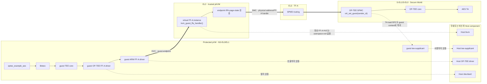
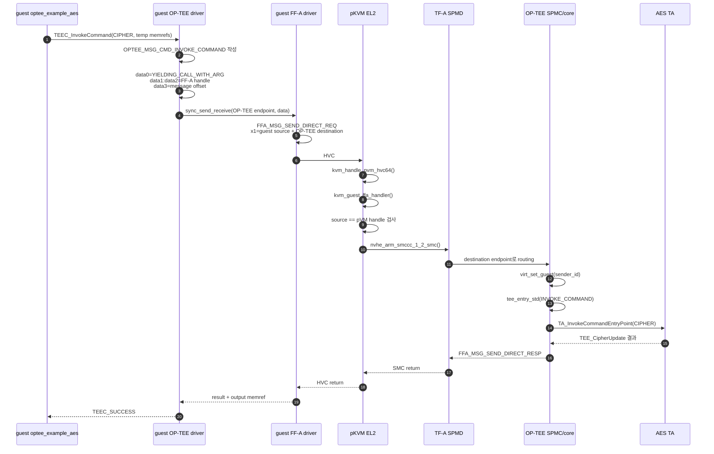
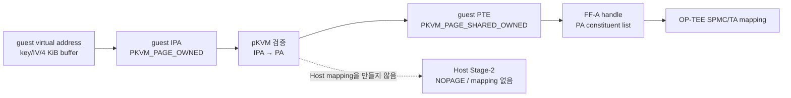

# FF-A를 이용한 pVM guest의 Secure World 직접 요청 경로

이 문서는 protected Linux pVM의 `optee_example_aes`가 Host의 OP-TEE component를 거치지
않고 Secure World의 OP-TEE TA를 호출할 수 있는 이유를 현재 구현 코드 기준으로 설명한다.

여기서 “직접”은 guest가 Secure World와 물리적으로 한 번에 전환한다는 뜻이 아니다. 요청은
반드시 pKVM EL2의 검증과 TF-A SPMD의 routing을 거친다. 우회하는 대상은 비신뢰 영역인 Host
userspace `lkvm`, Host Linux OP-TEE driver, Host `/dev/tee0`과 Host `tee-supplicant`다.

## 1. 전체 구조



Host가 완전히 사라지는 것은 아니다. Host `lkvm`은 VM을 만들고 kernel/initrd와 console을
제공하며 Host Linux KVM은 vCPU를 실행한다. 그러나 TA 요청의 control message와 AES
temporary memref는 Host OP-TEE stack에 전달되지 않는다.

## 2. 사전 조건: pVM에 virtual FF-A instance 연결

VMM은 protected VM을 생성한 직후 다음 capability를 설정한다.

```c
struct kvm_enable_cap cap = {
    .cap = KVM_CAP_ARM_PROTECTED_VM,
    .flags = KVM_CAP_ARM_PROTECTED_VM_FLAGS_SET_FFA,
    .args[0] = 1,
};
ioctl(vm_fd, KVM_ENABLE_CAP, &cap);
```

현재 `kvmtool-protected-ffa.patch`가 `--protected-ffa` 옵션을 이 ioctl로 연결한다. Host
NS-EL1의 `pkvm_vm_ioctl_enable_cap()`은 VM이 생성되기 전에만
`kvm->arch.pkvm.ffa_support`를 활성화한다.

guest Linux FF-A driver는 부팅하면서 다음 순서로 virtual instance를 초기화한다.

1. `FFA_VERSION`으로 pKVM과 FF-A 1.2를 협상한다.
2. `FFA_ID_GET`으로 자신만의 pVM endpoint ID를 받는다.
3. `FFA_FEATURES`로 RX/TX mailbox 조건을 확인한다.
4. `FFA_RXTX_MAP`으로 guest의 TX/RX page를 pKVM EL2와 공유한다.
5. `FFA_PARTITION_INFO_GET`으로 OP-TEE logical partition endpoint를 찾는다.
6. 발견된 FF-A device에 guest OP-TEE FF-A driver가 bind되어 `/dev/tee0`을 만든다.

`ffa_transport_init()`은 guest의 SMCCC conduit가 HVC이므로 `__arm_ffa_fn_hvc()`를 선택한다.
따라서 이후 Linux FF-A call은 Host kernel의 SMC 경로가 아니라 pVM HVC trap으로 들어간다.

## 3. endpoint가 Host와 guest를 분리하는 방법

Host의 physical Normal World FF-A endpoint는 `0`이다. protected guest는
`hyp_vcpu_to_ffa_handle()`에서 파생된 별도 endpoint를 사용한다.

guest가 `FFA_ID_GET`을 호출하면 `kvm_guest_ffa_handler()`는 이 pVM handle을 반환한다. 이후
direct request에서 pKVM의 `do_ffa_direct_msg()`는 register `x1`에 포함된 source endpoint가
그 handle과 같은지 검사한다. guest가 Host ID `0`이나 다른 pVM ID로 위조하면
`FFA_RET_INVALID_PARAMETERS`를 반환하고 Secure World로 전달하지 않는다.

OP-TEE SPMC는 SPMD가 보존한 `sender_id`를 받아 `virt_set_guest(sender_id)`를 호출한다.
이 값으로 guest별 MMU partition, runtime과 TA session namespace를 선택하므로 Host session과
다른 pVM session이 섞이지 않는다. 현재 OP-TEE는 다음 설정으로 빌드된다.

```text
CFG_NS_VIRTUALIZATION=y
CFG_VIRT_GUEST_COUNT=3
```

## 4. control path: TEEC command가 Secure World에 도달하는 과정



Linux OP-TEE driver가 direct message register에 넣는 것은 AES buffer 자체가 아니라
`optee_msg_arg`가 놓인 message shared memory의 위치다.

| FF-A payload | OP-TEE 값 | 의미 |
|---|---|---|
| `data0` / `x3` | `OPTEE_FFA_YIELDING_CALL_WITH_ARG` | OP-TEE yielding call 종류 |
| `data1:data2` / `x4:x5` | `shm->sec_world_id` | FF-A shared-memory handle |
| `data3` / `x6` | `offs` | shared memory 안의 `optee_msg_arg` 위치 |
| `x1` | source/destination endpoint | 호출 pVM과 OP-TEE partition identity |

각 AES temporary memref에는 별도 FF-A handle이 있으며,
`to_msg_param_ffa_mem()`이 그 값을 `optee_msg_arg.params[].u.fmem.global_id`에 기록한다.
Secure World는 direct-message가 가리키는 `optee_msg_arg`를 먼저 읽고 각 parameter의 handle을
따라 key, IV와 4 KiB input/output page를 찾는다.

direct-message register들은 HVC에서 EL2가 검사한 뒤 SMC register로 SPMD에 전달한다. 정상
성공 경로의 `kvm_guest_ffa_handler()`는 `true`를 반환하므로 `KVM_RUN`이 Host userspace
`lkvm`에 FF-A 요청 내용을 전달하지 않고 곧바로 guest를 재개한다.

## 5. data path: 4 KiB AES buffer가 Host에 매핑되지 않는 이유

AES key, IV, 평문과 출력 buffer는 direct-message register에 들어가지 않고 FF-A shared
memory page에 놓인다.



세부 과정은 다음과 같다.

1. `libteec`가 `TEEC_MEMREF_TEMP_INPUT/OUTPUT`을 Linux TEE shared memory로 등록한다.
2. guest OP-TEE FF-A driver의 `optee_ffa_shm_register()`가 `memory_share()`를 호출한다.
3. guest FF-A driver가 guest IPA constituent를 RX/TX descriptor에 기록하고 `FFA_MEM_SHARE`
   HVC를 실행한다.
4. pKVM은 descriptor의 `sender_id`가 현재 pVM endpoint인지 확인한다.
5. `ffa_guest_share_ranges()`가 각 guest IPA를 실제 PA로 번역한다.
6. `__pkvm_guest_share_ffa_page()`가 guest PTE를 `PKVM_PAGE_OWNED`에서
   `PKVM_PAGE_SHARED_OWNED`로 바꾸고 PA constituent descriptor를 만든다.
7. pKVM이 변환한 descriptor를 SMC `FFA_MEM_SHARE`로 SPMD에 전달하고 FF-A handle을 받는다.
8. 이후 direct request는 message shared memory handle과 offset을 전달한다. 그 안의
   `optee_msg_arg`는 각 AES memref의 FF-A handle을 참조하고, OP-TEE TA가 해당 page를 읽어
   `TEE_CipherUpdate()` 결과를 output memref에 쓴다.
9. unregister/reclaim 때 pKVM이 `__pkvm_guest_unshare_ffa_page()`로 guest page를 다시
   `PKVM_PAGE_OWNED`로 복원한다.

이 전환은 guest와 FF-A/Secure World 사이의 share다. `__pkvm_guest_share_ffa_page()`에는
Host Stage-2 mapping을 추가하거나 `__pkvm_guest_share_host()`를 호출하는 코드가 없다.
따라서 guest가 별도의 guest-to-Host share hypercall을 하지 않는 한 L0 Host CPU는 AES
memref page를 읽을 수 없다.

guest FF-A RX/TX mailbox도 Host userspace buffer가 아니다. `do_ffa_rxtx_guest_map()`은
guest page를 pKVM에만 공유하고 pVM별 `ffa_buf`에 보관한다. pKVM은 이 mailbox의 descriptor를
검증·변환하기 위해 사용하며 AES payload page는 FF-A handle로 Secure World에 공유한다.

## 6. TA loading RPC도 Host supplicant를 사용하지 않는 이유

AES TA가 Secure World에 아직 적재되지 않았다면 OP-TEE는 `OPTEE_RPC_CMD_LOAD_TA`를 반환한다.
이 응답은 호출한 `sender_id`의 FF-A direct-response 경로로 guest OP-TEE driver에 돌아온다.
guest 안에서 `/dev/teepriv0`을 열고 실행 중인 guest `tee-supplicant`가 guest rootfs의 `.ta`
binary를 읽고 같은 FF-A 경로로 resume한다.

따라서 runtime TA load RPC도 Host `tee-supplicant`에 위임하지 않는다. 다만 현재 PoC의 guest
kernel/initrd와 `.ta` 파일은 부팅 전에 Host가 제공하므로, image 무결성과 Host의 사전 파일
열람은 verified boot와 attestation이 없는 현재 범위에서 보호되지 않는다.

## 7. Host가 관여하는 예외와 관찰 가능한 정보

“Host를 거치지 않는다”는 표현에는 다음 예외와 한계가 있다.

| 상황 | Host 관여 | payload 노출 여부 |
|---|---|---|
| 정상 FF-A direct request/response | HVC를 EL2가 처리하고 guest로 복귀하므로 Host userspace exit 없음 | Host OP-TEE stack에 노출되지 않음 |
| EL2 page-table 또는 allocator 보충 필요 | `ARM_EXCEPTION_HYP_REQ`로 Host NS-EL1 KVM이 page 수, guest IPA와 크기 같은 요청을 처리한 뒤 instruction 재실행 | 요청 metadata만 전달하며 buffer 내용은 전달하지 않음 |
| serial console | Host `lkvm`이 MMIO console device를 제공하고 `/tmp/optee-pvm*.log`에 출력 저장 | guest가 출력한 문자열은 노출됨 |
| VM 부팅과 종료 | Host `lkvm`이 kernel/initrd를 적재하고 lifecycle을 제어 | 부팅 전 image와 실행 timing은 노출됨 |
| 외부 QEMU 개발 환경 | QEMU process가 전체 에뮬레이션을 소유 | 실제 하드웨어의 L0 Host 공격자 모델과 같은 보장을 제공하지 않음 |

현재 AES example은 key `0xa5`, 평문 `0x5a`, IV 0을 source에 고정하므로 이 값은 Host가
실행 전부터 알고 있다. 이 시험은 호출 경로와 page-state를 검증하지만 알 수 없는 실제
secret의 종단간 기밀성을 입증하지 않는다. 또한 generic private-page Host 접근 차단은
실측했지만 AES temporary memref page 자체를 대상으로 한 Host read negative test는 별도
보강 항목이다.

## 8. 핵심 코드 위치

| 단계 | 파일과 함수 |
|---|---|
| VMM의 FF-A 활성화 | `work/src/tools/optee-pkvm-guest/kvmtool-protected-ffa.patch`, `KVM_ENABLE_CAP(SET_FFA)` |
| KVM capability 적용 | `work/src/pkvm-linux/arch/arm64/kvm/pkvm.c:970`, `pkvm_vm_ioctl_enable_cap()` |
| guest의 HVC transport 선택 | `work/src/pkvm-linux/drivers/firmware/arm_ffa/smccc.c:20`, `ffa_transport_init()` |
| guest FF-A 초기화 | `work/src/pkvm-linux/drivers/firmware/arm_ffa/driver.c:1980`, `ffa_init()` |
| OP-TEE shared memory 등록 | `work/src/pkvm-linux/drivers/tee/optee/ffa_abi.c:270`, `optee_ffa_shm_register()` |
| memref handle을 OP-TEE parameter로 변환 | `work/src/pkvm-linux/drivers/tee/optee/ffa_abi.c:190`, `to_msg_param_ffa_mem()` |
| OP-TEE direct call 생성 | `work/src/pkvm-linux/drivers/tee/optee/ffa_abi.c:617`, `optee_ffa_do_call_with_arg()` |
| protected HVC dispatch | `work/src/pkvm-linux/arch/arm64/kvm/hyp/nvhe/pkvm.c:2080`, `kvm_handle_pvm_hvc64()` |
| guest FF-A call 분기 | `work/src/pkvm-linux/arch/arm64/kvm/hyp/nvhe/ffa.c:1757`, `kvm_guest_ffa_handler()` |
| source endpoint 검사와 SMC | `work/src/pkvm-linux/arch/arm64/kvm/hyp/nvhe/ffa.c:1604`, `do_ffa_direct_msg()` |
| guest IPA→PA 및 share | `work/src/pkvm-linux/arch/arm64/kvm/hyp/nvhe/ffa.c:790`, `ffa_guest_share_ranges()` |
| guest page-state 전환 | `work/src/pkvm-linux/arch/arm64/kvm/hyp/nvhe/mem_protect.c:1551`, `__pkvm_guest_share_ffa_page()` |
| Secure World guest 선택 | `work/src/optee-pkvm/optee_os/core/arch/arm/kernel/thread_spmc.c:902`, `optee_lsp_handle_direct_request()` |
| OP-TEE partition 전환 | `work/src/optee-pkvm/optee_os/core/arch/arm/kernel/virtualization.c:513`, `virt_set_guest()` |

AES client부터 TA 내부 crypto 함수까지의 전체 Host·guest 비교는
[Host와 pVM guest의 OP-TEE AES 호출 코드 흐름](./OPTEE-AES-CODE-FLOW.md), 환경을 처음부터
재현하는 명령은 [수동 검증 가이드](./VERIFICATION.md)를 참조한다.
