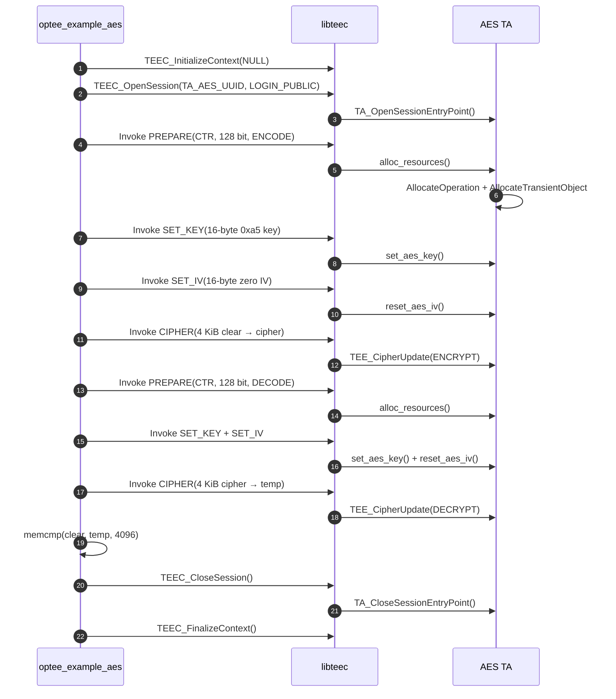
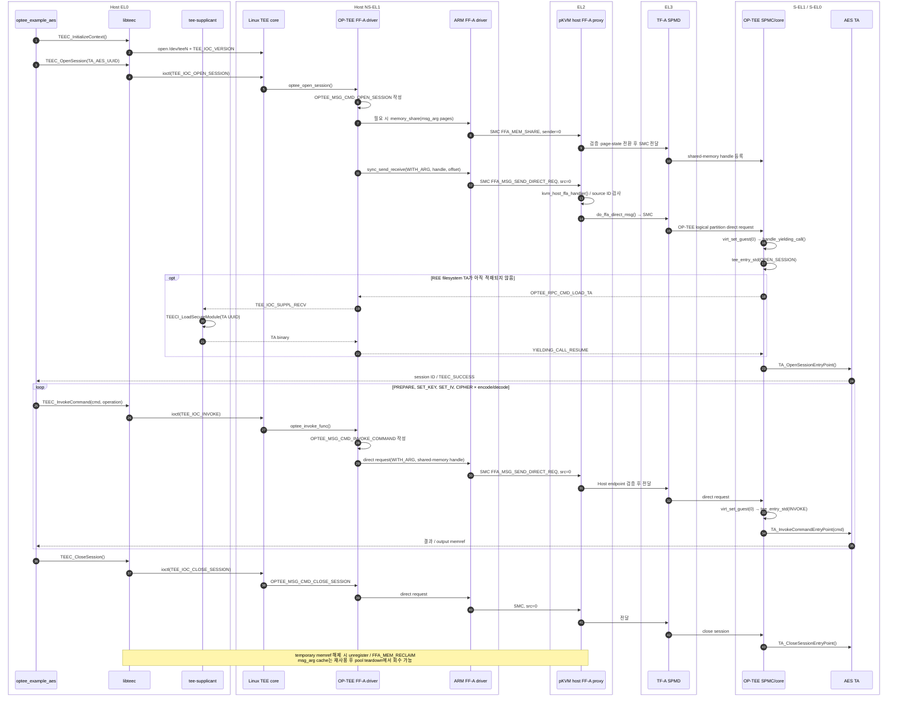
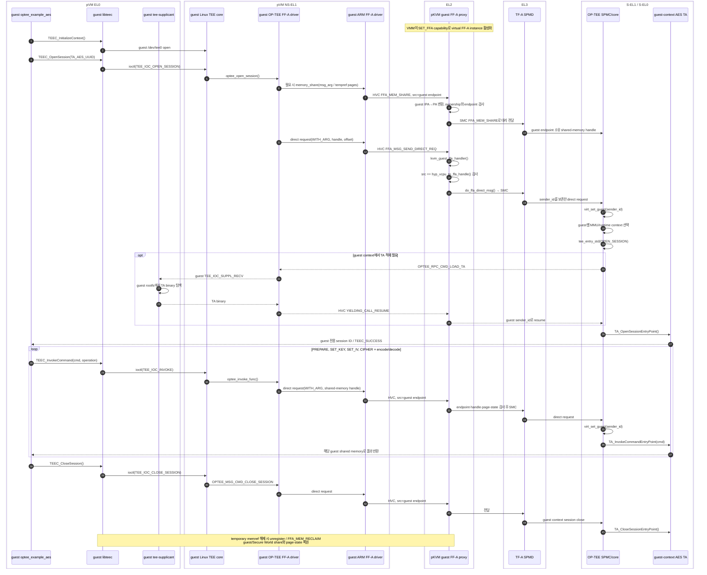

# Host와 pVM guest의 OP-TEE AES 호출 코드 흐름

이 문서는 `optee_example_aes`가 Host와 protected Linux pVM에서 OP-TEE의 AES TA를
호출하는 과정을 현재 저장소의 실제 함수 기준으로 정리한다. 두 환경에서 애플리케이션,
`libteec`, Linux OP-TEE driver와 AES TA 코드는 같다. 차이는 Linux FF-A transport 아래에서
Host 요청은 physical endpoint `0`의 SMC로, guest 요청은 pVM별 virtual endpoint의 HVC로
pKVM EL2에 들어간다는 점이다.

## 1. 한눈에 보는 호출 경로

| 구간 | Host | protected pVM guest |
|---|---|---|
| EL0 client | `/usr/bin/optee_example_aes` | guest rootfs의 같은 client |
| Linux TEE ABI | `libteec` → `/dev/tee0` ioctl | `libteec` → guest `/dev/tee0` ioctl |
| Linux OP-TEE ABI | FF-A OP-TEE driver | guest FF-A OP-TEE driver |
| SMCCC conduit | SMC | HVC |
| FF-A caller ID | physical NW endpoint `0` | `hyp_vcpu_to_ffa_handle()`이 정한 pVM별 endpoint |
| EL2 처리 | `kvm_host_ffa_handler()` | `kvm_guest_ffa_handler()` |
| Secure World context | `virt_set_guest(0)` | `virt_set_guest(sender_id)` |
| TA | AES TA의 독립 session | 해당 guest context 안의 독립 AES TA session |

호출 제어 정보는 FF-A direct message로 전달되고, `optee_msg_arg`, key, IV 및 4 KiB
입출력 버퍼는 FF-A로 등록된 shared memory에 놓인다. pKVM은 Host와 guest의 endpoint를
검사하고 memory share/reclaim을 중재한다.

## 2. 애플리케이션이 실행하는 공통 명령 순서

`optee_example_aes`의 Host와 guest binary는 다음 순서를 동일하게 실행한다.

실제 client는 `AES_TEST_BUFFER_SIZE`를 `4096`으로 정의하고, encode 결과를 다시 decode한
뒤 `memcmp()` 결과가 0이면 `Clear text and decoded text match`를 출력한다.

## 3. Host 호출 시퀀스

Host FF-A call은 `ffa_transport_init()`이 선택한 SMC conduit를 사용한다. EL2의
`kvm_host_ffa_handler()`는 direct request의 source가 `HOST_FFA_ID`인지 확인한 뒤 실제
SMC를 실행한다. OP-TEE에서는 physical Normal World endpoint `0`도 virtualization context로
만들어 Host session을 guest session과 분리한다.

## 4. protected pVM guest 호출 시퀀스

VMM은 `KVM_CAP_ARM_PROTECTED_VM_FLAGS_SET_FFA`를 먼저 설정한다. 이후 guest FF-A call은
`kvm_guest_ffa_handler()`로 들어가고, `FFA_ID_GET`에는 pVM별 handle을 반환한다. direct
message의 source ID가 그 handle과 다르면 `do_ffa_direct_msg()`가 요청을 거부한다. OP-TEE
SPMC는 전달받은 `sender_id`로 `virt_set_guest()`를 호출하여 guest별 MMU partition과 runtime,
TA session을 선택한다.

## 5. shared memory에서 실제 데이터가 이동하는 방식

`SET_KEY`, `SET_IV`, `CIPHER`는 client stack pointer를 Secure World에 직접 넘기지 않는다.
`libteec`의 `teec_pre_process_tmpref()`가 temporary memref를 shared memory로 등록하고, shadow
buffer가 필요하면 입력을 복사한다. Linux OP-TEE FF-A driver의
`optee_ffa_shm_register()`는 페이지 목록을 `memory_share()`에 넘겨 FF-A global handle을
받고 `shm->sec_world_id`에 저장한다.

`optee_ffa_do_call_with_arg()`의 direct message에는 다음 값만 실린다.

| direct-message 필드 | 값 |
|---|---|
| `data0` | `OPTEE_FFA_YIELDING_CALL_WITH_ARG` |
| `data1:data2` | `shm->sec_world_id` 64-bit FF-A handle |
| `data3` | shared memory 안의 `optee_msg_arg` offset |

따라서 4 KiB 평문과 암호문은 등록된 memref 안에서 TA의 `TEE_CipherUpdate()` 입력·출력으로
사용된다. 호출이 끝나 temporary memref가 해제되면 unregister와 `FFA_MEM_RECLAIM` 경로가
페이지 소유권을 되돌린다. Host는 Host Stage-2, guest는 guest Stage-2와 IPA→PA 검증을 거치므로
같은 API를 사용해도 pKVM 내부의 page-state 경로는 서로 다르다.

## 6. 실제 함수와 파일 대응표

| 레이어 | 파일과 함수 | 역할 |
|---|---|---|
| EL0 client | `work/src/optee-pkvm/optee_examples/aes/host/main.c:51` `prepare_tee_session()` | context/session 생성 |
| EL0 client | `main.c:76` `prepare_aes()`, `main.c:100` `set_key()`, `main.c:120` `set_iv()`, `main.c:139` `cipher_buffer()` | 네 종류의 TA command 작성 |
| libteec | `work/src/optee-pkvm/optee_client/libteec/src/tee_client_api.c:160` `TEEC_InitializeContext()` | `/dev/teeN` 탐색과 context 초기화 |
| libteec | `tee_client_api.c:594` `TEEC_OpenSession()`, `tee_client_api.c:678` `TEEC_InvokeCommand()` | operation 변환과 TEE ioctl 호출 |
| libteec | `tee_client_api.c:192` `teec_pre_process_tmpref()` | key/IV/4 KiB buffer를 shared memory로 등록 |
| Linux TEE core | `work/src/pkvm-linux/drivers/tee/tee_core.c:975` `tee_ioctl()` | `OPEN_SESSION`, `INVOKE`, `CLOSE_SESSION` ioctl 분기 |
| Linux OP-TEE | `work/src/pkvm-linux/drivers/tee/optee/call.c:362` `optee_open_session()` | `OPTEE_MSG_CMD_OPEN_SESSION` 생성 |
| Linux OP-TEE | `call.c:512` `optee_invoke_func()` | session 검사와 `OPTEE_MSG_CMD_INVOKE_COMMAND` 생성 |
| Linux OP-TEE FF-A | `work/src/pkvm-linux/drivers/tee/optee/ffa_abi.c:270` `optee_ffa_shm_register()` | FF-A memory share와 global handle 저장 |
| Linux OP-TEE FF-A | `ffa_abi.c:617` `optee_ffa_do_call_with_arg()` | message handle/offset를 yielding direct call로 포장 |
| Linux FF-A | `work/src/pkvm-linux/drivers/firmware/arm_ffa/driver.c:432` `ffa_msg_send_direct_req()` | source/destination endpoint와 payload를 FF-A register로 포장 |
| SMCCC transport | `work/src/pkvm-linux/drivers/firmware/arm_ffa/smccc.c:20` `ffa_transport_init()` | 실행 환경에 따라 SMC 또는 HVC 함수 선택 |
| pKVM EL2 Host | `work/src/pkvm-linux/arch/arm64/kvm/hyp/nvhe/ffa.c:1642` `kvm_host_ffa_handler()` | physical endpoint `0`의 FF-A call 처리 |
| pKVM EL2 guest | `ffa.c:1757` `kvm_guest_ffa_handler()` | pVM virtual FF-A call과 memory operation 처리 |
| pKVM EL2 공통 | `ffa.c:1604` `do_ffa_direct_msg()` | source endpoint 검사 후 EL3로 SMC 전달 |
| OP-TEE SPMC | `work/src/optee-pkvm/optee_os/core/arch/arm/kernel/thread_spmc.c:902` `optee_lsp_handle_direct_request()` | sender별 virtualization context 선택 |
| OP-TEE virtualization | `work/src/optee-pkvm/optee_os/core/arch/arm/kernel/virtualization.c:513` `virt_set_guest()` | endpoint별 partition/MMU context 설정 |
| OP-TEE core | `work/src/optee-pkvm/optee_os/core/tee/entry_std.c:533` `__tee_entry_std()` | open/invoke/close command dispatch |
| TA loading RPC | `work/src/optee-pkvm/optee_os/core/kernel/ree_fs_ta.c:186` `rpc_load()` | REE filesystem TA를 supplicant에 요청 |
| tee-supplicant | `work/src/optee-pkvm/optee_client/tee-supplicant/src/tee_supplicant.c:286` `load_ta()` | UUID에 해당하는 `.ta` binary 적재 |
| AES TA | `work/src/optee-pkvm/optee_examples/aes/ta/aes_ta.c:376` `TA_OpenSessionEntryPoint()` | session별 AES 상태 할당 |
| AES TA | `aes_ta.c:416` `TA_InvokeCommandEntryPoint()` | PREPARE/SET_KEY/SET_IV/CIPHER dispatch |
| AES TA crypto | `aes_ta.c:330` `cipher_buffer()` | `TEE_CipherUpdate()`로 AES-CTR 실행 |

## 7. 현재 구성에서의 실행 근거

- Host에서는 `coexist-test.sh`가 `/usr/bin/optee_example_aes`를 pVM과 동시에 실행하고,
  `COEX_AES_DURING_PVM_OK`와 재호출 결과 `COEX_AES_REOPEN_OK`를 확인한다.
- guest에서는 `work/src/tools/optee-pkvm-guest/init.sh:24`가 guest의
  `/dev/teepriv0`에 `tee-supplicant`를 시작한 뒤 line 31에서 같은 client를 실행한다.
- client 성공 시 guest init은
  `PVM_TA_AES_4K_OK: bytes=4096 encrypt=ok decrypt=ok compare=ok` marker를 출력한다.
- OP-TEE는 `CFG_NS_VIRTUALIZATION=y`, `CFG_VIRT_GUEST_COUNT=3`으로 빌드되어 Host와 두
  protected pVM endpoint에 독립 context를 제공한다.

이 결과가 의미하는 범위는 표준 GlobalPlatform TEE Client API를 통한 일반 AES TA 호출이다.
Trusted Access 전용 권한, 제품 키 provisioning 또는 Secure World 내부 메모리 관찰은 이
호출 경로와 Phase 06-B 완료조건에 포함하지 않는다.
