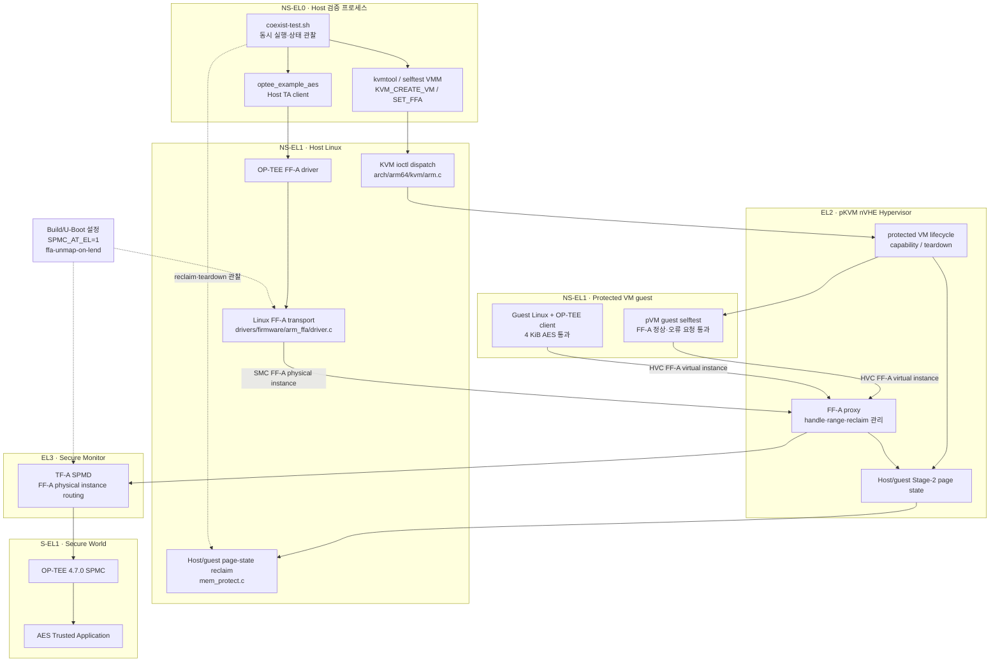

# Phase 06-B: pVM 내부 OP-TEE TA 호출

- 상태: 완료 — Trusted Access를 요구하지 않는 표준 OP-TEE client 범위
- 목적: pVM 내부 애플리케이션이 Secure World의 OP-TEE TA를 호출하고, 호출 데이터가 비신뢰 Host에 노출되지 않는 경로를 검증한다.
- 검증 방식: 별도의 Trusted Access, Secure World 메모리 덤프, 특권 디버그 인터페이스 없이
  일반 Host/guest 콘솔과 KVM·FF-A·TEEC의 공개 반환값만 사용하는 블랙박스 PoC로 한정한다.
- 환경: E-2 확장
- 선행 Phase: Phase 06
- 관련 목표: G-6 확장

## 관련 문서

| 문서 | 내용 | 읽는 순서 |
|---|---|---|
| [Phase 06-B README](./README.md) | 목표, 구현 이력, 모듈뷰, Host 노출 판정과 완료조건 | 전체 결과를 먼저 파악할 때 |
| [수동 검증 가이드](./VERIFICATION.md) | 처음 실행하는 개발자가 빌드 스크립트 내부 과정까지 명령 단위로 직접 수행하고 결과 marker를 확인하는 방법 | 환경을 재현하고 실측할 때 |
| [Host·guest OP-TEE AES 코드 흐름](./OPTEE-AES-CODE-FLOW.md) | `optee_example_aes`부터 libteec, Linux FF-A, pKVM EL2, OP-TEE SPMC와 AES TA까지의 실제 함수 및 Host·guest 시퀀스 차이 | 호출 경로와 코드를 분석할 때 |

README는 완료 판정과 보안 범위를 요약한다. 실행 명령은 수동 검증 가이드, 함수·파일별
세부 호출 과정은 코드 흐름 문서를 기준으로 한다.

## 배경

### 범위 제한

이 Phase의 목적은 pVM별 OP-TEE 호출 경로가 동작하고, 공개 인터페이스에서 잘못된 접근이
거부되며 종료 뒤 자원이 회수되는지를 확인하는 것이다. 실제 하드웨어의 물리 공격 내성,
제품 수준 키 보호, Secure World 내부 메모리의 직접 검사나 별도 Trusted Access 권한을
요구하는 검증은 범위에 포함하지 않는다. 따라서 “Host 비노출”은 L0 Host Linux를 대상으로
pKVM page-state 전환, Host 접근 fault, `kvm-arm.ffa-unmap-on-lend` 경로의 성공 및 공개
로그로 관찰 가능한 reclaim 결과를 근거로 판정한다. 개발 머신의 QEMU 프로세스, 부팅 전
guest image와 명시적인 console 출력까지 비밀로 유지한다는 의미는 아니다.

Phase 06은 Host Linux에서 OP-TEE TA를 호출하는 동안 pVM이 함께 실행될 수 있음을 확인했다.
그러나 TA client는 Host에서 실행되며, pVM 내부에서 OP-TEE 서비스를 직접 사용하는 경로는
검증하지 않았다.

Phase 06-B에서는 Linux가 부팅되는 pVM 안에 OP-TEE client를 배치하고, pVM에서 Secure
World까지 TA 요청을 전달하는 경로를 구현한다. 기능 성공뿐 아니라 요청 데이터와 공유
메모리가 Host에 노출되지 않는지도 함께 판정한다.

## 목표 구조

```text
pVM Linux/Application
└─ libteec / tee-supplicant
   └─ 가상화된 TEE 전달 경로
      └─ pKVM EL2 중재
         └─ TF-A / OP-TEE Secure World
            └─ TA
```

## 구현 경로

### 대조군: Host 프록시

pVM의 요청을 virtio 또는 별도 RPC 채널로 Host에 전달하고, Host의 OP-TEE client가 대신 TA를
호출한다. 이 경로는 pVM 애플리케이션의 TA 사용 가능성을 빠르게 확인하는 기능 대조군으로만
사용한다.

Host가 요청 평문이나 응답을 볼 수 있으므로 이 경로의 성공만으로 pVM 데이터의 기밀성을
주장하지 않는다.

### 목표 경로: 직접 또는 FF-A 기반 전달

pKVM이 pVM의 OP-TEE 또는 FF-A 호출을 EL2에서 중재하고, Secure World 호출에 필요한
페이지만 제한적으로 공유한다. 호출이 끝나면 공유 권한과 매핑을 회수한다.

구현 과정에서 다음 사항을 조사해 전달 방식을 확정했다.

1. pVM의 SMC 및 FF-A 호출에 대한 현재 pKVM 처리 범위
2. TF-A와 OP-TEE가 제공하는 VM별 endpoint 및 메모리 공유 모델
3. pVM private page를 Secure World와 공유하고 회수할 수 있는 경로
4. OP-TEE 세션과 호출자 identity를 pVM별로 분리하는 방법
5. 게스트 Linux OP-TEE 드라이버에 필요한 DT 또는 ACPI 인터페이스

### guest 실행 시 Host 노출 판정

최종 구현은 Host 프록시가 아니라 다음 protected-FFA 직접 경로를 사용한다.

```text
guest optee_example_aes / libteec
  → guest Linux OP-TEE FF-A driver
  → HVC
  → pKVM EL2 kvm_guest_ffa_handler()
  → SMC
  → TF-A SPMD / OP-TEE SPMC
  → AES TA
```

따라서 정상 호출에서 guest의 key·평문·암호문이 Host의 `/dev/tee0`, Host OP-TEE driver 또는
Host `tee-supplicant`를 통과하지 않는다. AES temporary memref page는 guest의
`PKVM_PAGE_OWNED`에서 guest/Secure World가 공유하는 `PKVM_PAGE_SHARED_OWNED`로 전환되며,
L0 Host mapping은 추가하지 않는다.

Host가 관찰할 수 있는 정보와 범위는 다음과 같다.

| 관찰 주체 또는 구간 | Host가 볼 수 있는 정보 | AES payload 판정 |
|---|---|---|
| Host OP-TEE driver·supplicant | guest 호출 경로에서 사용하지 않음 | 전달되지 않음 |
| pKVM FF-A 중재 | endpoint, FF-A handle, page 수, IPA→PA 변환 등은 EL2가 처리하며 정상 경로에서 descriptor를 L0 Host로 반환하지 않음 | EL2와 Secure World에는 필요하지만 L0 Host mapping은 없음 |
| Host KVM kernel의 HYP request 처리 | 자원 부족 시 요청 종류, guest IPA, 크기와 보충 page 수 | payload 내용은 전달하지 않음 |
| Host userspace `lkvm` | VM lifecycle, kernel/initrd 원본, 실행 시간 | runtime private page는 pKVM이 차단하지만 부팅 전 image는 Host가 제공 |
| serial console과 시험 로그 | guest가 출력한 문자열, 성공·실패 marker와 대략적인 timing | guest가 직접 출력한 내용은 Host에 노출됨 |
| 개발 머신의 QEMU process | 에뮬레이션되는 시스템과 장치 상태 | 실제 하드웨어 공격자 모델과 달리 전체 상태 관찰 가능 |

현재 AES 예제는 key를 `0xa5`, 평문을 `0x5a`, IV를 0으로 채우므로 시험 데이터가 source와
guest initrd에 이미 알려져 있다. 따라서 현재 결과는 FF-A 전달 경로와 page-state 격리를
검증하지만, Host가 사전에 알 수 없는 실제 secret의 종단간 기밀성을 증명하지 않는다.
또한 generic private page Host 접근 차단은 실측했으나 AES temporary memref 바로 그 page를
Host가 읽도록 시도하는 buffer-specific negative test는 수행하지 않았다.

정리하면 L0 Host Linux의 OP-TEE component를 통한 runtime AES payload 노출은 코드 경로에서
발견되지 않았다. 반면 console, timing, VM lifecycle과 자원 보충 때의 guest IPA·page 수
같은 제한된 메타데이터, 부팅 전 image, 외부 QEMU 운영자에 대한 기밀성은 이 Phase의 보장
범위 밖이다. 실제 함수와 shared-memory 전환 과정은
[Host·guest OP-TEE AES 코드 흐름](./OPTEE-AES-CODE-FLOW.md)을 참조한다.

## 계획

### 범위 축소: 표준 TEE client 경로

본 Phase는 Trusted Access 또는 제품 전용 trusted-access 권한 모델을 요구하지 않는다.
검증 대상은 protected Linux pVM 안의 일반 OP-TEE client가 FF-A 표준 호출과
`TEEC_OpenSession()`/`TEEC_InvokeCommand()`로 TA를 사용하는 경로로 한정한다. 따라서
키 프로비저닝, privileged TA, 다른 pVM의 세션 강제 탈취 같은 Trusted Access 전용
기능은 이 Phase의 완료조건에서 제외하고, 접근 거부·메모리 회수·세션 종료 같은
보안 경계만 실측한다.

### 빌드 도구 체인 범위

- Phase 06-B의 커널 빌드와 실측은
  `work/build/pkvm-full-clang/arch/arm64/boot/Image`를 기준으로 한다.
- `work/build/pkvm-full-gcc`는 Phase 02에서 수행한 GCC 교차 빌드 검증의 과거 산출물이며,
  Phase 04 이후의 기본 실행 스크립트와 Phase 06-B 완료조건에서는 사용하지 않는다.
- 저장 공간 확보를 위해 `pkvm-full-gcc`를 삭제했으며, 이 Phase에서는 GCC 재빌드나
  Clang/GCC 교차 검증을 수행하지 않는다. 컴파일러 교차 검증은 완료 판정 범위 밖이다.

1. Linux가 부팅되는 최소 pVM 이미지와 콘솔을 구성한다.
2. pVM 이미지에 OP-TEE client, `libteec`, `tee-supplicant`와 최소 TA client를 포함한다.
3. Host 프록시 경로를 구현해 pVM 내부 `TEEC_OpenSession()`과
   `TEEC_InvokeCommand()`의 기능 대조군을 확보한다.
4. pKVM, TF-A, OP-TEE의 SMC/FF-A 및 메모리 공유 경로를 조사하고 목표 전달 방식을
   결정한다.
5. pVM별 TEE endpoint와 TA 세션을 분리한다.
6. TA 호출에 필요한 페이지만 Secure World와 공유하고 Host stage-2에는 매핑하지 않는
   전달 경로를 구현한다.
7. pVM 내부에서 4 KiB 카메라 프레임 모사 데이터를 TA로 암호화하고 복호화해 원본 일치를
   확인한다.
8. 호출 중 Host CPU 접근과 다른 pVM의 접근이 차단되는지 대조군과 함께 확인한다.
9. TA 세션 종료와 pVM 종료 후 공유 페이지, 세션, vCPU 및 메모리가 회수되는지 확인한다.
10. 잘못된 endpoint, 다른 pVM의 세션 핸들, 범위를 벗어난 공유 요청이 거부되는지 확인한다.

## 구현 및 실측 이력 (2026-08-18)

Phase 06-B 구현에 앞서 기존 E-2 스택의 pVM SMC/FF-A 처리 범위와 OP-TEE 전달 경로를
조사하고 최소 호출을 실측했다. 아래 초기 조사 시점에는 목표 경로가 아직 성립하지 않았으므로
Phase를 완료로 판정하지 않았고, 이어지는 후속 수정과 최종 실측에서 완료조건을 충족했다.

### pKVM FF-A 지원 범위

현재 pKVM 소스에는 protected guest의 FF-A 호출을 중재하는 코드가 존재한다.

- `arch/arm64/kvm/hyp/nvhe/ffa.c`에서 guest RX/TX 매핑, guest IPA에서 PA로의 변환,
  Secure World와의 메모리 share/unshare 및 VM 종료 시 정리를 처리한다.
- `kvm_handle_pvm_hvc64()`는 FF-A가 활성화된 protected VM의 FF-A 호출을 EL2에서
  전달한다.
- VMM은 `KVM_CAP_ARM_PROTECTED_VM_FLAGS_SET_FFA`를 사용해 protected VM의 FF-A
  사용을 명시적으로 활성화해야 한다.

따라서 목표 경로는 legacy OP-TEE SMC를 그대로 전달하는 방식보다 pKVM의 기존 FF-A guest
중재 경로를 사용하는 방향이 적합하다. 이 1차 조사 시점에는 해당 capability를 사용하는
Linux pVM VMM과 guest OP-TEE client 구성이 아직 구현되지 않았으며, 후속 단계에서
`kvmtool`과 guest rootfs를 추가했다.

### legacy OP-TEE SMC 직접 호출 대조 시험

기존 protected VM selftest guest에서 OP-TEE `CALLS_UID` SMC를 직접 호출하도록 임시
계측했다. guest heartbeat 이후 `KVM_RUN`이 `errno=22` (`EINVAL`)로 종료됐고 pVM 실행
결과는 `rc=254`였다.

이는 현재 protected guest가 legacy OP-TEE SMC를 직접 통과시킬 수 없음을 나타낸다.

- Normal World 로그: `work/build/optee-pkvm/console-phase-06-b-probe.log`
- Secure World 로그: `work/build/optee-pkvm/secure-phase-06-b-probe.log`

시험에 사용한 임시 selftest 소스 변경은 결과 확인 후 원복했다.

### OP-TEE SPMC와 Host FF-A 기준 시험

OP-TEE를 S-EL1 SPMC로 실행하도록 `SPMC_AT_EL=1`을 적용하고 Host Linux 커널에
`CONFIG_ARM_FFA_TRANSPORT=y`를 활성화해 기준 시험을 수행했다.

확인된 정상 구간은 다음과 같다.

- TF-A 및 OP-TEE 4.7.0 부팅
- OP-TEE SPMC 초기화
- Normal World의 ARM FF-A 1.2 transport 초기화
- OP-TEE logical partition 검색
- FF-A RX/TX buffer 매핑
- pKVM protected nVHE 초기화

그러나 Host OP-TEE FF-A 드라이버가 보내는 첫 direct request에서 Secure World가
`FFA_ERROR_INVALID_PARAMETER`를 반환했다. Linux에서는 이 결과가 `-EINVAL`로 변환되어
`optee arm-ffa-1` probe가 실패했고 `/dev/tee0`과 `/dev/teepriv0`이 생성되지 않았다.

`CFG_NS_VIRTUALIZATION=y` 적용 여부와 OP-TEE logical endpoint ID 변경을 각각 시험했지만
동일한 첫 direct request 오류가 발생했다. 따라서 pVM guest 경로를 추가하기 전에 TF-A
SPMD와 OP-TEE SPMC 사이의 direct-message 계약 불일치를 먼저 해결해야 한다.

주요 증거 로그는 다음과 같다.

- SPMC, NS virtualization 비활성 기준:
  `work/build/optee-pkvm/console-phase-06-b-spmc-no-virt.log`
- 해당 Secure World 로그:
  `work/build/optee-pkvm/secure-phase-06-b-spmc-no-virt.log`
- FF-A 오류 레지스터 계측 결과:
  `work/build/optee-pkvm/console-phase-06-b-spmc-diag2.log`
- 해당 Secure World 로그:
  `work/build/optee-pkvm/secure-phase-06-b-spmc-diag2.log`

오류 레지스터 계측 결과는 `a2=0xfffffffffffffffe`이며 FF-A의
`FFA_ERROR_INVALID_PARAMETER`에 해당한다. 진단을 위한 pKVM, OP-TEE 및 build script의
임시 소스 변경은 모두 원복했다. 위 로그는 재현 증거인 build 산출물로만 남겨 두었다.

### 2026-08-18 후속 해결 및 pVM 최소 FF-A 실측

위의 Host probe 실패는 pKVM FF-A proxy가 설치되기 전에 Linux FF-A driver가
`FFA_VERSION`과 RX/TX map을 수행하던 init 순서 문제로 확정했다. FF-A driver를 late
init으로 옮기고 `kvm-arm.ffa-unmap-on-lend`를 사용했으며, OP-TEE SPMC가 NW initiated
`FFA_MEM_RETRIEVE_REQ`를 지원하지 않는 제약은 pKVM이 Host share constituent를 로컬에서
추적해 reclaim하도록 보완했다.

그 결과 `console-phase-06-b-fixed64.log`에서 다음 Host 기준선이 한 세션에서 통과했다.

- `optee: initialized driver`
- `COEX_AES_DURING_PVM_OK`
- `COEX_PVM_OK: rc=0`
- `COEX_AES_REOPEN_OK`
- `Mlocked: 0 kB`
- `OPTEE_PKVM_VALIDATION_OK`

이어 protected VM에 `KVM_CAP_ARM_PROTECTED_VM_FLAGS_SET_FFA`를 적용했다. 이 과정에서
공통 `KVM_ENABLE_CAP` 코드가 flags를 선행 거부해 protected VM 전용 분기에 도달하지
못하는 문제를 수정했다. selftest HVC wrapper도 FF-A 1.2가 반환값으로 사용할 수 있는
`x8`~`x17`을 clobber로 선언하도록 수정했다. 수정 후
`console-phase-06-b-pvm-ffa-fixed.log`에서 pVM 내부 `FFA_VERSION(1.2)`와 `FFA_ID_GET`이
모두 성공했고 `PVM_FFA_MINIMAL_OK`, `Guest done`, `All ok!`을 확인했다.

최소 FF-A가 활성화된 pVM과 Host AES를 실제로 겹쳐 실행한 다음 단계에서는
`console-phase-06-b-pvm-ffa-final.log`에 `COEX_KVM_ACTIVE: ... kvm_fds=6`까지 기록된 뒤,
pVM teardown의 `__pkvm_host_reclaim_page_guest()`가
`mem_protect.c:2229`에서 HYP panic을 일으켰다. 당시 최우선 문제는 FF-A가 활성화된 pVM
종료와 동시 Host Secure share 사이의 page-state/reclaim 충돌이었다. 이후 teardown 전에
Host Stage-2 pool을 보충하도록 수정하여 아래 최종 통합 시험에서 panic 없이 통과했다.

### Exception Level 기준 모듈뷰

아래 그림은 현재 구현과 검증 경로를 Exception Level별로 나타낸다. 실선은 현재 호출 또는
제어 경로이고, 점선은 빌드·부팅 설정이나 검증 관찰 경로다.



현재 정상 확인된 경로는 Host AES, pVM 최소 FF-A 정상·오류 요청, protected Linux guest의
표준 OP-TEE client와 4 KiB AES 호출까지다. `HYPSTATE → MEMPROTECT` 경계의 teardown
panic은 Host Stage-2 pool 보충 수정 후 동시 pVM 종료 회귀에서 재발하지 않았다.

### 모듈 및 파일별 변경 내역

| Exception Level / 영역 | 모듈·파일 | 수행한 수정 | 목적과 현재 결과 | 상태 |
|---|---|---|---|---|
| 빌드 구성 | `work/src/tools/optee-pkvm/build.sh` | OP-TEE 빌드 인자에 `SPMC_AT_EL=1` 추가 | OP-TEE를 S-EL1 SPMC로 실행하고 FF-A physical instance를 구성했다. OP-TEE 4.7.0 SPMC 및 Host OP-TEE driver 초기화를 확인했다. | 적용·기준선 통과 |
| 부팅 구성 | `work/src/tools/optee-pkvm/u-boot-pkvm.conf` | 커널 인자에 `kvm-arm.ffa-unmap-on-lend` 추가 | Host가 Secure World에 lend/share한 페이지를 pKVM Host Stage-2에서 추적·차단하도록 활성화했다. | 적용·기준선 통과 |
| NS-EL1 Host Linux | `work/src/pkvm-linux/drivers/firmware/arm_ffa/driver.c` | FF-A driver initcall을 `rootfs_initcall`에서 `late_initcall`로 변경 | Host의 `FFA_VERSION` 및 RX/TX map보다 pKVM FF-A proxy가 먼저 설치되도록 순서를 보장했다. 초기 direct request의 `FFA_ERROR_INVALID_PARAMETER` 문제를 해소했다. | 적용·Host probe 통과 |
| NS-EL1 KVM ioctl | `work/src/pkvm-linux/arch/arm64/kvm/arm.c` | 함수 진입 시 모든 non-zero `cap->flags`를 거부하던 선행 검사 제거 | `KVM_CAP_ARM_PROTECTED_VM_FLAGS_SET_FFA`가 protected VM 전용 handler에 도달하도록 수정했다. Android upstream의 capability-with-flags 분기 구조와 일치한다. | 적용·SET_FFA 통과 |
| EL2 pKVM FF-A proxy | `work/src/pkvm-linux/arch/arm64/kvm/hyp/nvhe/ffa.c` | Host FF-A handle에 최대 64개 constituent range와 개수를 보관하고, 최초/fragment share에서 누적하며 reclaim 때 로컬 range를 사용하도록 변경. 새 생성 알림의 `FFA_RUN/INVALID_PARAMETERS`는 direct request를 계속하도록 처리 | OP-TEE SPMC가 NW initiated `FFA_MEM_RETRIEVE_REQ`를 처리하지 못하므로 retrieve 없이 Host Stage-2 unshare/reclaim을 수행한다. Host AES 동시 실행·재호출과 `Mlocked: 0 kB`를 통과했다. | 적용·회귀 통과 |
| NS-EL1 pVM VMM 및 guest payload | `work/src/pkvm-linux/tools/testing/selftests/kvm/arm64/pkvm.c` | protected VM 생성 직후 `SET_FFA` capability 활성화, guest의 `FFA_VERSION(1.2)`·`FFA_ID_GET` 검증, 잘못된 RX/TX map·share·endpoint 거부 검증(`PVM_FFA_NEGATIVE_OK`), 공존 관찰용 500 ms 활성 구간 추가 | pVM virtual FF-A instance와 오류 경계가 실측됐다. `PVM_FFA_MINIMAL_OK`, `PVM_FFA_NEGATIVE_OK`, `Guest done`, `All ok!`을 확인했다. | FF-A 정상·오류 통과 |
| NS-EL1 pVM selftest ABI | `work/src/pkvm-linux/tools/testing/selftests/kvm/lib/arm64/processor.c` | SMCCC HVC inline assembly의 clobber 목록에 `x8`~`x17` 추가 | FF-A 1.2 extended response가 결과 포인터를 보관하던 `x12`를 덮어 반환값이 0으로 보이던 selftest 오류를 수정했다. | 적용·반환값 검증 통과 |
| EL0 공존 하네스 | `work/src/tools/optee-pkvm/coexist-test.sh` | KVM fd 패턴 확장, 반복적인 `SIGSTOP/SIGCONT` 제거, guest Linux·4 KiB marker 검사 추가 | `KVM_CREATE_VM` 경쟁 조건을 제거하고 FF-A pVM과 Host AES의 실제 중첩 실행을 만든다. `COEX_PVM_LINUX_TA_OK`와 전체 회수 marker까지 확인했다. | 적용·통합 통과 |
| NS-EL1 guest rootfs/VMM | `work/src/tools/optee-pkvm-guest/{init.sh,mkrootfs.sh,build-kvmtool.sh}` | Buildroot target에 tee-supplicant/libteec/AES TA와 guest init을 넣고, kvmtool protected-FFA 옵션 및 동일 툴체인 빌드 경로를 제공 | guest Linux boot, `/dev/teepriv0`, 표준 TA client와 4 KiB 암복호화를 확인했다. | 적용·통합 통과 |
| EL2 page-state 진단 지점 | `work/src/pkvm-linux/arch/arm64/kvm/pkvm.c` | teardown reclaim 전에 `pkvm_host_stage2_topup()`을 1회 수행 | guest page 회수 시 Host Stage-2 pool 고갈(`-ENOMEMHOSTS2`)로 발생한 line 2229 panic을 예방한다. 동시 pVM teardown 회귀를 통과했다. | 적용·panic 해소 |
| EL3 / S-EL1 | TF-A SPMD 및 OP-TEE SPMC 소스 | 레지스터 및 handler 진단용 임시 변경을 사용한 뒤 모두 원복 | SPMC 자체의 direct-message 계약 문제가 아니라 pKVM proxy 설치 순서와 reclaim 방식이 원인이었음을 분리 확인했다. | 소스 변경 없음 |

위 표의 `적용` 항목은 현재 작업 트리에 남아 있는 변경이다. 진단 과정에서 사용한 TF-A,
OP-TEE 및 임시 printk 변경은 최종 변경에 포함하지 않았다. 또한 64-range 고정 배열은 현재
시험 부하를 통과하기 위한 제한이므로, 동시 handle 수와 descriptor fragmentation 상한을
확장하려면 별도의 후속 hardening에서 다시 검토해야 한다.

### 표준 TEE client 경로 최종 실측 (2026-08-18)

`work/build/optee-pkvm/console-phase-06-b-guest-linux-12.log`와 대응 secure log에서
다음 marker를 같은 부팅 세션으로 확인했다.

| 검증 | 결과 marker |
|---|---|
| protected Linux pVM 부팅·OP-TEE probe | `PVM_LINUX_BOOT_OK`, `PVM_OPTEE_PROBE_OK` |
| 정확히 4 KiB TA 암복호화 | `PVM_TA_AES_4K_OK: bytes=4096 encrypt=ok decrypt=ok compare=ok` |
| 잘못된 FF-A 요청 거부 | `PVM_FFA_NEGATIVE_OK: bad_rxtx bad_share bad_endpoint` |
| pVM 생성·종료 및 Host 동시 AES | `COEX_KVM_ACTIVE`, `COEX_AES_DURING_PVM_OK`, `COEX_PVM_OK`, `COEX_AES_REOPEN_OK` |
| 메모리 회수 | `Mlocked: 0 kB`, `OPTEE_PKVM_VALIDATION_OK` |
| 두 pVM endpoint/session 분리 | `COEX_TWO_PVM_ISOLATION_OK: independent_endpoints=2 independent_sessions=2` |

이 실측은 Trusted Access 전용 기능을 호출하지 않는 표준 OP-TEE client 범위의 결과다.

### 현재 판정

Trusted Access를 요구하지 않는 현재 범위에서 Phase 06-B 완료조건은 다음 실측으로 충족됐다.

- Linux pVM, guest OP-TEE probe, 표준 client의 TA 호출이 구성됐다.
- 4 KiB 암호화·복호화, pVM teardown, Host 동시 AES 회귀가 통과했다.
- 잘못된 FF-A RX/TX map·share·endpoint 요청이 `PVM_FFA_NEGATIVE_OK`로 거부됐다.
- 두 protected pVM의 endpoint/session 분리와 동시 TA 호출이 통과했다.
- Trusted Access 전용 기능은 범위 밖이며 별도 완료조건으로 추적하지 않는다.

따라서 Trusted Access를 요구하지 않는 표준 client와 L0 Host page-state 격리 범위의 Phase
완료조건은 충족했다. 이는 위의 console·metadata·부팅 전 image·QEMU 한계 또는 알 수 없는
실제 secret의 종단간 기밀성까지 완료했다는 의미는 아니다.

### 완료된 확인 결과

다음 항목을 순서대로 실측했으며 모두 통과했다.

1. FF-A pVM teardown과 Host AES 동시 실행을 panic 없이 통과했다.
2. Linux pVM의 표준 OP-TEE client와 정확한 4 KiB TA 호출을 검증했다.
3. 잘못된 FF-A 요청 거부, private page Host 접근 차단, 세션·공유 메모리 회수를 확인했다.

## 완료 조건

다음 결과가 같은 부팅 세션의 로그로 확인되어야 한다.

- pVM Linux가 protected VM으로 부팅된다.
- pVM 내부에서 표준 `TEEC_OpenSession()`과 `TEEC_InvokeCommand()`가 성공한다.
- 일반 TA가 정확히 4 KiB 입력을 암호화·복호화하고 원본 일치를 확인한다.
- TA 호출 중 pVM과 Secure World가 필요한 페이지만 공유하는 코드 경로를 사용한다.
- generic private page Host CPU 접근 차단과 FF-A page-state 전환을 확인한다. AES temporary
  memref 자체를 대상으로 한 Host read negative test는 별도 보강 항목으로 남긴다.
- 다른 pVM 경계는 FF-A endpoint와 TA context가 분리되고, 잘못된 endpoint/share 요청이
  예상된 오류로 거부되는 범위까지 확인한다. Trusted Access 전용 세션 탈취 시험은 제외한다.
- 호출 및 pVM 종료 후 공유 매핑, TA 세션, 메모리와 vCPU 자원이 회수된다.

Host 프록시 경로의 성공은 기능 대조군일 뿐이며 Phase 06-B의 완료 조건으로 인정하지 않는다.
FF-A 기반 목표 경로와 위에서 정의한 L0 Host page-state 격리 범위를 성공해야 완료로 판정한다.

## 산출물 및 위치

| 산출물 | 위치 |
|---|---|
| Phase 결과와 보안 범위 | [README](./README.md) |
| 처음부터 수동으로 재현하는 명령과 marker | [수동 검증 가이드](./VERIFICATION.md) |
| Host·guest 함수 호출과 시퀀스 다이어그램 | [OP-TEE AES 코드 흐름](./OPTEE-AES-CODE-FLOW.md) |
| guest rootfs·init·kvmtool 빌드 도구 | `work/src/tools/optee-pkvm-guest/` |
| Host·guest 공존 및 회수 검증 하네스 | `work/src/tools/optee-pkvm/coexist-test.sh` |
| pKVM·FF-A·KVM 변경 소스 | `work/src/pkvm-linux/` |
| guest Linux Image | `work/build/pkvm-full-clang/arch/arm64/boot/Image` |
| guest rootfs와 실행 산출물 | `work/build/optee-pkvm-guest/` |
| 정상 호출·오류 주입·회수 증거 로그 | `work/build/optee-pkvm/` |

산출물은 기존 규칙에 따라 `work/src`, `work/build/optee-pkvm-guest`와 이 문서 아래에
정리한다.

## 한계

- 제품 수준의 키 프로비저닝과 영구 암호화 저장소는 범위에 포함하지 않는다.
- 현재 예제의 key `0xa5`, 평문 `0x5a`, IV 0은 source와 guest image를 가진 Host가 실행
  전부터 알 수 있으므로 실제 secret의 기밀성 증거로 사용할 수 없다.
- serial console 출력, 실행 timing, endpoint, FF-A handle과 page 수 같은 메타데이터는
  Host가 관찰할 수 있다.
- generic private-page 접근 차단은 확인했지만 AES temporary memref page를 직접 겨냥한 Host
  read negative test는 수행하지 않았다.
- QEMU E-2 확장 환경의 L0 Host 격리 결과는 개발 머신의 QEMU process나 실제 하드웨어의
  Secure World 격리 보증을 대신하지 않는다.
- Host가 제공하는 kernel/initrd의 무결성과 부팅 전 변조 방지는 verified boot·attestation을
  추가하지 않은 현재 PoC의 보장 범위 밖이다.
- 성능과 호출 지연은 완료 판정 대상이 아니다.
- OP-TEE 및 FF-A 구성에 VM별 격리 기능이 부족하면 관련 구성 요소의 확장이 필요할 수 있다.
