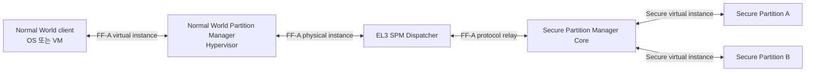
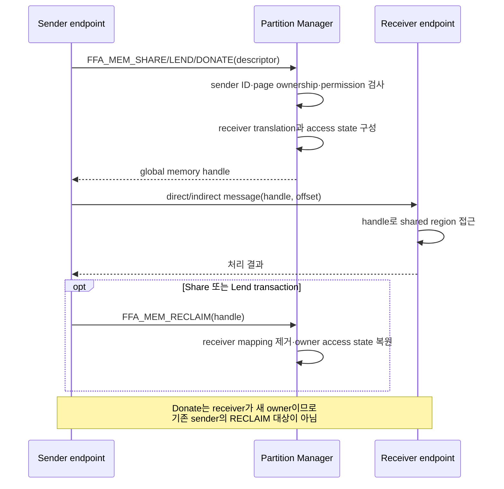

# FF-A란 무엇인가

- 조사일: 2026-08-18
- 기준: Arm DEN0077/DEN0140, Trusted Firmware-A와 Linux 공식 문서, 현재 저장소의 FF-A 1.2 구현

FF-A는 **Firmware Framework for Arm A-profile**의 약자다. Arm A-profile 시스템에서 서로
격리된 Normal World VM과 Secure World의 Secure Partition이 서비스를 발견하고, 메시지를
교환하며, memory ownership과 access permission을 안전하게 전환하기 위한 표준 소프트웨어
아키텍처와 ABI(Application Binary Interface)다.

Arm은 FF-A를 A-profile secure application을 위한 표준 programming environment로 정의한다.
FF-A의 core specification은 DEN0077이고, memory ownership과 access 전환의 세부 protocol은
DEN0140 supplement가 정의한다. 이 문서는 현재 저장소가 사용하는 FF-A 1.2 개념을 기준으로
정리한다.

## 1. FF-A가 필요한 이유

TrustZone은 CPU와 메모리를 Secure/Non-secure state로 나눌 수 있지만, 다음과 같은
소프트웨어 계약까지 자동으로 제공하지는 않는다.

- Normal World client가 어떤 Secure service를 어디서 찾는가?
- 서로 다른 vendor의 Secure service를 어떻게 독립된 sandbox로 격리하는가?
- VM 또는 Secure Partition을 어떤 ID로 식별하는가?
- request와 response를 어떤 register 또는 buffer 형식으로 교환하는가?
- 한 partition의 memory page를 다른 partition에 share, lend 또는 donate할 때 누가
  ownership과 mapping을 검사하는가?
- Secure service가 block, yield, resume될 때 execution context를 누가 관리하는가?

FF-A는 이 문제를 vendor별 private SMC protocol 대신 공통 ABI로 해결한다. Arm의 FF-A
Architecture Compliance Suite 설명도 FF-A의 핵심 목표를 vendor software image 격리와
Normal/Secure World 사이 communication interface 표준화로 정리한다.



## 2. FF-A가 아닌 것

FF-A의 역할을 이해하려면 다음 기술과 구분해야 한다.

| 기술 | 역할 | FF-A와의 관계 |
|---|---|---|
| Arm TrustZone | CPU security state, Secure/Non-secure memory와 exception routing 제공 | FF-A가 동작할 수 있는 hardware isolation 기반 |
| SMCCC | SMC/HVC function ID와 register calling convention 정의 | FF-A ABI가 register를 전달할 때 사용하는 하위 calling convention |
| TF-A | EL3 Secure Monitor와 SPMD 등의 reference implementation | FF-A를 실제로 routing하는 구현체 중 하나 |
| OP-TEE | Trusted OS, TEE core와 TA 실행 환경 제공 | FF-A endpoint 또는 SPMC 역할로 secure service 제공 가능 |
| GlobalPlatform TEE Client API | `TEEC_OpenSession()`, `TEEC_InvokeCommand()` 같은 application API | Linux OP-TEE driver가 high-level TEEC operation을 FF-A message와 shared memory로 변환 |
| pKVM | Normal World의 protected VM과 Stage-2 memory를 관리하는 hypervisor | guest에 virtual FF-A instance를 제공하고 guest request를 검증·중계 |

FF-A는 payload를 자동으로 암호화하는 protocol이 아니며 TrustZone이나 pKVM을 대신하지
않는다. FF-A는 identity, message, scheduling과 memory-transfer 규칙을 표준화하고, 실제
isolation은 Hypervisor, SPMC, Stage-2 page table과 platform hardware가 집행한다.

## 3. 핵심 구성요소

### Partition과 endpoint

Partition은 격리된 software execution environment다. Normal World의 VM과 Secure World의
Secure Partition(SP)이 대표적인 partition이다. FF-A message를 보내거나 받는 주소 단위를
endpoint라고 하며, 많은 문맥에서 partition과 endpoint를 같은 의미로 사용한다.

각 endpoint는 FF-A ID를 가진다. request header의 source/destination ID를 통해 partition
manager가 caller spoofing을 검사하고 message를 올바른 receiver로 전달한다. service는 UUID를
manifest에 공개할 수 있고 client는 partition discovery ABI로 해당 service의 endpoint와
capability를 찾는다.

### Partition Manager, SPMC와 SPMD

- Normal World에서는 OS kernel 또는 Hypervisor가 VM의 Partition Manager 역할을 한다.
- Secure World에서는 SPMC(Secure Partition Manager Core)가 Secure Partition의 lifecycle,
  execution context, message와 memory access를 관리한다.
- SPMD(Secure Partition Manager Dispatcher)는 EL3에 위치하며 Normal World에서 들어온
  FF-A protocol을 SPMC로 relay한다.

TF-A 공식 문서는 SPMD가 EL3에서 Normal World의 Hypervisor 또는 OS kernel과 SPMC 사이의
FF-A protocol을 중계하며, SPMC는 build configuration에 따라 S-EL1, S-EL2 또는 EL3에 놓일
수 있다고 설명한다. 현재 Phase 06-B 구성은 EL3 TF-A SPMD와 S-EL1 OP-TEE SPMC를 사용한다.

### FF-A instance

FF-A instance는 exception-level boundary에서 마주 보는 두 FF-A component의 interface다.

| instance | 일반적인 경계 | 현재 Phase 06-B 대응 |
|---|---|---|
| Non-secure virtual instance | guest VM ↔ Normal World Hypervisor | guest Linux ↔ pKVM EL2 |
| Non-secure physical instance | Hypervisor/OS ↔ EL3 SPMD | pKVM EL2 ↔ TF-A SPMD |
| Secure physical instance | EL3 SPMD ↔ SPMC | TF-A SPMD ↔ S-EL1 OP-TEE SPMC |
| Secure virtual instance | SPMC ↔ Secure Partition | 구성에 따라 OP-TEE가 secure endpoint를 관리하는 내부 경계 |

### Conduit

Conduit는 FF-A ABI invocation이 exception-level boundary를 넘는 instruction 경로다.

- `HVC`: EL1 guest가 EL2 Hypervisor의 virtual FF-A instance를 호출
- `SMC`: Normal World Hypervisor 또는 OS가 EL3의 physical FF-A instance를 호출
- `SVC`: 일부 동일 security-state의 lower-EL software가 상위 component를 호출하는 구성
- `ERET`: 상위 exception level의 manager가 lower-EL endpoint에 request나 response를 전달

FF-A는 SMCCC의 register convention 위에서 이 conduit들을 조합한다. 이 프로젝트의 guest
TA 요청은 `HVC → pKVM EL2 → SMC → TF-A SPMD → OP-TEE SPMC` 순서다.

## 4. FF-A가 제공하는 기능

### 초기화와 discovery

| ABI | 목적 |
|---|---|
| `FFA_VERSION` | 양쪽 FF-A component가 지원 version을 협상 |
| `FFA_FEATURES` | 특정 ABI와 optional feature 지원 여부 조회 |
| `FFA_ID_GET` | caller 자신의 endpoint ID 조회 |
| `FFA_PARTITION_INFO_GET` | UUID에 맞는 service partition, endpoint와 property 발견 |
| `FFA_RXTX_MAP` / `FFA_RXTX_UNMAP` | indirect message와 memory descriptor용 RX/TX mailbox 등록·해제 |
| `FFA_RX_RELEASE` | receiver가 RX buffer ownership 반환 |

FF-A specification은 다른 FF-A ABI보다 먼저 `FFA_VERSION`을 협상하도록 요구한다. Linux
ARM FF-A driver도 version, endpoint ID, feature, RX/TX buffer와 partition discovery 순서로
transport를 초기화한다.

### Direct messaging

Direct messaging은 sender가 request와 함께 receiver에 execution control을 넘기고 response가
돌아올 때까지 block하는 synchronous call 방식이다. 함수 호출과 비슷하며
`FFA_MSG_SEND_DIRECT_REQ`/`FFA_MSG_SEND_DIRECT_RESP`가 대표 ABI다.

message header와 작은 payload는 general-purpose register에 놓을 수 있다. 현재 OP-TEE FF-A
ABI는 register에 OP-TEE call type, shared-memory handle과 offset을 싣고, 큰 command parameter와
4 KiB AES buffer는 shared memory에서 찾는다.

### Indirect messaging

Indirect messaging은 sender의 TX buffer에서 receiver의 RX buffer로 message를 전달하고,
receiver scheduling을 message 전달과 분리하는 방식이다. direct call처럼 sender가 receiver
response를 같은 call chain에서 기다릴 필요가 없다. `FFA_MSG_SEND2`, RX/TX mailbox,
notification과 scheduling ABI가 조합될 수 있다.

현재 Phase 06-B의 OP-TEE AES request는 direct messaging을 중심으로 사용하며, RX/TX buffer는
partition discovery와 FF-A memory descriptor 전달에도 사용한다.

### Scheduling과 notification

FF-A는 `FFA_RUN`, `FFA_YIELD`, `FFA_MSG_WAIT` 등을 통해 execution context의 run/wait/yield
전환을 표현한다. notification ABI는 receiver에 pending event가 있음을 알리는 doorbell 역할을
한다. 이 기능은 interrupt와 scheduler가 서로 다른 exception level과 partition에 있을 때
공통 runtime model을 제공한다.

## 5. Memory management protocol

FF-A memory transaction은 data를 반드시 복사하는 API가 아니다. sender가 physical memory
region의 constituent page, receiver, permission과 attribute를 descriptor로 제공하면 partition
manager가 translation과 ownership state를 검사·변경하고 global memory handle을 반환한다.

| transaction | ownership/access 의미 | 일반적인 용도 |
|---|---|---|
| Share | owner가 ownership과 access를 유지하면서 receiver에도 동시 access 허용 | Normal/Secure component가 같은 buffer를 함께 사용 |
| Lend | owner는 ownership을 유지하지만 transaction 동안 access를 포기하고 borrower에 access 부여 | 한 시점에 borrower만 사용하는 temporary buffer |
| Donate | ownership 자체를 receiver로 이전 | receiver가 새 owner가 되는 영구적 또는 장기 이전 |
| Reclaim | share/lend가 끝난 뒤 borrower access를 제거하고 owner 상태 복원 | call 종료와 buffer 회수 |

Memory management supplement는 Hypervisor, SPMC와 endpoint마다 physical memory region에 대한
ownership/access attribute가 있으며, EL2 Hypervisor가 Normal World VM의 Stage-2 translation을,
SPMC가 Secure Partition의 translation을 관리하는 model을 정의한다.



이 프로젝트에서는 pKVM이 guest의 IPA constituent를 PA로 번역하고 guest PTE를
`PKVM_PAGE_SHARED_OWNED`로 전환한 뒤 Secure World에 handle을 전달한다. Host Stage-2 mapping을
만들지 않으므로 guest/Secure World share가 guest/Host share로 바뀌지 않는다.

## 6. 이 프로젝트에서 FF-A와 OP-TEE가 연결되는 방식

```text
optee_example_aes
  → GlobalPlatform libteec
  → guest Linux TEE core
  → guest OP-TEE FF-A driver
  → Linux ARM FF-A driver
  → HVC: pKVM virtual FF-A instance
  → SMC: TF-A SPMD
  → OP-TEE SPMC logical partition
  → OP-TEE core
  → AES TA
```

OP-TEE AES TA 자체가 FF-A ABI를 직접 호출하는 것은 아니다. application의 TEEC command를
guest Linux OP-TEE driver가 OP-TEE message 형식으로 만들고, ARM FF-A driver가 이를 FF-A
memory transaction과 direct request로 운반한다. OP-TEE SPMC는 FF-A `sender_id`로 Host 또는
pVM context를 선택한 뒤 기존 OP-TEE core와 TA entry point로 dispatch한다.

따라서 FF-A는 이 구조에서 다음 세 역할을 한다.

1. guest와 OP-TEE service endpoint를 식별하고 발견한다.
2. pVM별 source ID를 유지해 Host와 다른 pVM의 session context를 분리한다.
3. OP-TEE command와 AES memref page를 message와 memory handle로 안전하게 전달·회수한다.

구체적인 구현 경로는 [FF-A guest 직접 요청 경로](./FFA-GUEST-DIRECT-PATH.md), Host와 guest
함수 비교는 [OP-TEE AES 코드 흐름](./OPTEE-AES-CODE-FLOW.md)을 참조한다.

## 7. 보안상 의미와 한계

FF-A를 사용한다는 사실만으로 confidentiality가 자동 보장되지는 않는다.

- Hypervisor와 SPMC가 endpoint ID, descriptor, permission과 ownership transition을 올바르게
  검증해야 한다.
- platform Stage-2 page table과 memory controller가 access policy를 실제로 집행해야 한다.
- message payload를 console, shared I/O 또는 다른 explicit Host-shared page에 복사하면 그
  channel에서는 Host가 내용을 볼 수 있다.
- side channel, timing, page 수, lifecycle 같은 metadata는 별도 threat model이 필요하다.
- QEMU process가 전체 machine을 emulate하는 현재 PoC는 실제 hardware 공격자 model의
  confidentiality 증명이 아니다.

FF-A ACS는 specification invariant를 검사하는 functional compliance suite이지만, Arm도 이를
design verification의 대체물로 보지 않는다. 이 Phase의 성공 marker 역시 현재 구현 경로의
기능과 일부 isolation boundary를 확인한 것이며 제품 전체 보안 인증을 의미하지 않는다.

## 8. 공식 자료

- [Arm Firmware Framework for Arm A-profile, DEN0077](https://developer.arm.com/documentation/den0077/latest/)
  — FF-A base architecture, endpoint, instance, conduit, discovery, messaging과 runtime model
- [Arm FF-A Memory Management Protocol, DEN0140](https://documentation-service.arm.com/static/65819a29159ca73387224b7e)
  — ownership/access attribute와 share·lend·donate·reclaim protocol
- [Arm Platform Security: Firmware Framework for A](https://www.arm.com/architecture/security-features/platform-security)
  — FF-A의 목적과 Arm platform security specification 체계
- [Trusted Firmware-A Secure Partition Manager](https://trustedfirmware-a.readthedocs.io/en/lts-v2.12.14/components/secure-partition-manager.html)
  — EL3 SPMD와 S-EL1/S-EL2 SPMC reference architecture
- [Linux Kernel TS-TEE documentation](https://docs.kernel.org/tee/ts-tee.html)
  — Linux TEE subsystem 위에서 FF-A Secure Partition service를 사용하는 사례
- [Arm FF-A Architecture Compliance Suite](https://github.com/ARM-software/ff-a-acs)
  — FF-A implementation의 functional invariant를 검사하는 official compliance suite
