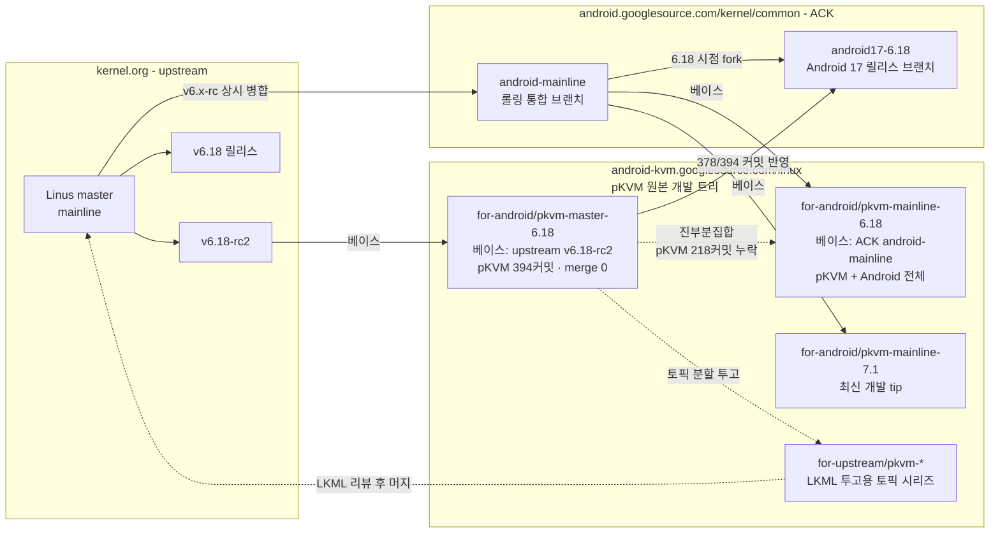

# Android Common Kernel pKVM 패치의 베이스 커널 버전 조사

- 조사일: 2026-08-06
- 목적: Android AVF가 사용하는 Android Common Kernel(ACK)의 pKVM 패치를 upstream Linux kernel에 머지하기 위해, 해당 패치들이 어떤 Linux 버전을 베이스로 하고 있는지 확인
- 조사 방법: `android.googlesource.com/kernel/common` 및 `android-kvm.googlesource.com/linux` 저장소의 브랜치/태그 목록과 각 브랜치의 `Makefile` 버전 변수 직접 확인

---

## 1. 결론 요약

ACK의 pKVM 패치는 **ACK 브랜치별 LTS 버전**을 베이스로 한다. 그러나 upstream 머지 작업의 소스로 사용해야 할 것은 ACK가 아니라, **`android-kvm.googlesource.com/linux`의 mainline 리베이스 브랜치**다.

- 현재 최신 통합 브랜치: `for-android/pkvm-mainline-7.1` (Makefile v7.1.0)
- ACK(`kernel/common`)는 pKVM 개발의 원본 트리가 아니라 **하류(downstream) 배포처**다.
- **주의**: `pkvm-mainline-<VER>`는 순수 mainline 위 리베이스가 아니라 ACK `android-mainline` 스냅샷이다. 이름이 헷갈리기 쉽다.
- 6.18 소스는 **`pkvm-mainline-6.18`을 기준으로 삼고 `pkvm-master-6.18`은 추출 보조로 쓴다.** master는 pKVM 커밋 218개가 누락된 진부분집합이다. 2-4절과 6.1절 참조.
- **타깃 커널 버전은 6.18로 결정했다.** 근거는 5장 참조.

---

## 2. pKVM 개발 트리 구조

### 2-1. 저장소와 브랜치의 관계



읽는 법이다.

- **왼쪽이 상류, 오른쪽이 하류다.** upstream에서 출발해 pKVM 개발 트리를 거쳐 ACK 릴리스 브랜치로 흘러간다.
- **`master`와 `mainline`은 베이스 트리 이름이다.** `pkvm-master-*`는 Linus의 `master`를, `pkvm-mainline-*`는 ACK의 `android-mainline`을 베이스로 한다. 헷갈리기 쉬운 지점이다.
- **실선은 실측으로 확인한 관계다.** 커밋 수치는 2-4절 조사 결과다.
- **점선은 포함 관계 또는 투고 경로다.** `for-upstream/pkvm-*`에서 LKML을 거쳐 mainline에 반영되는 흐름은 AOSP·LKML 공개 절차 기준이며 커밋 단위로 대조하지는 않았다.
- 폐기된 `for-android16/*` 네임스페이스는 생략했다. 2-3절 참조.

### 2-2. 브랜치 계열

pKVM의 원본 개발은 `android-kvm.googlesource.com/linux`에서 이루어지며, 세 갈래로 관리된다.

| 브랜치 계열 | 용도 | 베이스 |
|---|---|---|
| `for-upstream/pkvm-*` | LKML 투고용 토픽 시리즈 (core, modules, smmu-v3, tracing, pviommu, dev-assign, sme, kcov 등 약 25개) | 투고 당시 mainline |
| `for-android/pkvm-master-<VER>` | **순수 pKVM 패치 스택**. Android 범용 코드 없음 | upstream(Linus) `master`, v`<VER>`-rc2 |
| `for-android/pkvm-mainline-<VER>` | ACK `android-mainline` 스냅샷 **위에** 얹은 pKVM 스택 | ACK `android-mainline` (Makefile v`<VER>`) |
| `for-android<NN>/pkvm-*` | 특정 ACK 릴리스를 타깃으로 한 백포트 (**구 방식, 폐기**) | 해당 ACK 포크 지점 |

브랜치 이름의 `master`와 `mainline`은 **베이스 트리를 가리키는 말**이다. `master`는 Linus의 `master`(upstream), `mainline`은 ACK의 `android-mainline`이다. 이름이 헷갈리기 쉬우니 주의한다. 상세 비교는 2-4절 참조.

`for-android<NN>/` 네임스페이스는 더 이상 쓰이지 않는다. 2-3절 참조.

LKML은 **L**inux **K**ernel **M**ailing **L**ist의 약자다. 커널 개발의 주 메일링 리스트이며, 모든 패치가 여기에 게시되어 리뷰를 거친다. 주소는 `linux-kernel@vger.kernel.org`다. pKVM처럼 arm64 KVM 영역은 `kvmarm@lists.linux.dev`와 `linux-arm-kernel@lists.infradead.org`에도 함께 보낸다.

### 2-3. `for-android17/pkvm-*` 브랜치가 없는 이유

조사일 2026-08-07. `git ls-remote --heads`로 두 저장소를 전수 확인했다.

`for-android17/` 네임스페이스는 **존재하지 않는다**. 오타나 권한 문제가 아니다. `for-android15/`도 마찬가지로 없다. 이 네임스페이스가 있는 것은 `for-android14-6.1/`(1개)과 `for-android16/`(27개, 2024-10-15 이후 동결)뿐이다.

ACK(`kernel/common`)에는 `android17-6.18`과 그 파생 브랜치가 정상 존재한다. **Android 17의 브랜치 컷은 완료되었고, pKVM 개발 저장소의 명명 규칙만 바뀐 것**이다.

원인은 두 가지다.

1. **버전 키가 Android 릴리스 번호에서 커널 버전 번호로 바뀌었다.** `for-android16/<토픽>` 방식이 `for-android/pkvm-<종류>-<커널버전>` 방식으로 대체되었다. Android 17에 해당하는 브랜치는 `-6.18` 접미사가 붙은 것들이다.
2. **토픽 분할이 브랜치에서 태그로 옮겨갔다.** `for-android16/`의 27개 토픽 브랜치가 하던 역할을 `pkvm-<VER>-<토픽>` 태그(7.1 기준 약 40개)가 대신한다. 새 네임스페이스를 팔 이유가 사라졌다.

따라서 Android 17 = 커널 6.18에 해당하는 브랜치는 다음 둘이다. 차이는 2-4절에서 다룬다.

- `for-android/pkvm-master-6.18` — `for-android16/pkvm-integration`의 후계
- `for-android/pkvm-mainline-6.18` — `for-android/pkvm-mainline-6.12`의 후계

`for-android/pkvm-master-6.18-protected`(protected guest), `-smmu`(SMMUv3) 파생 브랜치도 있다.

### 2-4. `pkvm-master-6.18`과 `pkvm-mainline-6.18`의 차이

- 조사일: 2026-08-07
- 조사 방법: `git fetch --filter=tree:0 --depth=3000`으로 세 브랜치를 실제로 받아 커밋 그래프 직접 분석

#### 실측 비교표

| 항목 | `for-android/pkvm-master-6.18` | `for-android/pkvm-mainline-6.18` |
|---|---|---|
| 베이스 트리 | **upstream Linus `master`** | **ACK `android-mainline`** |
| 베이스 커밋 | `211ddde0823` = **Linux 6.18-rc2** | android-mainline (6.19 머지윈도 시점) |
| Makefile 버전 | `6.18.0-rc2` | `6.18.0` |
| 베이스 이후 커밋 수 | **394** | **3533** |
| merge 커밋 | **0** | 1188 |
| `into android-mainline` 병합 | **0** | **1141** |
| ACK 전용 코드 (`GKI`/`INCFS`/`OWNERS`/`ashmem` 등) | **없음** | 158개 커밋 |
| 최종 커밋 | 2025-11-05 | 2026-04-13 |

#### `pkvm-master-6.18` = 순수 pKVM 패치 스택

394개 커밋의 접두사 분포다. 전부 pKVM 또는 그 주변 기능이다.

| 접두사 | 수 |
|---|---|
| `ANDROID: KVM:` | 343 |
| `ANDROID:` (비 KVM) | 17 |
| `KVM:` | 13 |
| `FROMLIST:` 계열 | 13 |
| `ANDROID: BACKPORT: KVM:` | 4 |
| 기타 (`SQUASH:`, `BACKPORT:` 등) | 4 |

비 KVM `ANDROID:` 17개도 모두 pKVM 종속 기능이다. virtio-balloon(메모리 릴린퀴시), ring-buffer(hyp tracing), kallsyms/modpost(EL2 모듈 심볼), MMIO guard, pKVM용 pl011 예제 드라이버 등이다. GKI·ashmem·incfs 같은 Android 범용 코드는 **한 건도 없다**.

merge 커밋이 0이라는 점도 중요하다. v6.18-rc2 위에 선형으로 쌓인 패치 시리즈이므로 `git format-patch`로 그대로 뽑아낼 수 있다.

#### `pkvm-mainline-6.18` = android-mainline 스냅샷

`android-mainline`은 ACK가 upstream mainline을 상시 추종하며 Android 패치를 얹는 롤링 브랜치다. `pkvm-mainline-6.18`은 그 위에 pKVM 스택을 올린 것이다.

- `Merge tag 'v6.17-rc5' into android-mainline` 형태의 병합이 1141개 있다.
- `Merge tag 'vfs-6.19-rc1.*'` 등 6.19 머지윈도 내용까지 포함한다. Makefile이 아직 `6.18.0`인 이유는 Linus가 `-rc1` 태그를 찍을 때 버전을 올리기 때문이다. 즉 이 브랜치는 **v6.18 릴리스보다 뒤**에 있다.
- `ANDROID: GKI:` 147개, `ANDROID: INCFS:`, `ANDROID: OWNERS:`, ashmem 관련 등 pKVM과 무관한 ACK 코드가 섞여 있다.

#### 포함 관계

`pkvm-master-6.18`의 394개 커밋 중 **391개(99%)가 `pkvm-mainline-6.18`에도 존재한다** (접두사 정규화 후 비교). 즉 master는 mainline에서 pKVM 부분만 떼어낸 부분집합에 가깝다.

ACK 반영도 확인했다. `kernel/common`의 `android17-6.18`을 받아 대조한 결과 **394개 중 378개(96%)가 ACK에 그대로 들어가 있다.** `pkvm-master-6.18`이 Android 17로 흘러가는 실제 경로임이 확인된다.

참고로 `pkvm-mainline-7.1`과의 정규화 일치는 238개(60%)다. 나머지는 upstream 반영 과정에서 제목이 바뀌었거나 재작성된 것으로 보인다.

#### master는 mainline의 진부분집합이다 (중요)

pKVM 계열 커밋(`ANDROID: KVM:`, `ANDROID: BACKPORT: KVM:`, `ANDROID: ARM64:`)만 추려 양방향으로 비교했다.

| 구분 | 개수 |
|---|---|
| `pkvm-mainline-6.18`의 pKVM 계열 | 566 |
| `pkvm-master-6.18`의 pKVM 계열 | 348 |
| **mainline에만 있는 것** | **218** |
| master에만 있는 것 | **0** |

**master에만 있는 커밋은 하나도 없다.** 즉 `pkvm-master-6.18`은 깨끗하지만 **불완전하다**. 2025-11-05에 갱신이 멈춘 스냅샷이라 이후 작업이 통째로 빠져 있다.

빠진 218개는 특정 기능 영역에 몰려 있다.

- device assignment (`Add arch function for device assignment`, `Add HVC to donate/reclaim assignable MMIO`)
- pvIOMMU (`Add documentation for pvIOMMU UAPI`, `Add extra IOMMU idmap callbacks`)
- DMA-BUF 기반 pVM 메모리 (`Accept DMA-BUF mappings to back pVMs`)
- guest share/unshare 하이퍼콜의 range 확장
- defconfig (`gki_defconfig`, `microdroid_defconfig`의 PKVM guest driver 활성화)

따라서 **머지 대상 목록을 master만 보고 확정하면 안 된다.**

#### 용도 구분

| 목적 | 사용할 브랜치 | 근거 |
|---|---|---|
| 머지 대상 **전체 목록 확정** | `pkvm-mainline-6.18` | pKVM 계열 566개 전량 보유. master는 218개 누락 |
| 패치 시리즈 **초안 추출** | `pkvm-master-6.18` | v6.18-rc2 위 선형 394커밋, merge 0. `git format-patch` 직행 가능 |
| ACK/GKI 통합 환경 빌드·검증 | `pkvm-mainline-6.18` | ACK `android17-6.18`과 사실상 동일 구성 |
| 최신 pKVM 개발 현황 추적 | `pkvm-mainline-7.1` | 2026-07-31 tip. 가장 활발 |

권장 순서는 이렇다. `pkvm-mainline-6.18`에서 머지 대상 목록을 확정하고, 그중 `pkvm-master-6.18`에 있는 348개는 선형 시리즈로 그대로 뽑는다. 나머지 218개는 `pkvm-mainline-6.18`에서 개별 cherry-pick 한다.

`pkvm-master-<VER>` 계열은 6.17과 6.18에만 존재하고 7.1용은 없다. 이 계열이 계속 유지될지는 확인되지 않았으므로 의존도를 낮춰 두는 편이 안전하다.

### 2-5. 커밋 태그로 본 출처 구분

ACK에 반영된 pKVM 커밋은 다음 접두사로 출처가 구분된다.

- `UPSTREAM:` / `BACKPORT:` — 이미 mainline에 있는 커밋
- `FROMGIT:` / `FROMLIST:` — maintainer tree 또는 메일링 리스트 게시분
- `ANDROID:` — **순수 out-of-tree 패치** (실제 머지 대상)

`for-android/pkvm-mainline-7.1`의 최근 100 커밋 기준으로 `ANDROID:` 접두사 커밋은 약 45~50%를 차지한다.

---

## 3. 버전 매핑표

각 브랜치의 `Makefile` VERSION/PATCHLEVEL/SUBLEVEL 값을 직접 확인한 결과다.

| Android | ACK 브랜치 | ACK 커널 버전 | 대응 pKVM 개발 브랜치 | 확인된 베이스 |
|---|---|---|---|---|
| 14 | `android14-6.1` | 6.1.x | `for-android14-6.1/pkvm` | v6.1 |
| 15 | `android15-6.6` | 6.6.x | `pkvm-integration-6.6`, `dmitriyf/pkvm-android15-6.6` | v6.6 |
| 16 | `android16-6.12` | **6.12.90** | `for-android16/pkvm-integration` 외 16개 토픽 | **v6.12.0-rc2** |
| 17 | `android17-6.18` | **6.18.32** | `for-android/pkvm-master-6.18` | **v6.18.0-rc2** (upstream `master`) |
| 17 | `android17-6.18` | **6.18.32** | `for-android/pkvm-mainline-6.18` | **v6.18.0** (ACK `android-mainline`) |
| (개발 최신) | — | — | **`for-android/pkvm-mainline-7.1`** | **v7.1.0** (ACK `android-mainline`, tip: 2026-07-31) |

`확인된 베이스`는 `Makefile` 값이다. 같은 `6.18`이라도 `pkvm-master-6.18`은 upstream 트리, `pkvm-mainline-6.18`은 ACK `android-mainline` 트리 위에 있다. 2-4절 참조.

### 참고: kernel.org 현황 (2026-08-06 기준)

| 구분 | 버전 | 릴리스일 |
|---|---|---|
| mainline | 7.2-rc6 | 2026-08-02 |
| stable | 7.1.6 | 2026-08-03 |
| longterm | 6.18.42 | 2026-08-03 |
| longterm | 6.12.101 | 2026-08-03 |
| longterm | 6.6.148 | 2026-08-03 |
| longterm | 6.1.180 | 2026-07-30 |

---

## 4. 대상 커널 버전의 유지보수 기간

- 조사일: 2026-08-07
- 출처: kernel.org Releases 페이지, Greg Kroah-Hartman의 2026-02-25 LTS 연장 발표

### 4.1 요약표

| 버전 | 구분 | 릴리스일 | 유지보수 종료(EOL) | 총 유지보수 기간 | 잔여 기간 |
|---|---|---|---|---|---|
| **6.12** | longterm (LTS) | 2024-11-17 | **2028년 12월** | 약 4년 | 약 2년 4개월 |
| **6.18** | longterm (LTS) | 2025-11-30 | **2028년 12월** | 약 3년 | 약 2년 4개월 |
| **7.1** | stable (비 LTS) | 2026-06-14 | **7.2 릴리스 직후 (2026년 8월 예상)** | 약 2~3개월 | 수 주 |

### 4.2 버전별 상세

#### 6.12 (LTS)

- 25번째 LTS 릴리스. 최신 릴리스는 6.12.101 (2026-08-03).
- 당초 EOL은 2026년 12월이었으나 2026-02-25 발표로 **2년 연장**되어 2028년 12월이 되었다.
- 연장 근거: PREEMPT_RT 정식 반영, Debian 13(Trixie)과 RHEL 10의 베이스, Raspberry Pi 5 지원.
- CIP(Civil Infrastructure Platform)의 SLTS 대상이다. `6.12-cip`는 **2035년 중반까지** 유지된다.
- Android 16의 ACK(`android16-6.12`) 베이스이기도 하다.

#### 6.18 (LTS)

- 26번째 LTS 릴리스. 최신 릴리스는 6.18.43 (2026-08-06).
- 2026-02-25 발표에서 "최소 3년" 유지로 확정되어 EOL은 2028년 12월이다.
- Android 17의 ACK(`android17-6.18`) 베이스다.
- 아직 CIP SLTS 대상으로 지정되지 않았다.

#### 7.1 (stable, 비 LTS)

- 정규 stable 릴리스이며 **LTS가 아니다**. 최신 릴리스는 7.1.7 (2026-08-06).
- 정규 stable은 다음 메이저 버전이 나오면 곧바로 EOL 처리된다.
- 직전 사례: 7.0은 2026-04-12 릴리스 후 2026-06-27 EOL. 유지 기간 약 2.5개월.
- 현재 7.2-rc6(2026-08-02)까지 진행되었다. 7.2 정식 릴리스 후 7.1도 수 주 내 EOL 예상.

#### 참고: CIP SLTS란

CIP(Civil Infrastructure Platform)는 Linux Foundation 산하 프로젝트다. 발전소, 철도, 산업 제어 등 수명이 수십 년인 인프라 설비를 대상으로 한다. 이런 설비는 커널 LTS 주기(3~6년)보다 훨씬 오래 가동된다.

SLTS(Super Long Term Support)는 CIP가 선정한 커널을 **최소 10년** 유지하는 프로그램이다. kernel.org의 upstream 지원이 끝난 뒤에도 CIP가 자체적으로 보안 패치와 버그 수정을 이어받는다.

- 현재 SLTS 대상: 4.19, 5.10, 6.1, 6.12 (5개 계열)
- `6.12-cip`는 2035년 중반까지 유지 예정
- upstream LTS와 별개의 브랜치다. 신규 기능은 받지 않고 수정만 반영한다
- 모든 LTS가 SLTS가 되지는 않는다. CIP가 선별한다

정리하면 6.12는 **2028년 12월까지 upstream 커뮤니티(Greg KH) 지원 → 이후 2035년까지 CIP 지원** 구조다.

### 4.3 2026-02-25 LTS 연장 발표 전문 요약

Greg Kroah-Hartman이 여러 기업 및 stable 메인테이너와의 논의를 거쳐 유지보수 기간을 갱신했다.

| 버전 | 확정 유지 기간 | EOL |
|---|---|---|
| 5.10 | 6년 | 2026년 12월 |
| 5.15 | 5년 | 2026년 12월 |
| 6.1 | — | 2027년 12월 |
| 6.6 | 4년 | 2027년 12월 |
| 6.12 | 4년 | 2028년 12월 |
| 6.18 | 최소 3년 | 2028년 12월 |

EOL 날짜는 확정된 것이 아니다. 산업계 수요와 메인테이너 여력에 따라 추가 연장될 수 있다.

### 4.4 pKVM 머지 관점의 시사점

1. **7.1은 제품 타깃으로 부적합하다.** 유지보수 기간이 사실상 남아 있지 않다. `for-android/pkvm-mainline-7.1`은 개발/리베이스 기준선으로만 활용하고, 실제 머지 타깃은 mainline(7.2 이후) 또는 LTS로 잡아야 한다.
2. **장기 제품 타깃은 6.12 또는 6.18이다.** 두 버전의 EOL이 2028년 12월로 동일하다. 따라서 신규 진입이라면 코드베이스가 1년 더 새로운 **6.18을 권장한다**.
3. **초장기 유지가 필요하면 6.12다.** CIP SLTS로 2035년까지 커버되는 유일한 후보다. 다만 upstream 커뮤니티 지원은 2028년 12월에 끝나고 이후는 CIP 범위다.
4. **upstream 머지 자체는 mainline을 타깃해야 한다.** LTS 브랜치는 신규 기능을 받지 않는다. mainline 반영 후 필요 시 백포트하는 순서가 맞다.

---

## 5. 결정: 타깃 커널 버전은 6.18

- 결정일: 2026-08-07
- **결정: 6.18을 타깃 커널 버전으로 채택한다.**

### 5.1 후보 비교

| 항목 | 6.12 | 6.18 |
|---|---|---|
| pKVM 패치 존재 | 있음 (`for-android16/pkvm-integration`) | 있음 (`for-android/pkvm-mainline-6.18`) |
| 유지보수 종료 | 2028년 12월 | 2028년 12월 |
| 대응 Android | Android 16 (`android16-6.12`) | Android 17 (`android17-6.18`) |
| 릴리스일 | 2024-11-17 | 2025-11-30 |

### 5.2 결정 근거

1. **양쪽 모두 pKVM 패치가 존재한다.** 6.12와 6.18 각각에 대응하는 pKVM 개발 브랜치가 갖춰져 있다. 패치 가용성 측면에서는 두 후보가 동등하다.
2. **유지보수 기간이 동일하다.** 두 버전 모두 upstream EOL이 2028년 12월이다. 6.12를 선택해도 지원 기간상 이득이 없다.
3. **Android 17이 6.18을 사용한다.** 최신 Android 릴리스와 커널 버전을 맞추는 편이 ACK 대응과 향후 추적에 유리하다.

따라서 유지보수 기간이 같은 조건에서 더 새로운 코드베이스이자 최신 Android가 채택한 **6.18**을 선택한다.

### 5.3 결정에 따른 후속 사항

- 소스 브랜치는 **용도별로 나눠 쓴다**. 머지 대상 목록 확정과 검증은 `for-android/pkvm-mainline-6.18`, 패치 시리즈 초안 추출은 `for-android/pkvm-master-6.18`이다. 6.1절 참조.
- 6.12는 대상에서 제외한다. CIP SLTS(2035년)가 필요한 요건이 새로 생기면 재검토한다.
- 7.1은 유지보수 기간이 사실상 없어 제품 타깃에서 제외한다. 개발/리베이스 기준선으로만 참고한다.

---

## 6. 머지 전략 권고

### 6.1 타깃 커널 버전별 소스 선택

타깃은 5장 결정에 따라 **LTS 6.18**이다. 6.18 소스는 단일 브랜치가 아니라 **역할별로 두 개를 나눠 쓴다.**

| 역할 | 사용할 브랜치 | 근거 |
|---|---|---|
| **① 머지 대상 목록 확정 (기준 트리)** | **`for-android/pkvm-mainline-6.18`** | pKVM 계열 커밋 566개 전량 보유. 2026-04-13까지 갱신 |
| **② 패치 시리즈 초안 추출** | **`for-android/pkvm-master-6.18`** | v6.18-rc2 위 선형 394커밋, merge 0. `git format-patch` 직행 |
| ③ ACK/GKI 환경 빌드·검증 | `for-android/pkvm-mainline-6.18` | ACK `android17-6.18`과 사실상 동일 구성 |
| ④ 최신 개발 현황 대조 | `for-android/pkvm-mainline-7.1` | 2026-07-31 tip |

#### 두 브랜치를 나눠 쓰는 이유

**mainline이 기준인 이유**는 완전성이다. `pkvm-master-6.18`은 2025-11-05에 멈춘 스냅샷이라 pKVM 계열 566개 중 348개만 갖고 있다. **218개가 누락**되어 있으며 device assignment, pvIOMMU, DMA-BUF 기반 pVM 메모리 등 통째로 빠진 기능 영역이 있다. 반대로 master에만 있는 커밋은 0개다. 목록 확정을 master로 하면 기능이 누락된다. 상세는 2-4절이다.

**master를 함께 쓰는 이유**는 추출 편의다. `pkvm-mainline-6.18`은 ACK `android-mainline` 스냅샷이라 GKI·ashmem·incfs 등 pKVM과 무관한 커밋이 대량으로 섞여 있다(v6.18 이후 3533커밋, merge 1188개). 여기서 pKVM만 골라내는 작업이 만만치 않다. `pkvm-master-6.18`은 그 선별을 이미 끝내 둔 결과물이라 348개를 그대로 뽑을 수 있다.

#### 권장 절차

1. `pkvm-mainline-6.18`에서 머지 대상 목록을 확정한다. 좁은 필터 566개, 확장 필터 710개다.
2. 그중 `pkvm-master-6.18`에 있는 348개는 선형 시리즈로 일괄 추출한다.
3. 나머지는 `pkvm-mainline-6.18`에서 개별 cherry-pick 한다.
4. 베이스 차이에 주의한다. master는 **v6.18-rc2** 기준이므로 v6.18 정식 위에 올릴 때 재정렬이 필요할 수 있다.

단계별 명령과 리스크는 **8장 실행 계획**에 정리했다.

#### 그 외 커널 버전 (참고)

| 머지 타깃 | 사용할 브랜치 | 근거 |
|---|---|---|
| 최신 mainline (7.1 / 7.2) | `for-android/pkvm-mainline-7.1` | 2026-07-31 tip. `pkvm-master-7.1`은 없음 |
| LTS 6.12 | `for-android16/pkvm-integration` | v6.12.0-rc2 베이스 |
| LTS 6.6 | `pkvm-integration-6.6` | v6.6 베이스 |

**ACK 브랜치(`kernel/common`)에서 직접 패치를 추출하는 것은 권장하지 않는다.** ACK에는 pKVM 외의 대량의 Android 전용 패치가 뒤섞여 있어 pKVM 패치만 분리하기 어렵고, LTS 백포트가 누적되어 mainline과의 diff가 불필요하게 커진다.

---

## 7. Upstream 반영 현황

### 7.1 이미 mainline에 있는 부분

pKVM 호스트 측 기반(nVHE protected mode, host stage-2 격리)은 **v5.13 ~ v5.16 시기에 mainline 진입 완료**. `Documentation/virt/kvm/arm/pkvm.rst`가 mainline에 존재한다.

### 7.2 아직 out-of-tree인 부분

Protected guest(pVM) 지원은 **여전히 진행 중**이다.

- 2026-01 투고 시리즈 "KVM: arm64: Add support for protected guest memory with pKVM" 기준 베이스는 v6.19-rc4
- guest_memfd 작업 대기로 upstream 진행이 지연되어 왔고, 익명 메모리 기반의 점진적 접근으로 방향 전환
- 현재도 protected VM 생성에 **개발자용 Kconfig 옵션 + kernel taint**를 요구하는 단계
- 미구현: CPU 레지스터 상태 격리, DMA 접근 격리, 호스트로부터의 완전 격리

그 외 다음 영역이 대부분 out-of-tree로 남아 있다.

- pKVM vendor module 프레임워크 (EL2 module loading, symbol/permission 관리)
- SMMUv3 / pvIOMMU (`for-upstream/pkvm-smmu-v3`, `pkvm-smmu-v3-part-2`)
- hyp tracing / hyp_printk
- FF-A (Firmware Framework for Armv8-A) 프록시 처리
- pvmfw loader, PSCI mem-protect, MMIO guard

---

## 8. 6.18 머지 실행 계획

upstream **v6.18** 위에 pKVM 패치를 올리는 실제 작업 절차다. 5장 결정과 6장 소스 선택을 전제로 한다.

### 8.1 대상 규모

`for-android/pkvm-mainline-6.18`에서 v6.18 이후 커밋을 필터별로 집계한 결과다.

| 필터 | 커밋 수 | 설명 |
|---|---|---|
| `ANDROID:` 계열 전체 | 1587 | 상한. pKVM 무관 항목 포함 |
| 확장 필터 (pKVM 키워드) | **710** | 현실적 상한 |
| 좁은 필터 (`ANDROID: KVM/ARM64`) | **566** | 현실적 하한 |
| 명백한 비대상 (`GKI`/`INCFS`/`OWNERS`) | 153 | 제외 대상 |

**대상은 566 ~ 710 커밋 범위다.** 좁은 필터만 쓰면 안 된다. 접두사가 `ANDROID: KVM:`이 아닌 pKVM 구성 요소가 144개 누락되기 때문이다. 누락 영역은 다음과 같다.

| 영역 | 커밋 수 |
|---|---|
| `iommu/arm-smmu-v3-kvm-pv` | 33 |
| `dma-buf` | 13 |
| `iommu/arm-smmu-v3-kvm` | 12 |
| `iommu/arm-smmu-v3`, `io-pgtable-arm` | 11 |
| `drivers`, `misc`, `drivers/vfio` | 18 |
| `virtio_balloon`, `swiotlb` | 7 |

### 8.2 단계별 절차

#### 0단계. 작업 트리 준비

```bash
git clone https://android-kvm.googlesource.com/linux pkvm-linux
cd pkvm-linux
git remote add korg https://git.kernel.org/pub/scm/linux/kernel/git/torvalds/linux.git
git fetch korg v6.18 --no-tags
git fetch origin for-android/pkvm-mainline-6.18 for-android/pkvm-master-6.18
git switch -c pkvm-6.18-merge v6.18
```

#### 1단계. 대상 집합 확정

```bash
BASE=$(git rev-parse v6.18)
ML=origin/for-android/pkvm-mainline-6.18

# 1차: 확장 필터로 후보 수집
git log --reverse --format='%H %s' $BASE..$ML \
  | grep -E ' (ANDROID|SQUASH: ANDROID|BACKPORT: ANDROID):' \
  | grep -iE 'kvm|hyp|pkvm|smmu|iommu|pvmfw|swiotlb|balloon|ffa|vfio|arm64|dma-buf' \
  | grep -vE ' ANDROID: (GKI|INCFS|OWNERS)' > candidates.txt

# 2차: 경로 기반 교차 검증 (접두사 필터 누락분 보완)
git log --format='%H' $BASE..$ML -- \
  arch/arm64/kvm drivers/iommu drivers/virt drivers/vfio \
  include/uapi/linux/kvm.h Documentation/virt/kvm > by-path.txt
```

접두사 필터와 경로 필터의 **합집합**을 대상으로 잡는다. 어느 한쪽만으로는 누락이 생긴다.

#### 2단계. 실제 신규 머지 대상 선별

접두사로 이미 상류에 있는 것을 걸러낸다.

- `UPSTREAM:` / `BACKPORT:` — v6.18에 이미 존재. **제외**
- `FROMGIT:` / `FROMLIST:` — maintainer tree 또는 LKML 게시 완료. **중복 투고 주의**, 별도 관리
- `ANDROID:` — 순수 out-of-tree. **실제 머지 대상**

```bash
# v6.18 에 이미 있는지 제목으로 대조
while read h s; do
  git log --oneline v6.18 --grep="$(echo "$s" | sed 's/^[A-Z]*: //')" -1
done < candidates.txt
```

#### 3단계. 토픽 분류

6.18용 토픽 태그는 **존재하지 않는다**(`pkvm-6.18-*` 0개). 직접 분류해야 한다. 분류 체계는 `pkvm-7.1-*` 태그 40개의 구분을 참고한다.

권장 토픽 구분이다.

```
base -> pvm-core -> hypmem/hypexport
     -> modules (core, perms, early, lock, prot)
     -> psci-memprotect -> mem-relinquish -> mmioguard
     -> ffa -> sve/sme -> pvmfw
     -> 메모리 최적화 (cma, pinpage, coalesce, thp)
     -> 락/TLB (tlbi, fgt, rwlock)
     -> smc handlers -> tracing -> hyp-req
     -> iommu/smmu-v3, pviommu
```

#### 4단계. 스택 순서 결정

`for-android/pkvm-master-6.18`의 348커밋이 **이미 의존 순서대로 선형 정렬**되어 있다. 이 순서를 뼈대로 삼고 나머지를 끼워 넣는다.

#### 5단계. 추출과 적용

```bash
# (a) master 의 348개: 선형 시리즈 일괄 추출
git format-patch --no-numbered -o series/ \
  $(git merge-base v6.18-rc2 origin/for-android/pkvm-master-6.18)..origin/for-android/pkvm-master-6.18

# (b) master 에 없는 218개 이상: mainline 에서 개별 cherry-pick
git cherry-pick -x <sha>
```

`master`는 **v6.18-rc2** 기준이다. v6.18 정식 위에 올리면 rc2~정식 사이 변경과 충돌할 수 있으므로 재정렬을 전제로 한다.

#### 6단계. 빌드와 동작 검증

```bash
make ARCH=arm64 defconfig
./scripts/config -e KVM -e NVHE_EL2_DEBUG -e PROTECTED_NVHE_STACKTRACE
make ARCH=arm64 -j"$(nproc)"
```

ACK `android17-6.18`과 대조해 누락을 잡는다. `pkvm-master-6.18`의 394커밋 중 378개가 ACK에 있으므로, ACK를 정답지로 쓸 수 있다.

#### 7단계. 투고 준비

토픽별 시리즈로 쪼개 투고한다. CC 대상은 2-2절에 정리한 세 리스트다. `linux-kernel@vger.kernel.org`, `kvmarm@lists.linux.dev`, `linux-arm-kernel@lists.infradead.org`다.

### 8.3 리스크

| 리스크 | 내용 | 대응 |
|---|---|---|
| 대상 집합 누락 | 접두사 필터만으로는 pviommu·smmu-v3-kvm·dma-buf 등 144개 누락 | 1단계에서 경로 필터 병행 |
| 베이스 불일치 | `master-6.18`은 v6.18-rc2 기준 | 5단계에서 재정렬 전제 |
| 중복 투고 | `FROMLIST:` 커밋은 이미 LKML 게시분 | 2단계에서 분리 관리 |
| 상류 진행과 충돌 | protected guest는 upstream 진행 중 (7.2절) | 해당 영역은 upstream 시리즈 추종, 독자 투고 지양 |
| 소스 갱신 정지 | `pkvm-master-6.18`은 2025-11-05 이후 갱신 없음 | `pkvm-mainline-6.18`을 기준 트리로 유지 |

### 8.4 미결 사항

- 경로 기반 집계를 완주하지 못했다. blobless clone에서 트리 지연 fetch가 느려 시간 초과했다. 정식 clone 후 재측정이 필요하다.
- 566 ~ 710 범위의 정확한 확정은 1단계 산출물로 대체한다.

---

## 9. 참고 자료

- [android-kvm/linux refs (전체 브랜치·태그 목록)](https://android-kvm.googlesource.com/linux/+refs)
- [for-android/pkvm-mainline-7.1](https://android-kvm.googlesource.com/linux/+/refs/heads/for-android/pkvm-mainline-7.1)
- [kernel/common refs (ACK 브랜치 목록)](https://android.googlesource.com/kernel/common/+refs)
- [KVM: arm64: Add support for protected guest memory with pKVM (LWN)](https://lwn.net/Articles/1053007/)
- [KVM: Restricted mapping of guest_memfd at the host and pKVM/arm64 support (LWN)](https://lwn.net/Articles/984255/)
- [Protected KVM (pKVM) — Linux Kernel documentation](https://www.kernel.org/doc/html/next/virt/kvm/arm/pkvm.html)
- [AVF architecture (AOSP)](https://source.android.com/docs/core/virtualization/architecture)
- [Implement a pKVM vendor module (AOSP)](https://source.android.com/docs/core/virtualization/pkvm-modules)
- [kernel.org](https://www.kernel.org/)
- [kernel.org Releases (LTS EOL 표)](https://www.kernel.org/category/releases.html)
- [Linux 6.18 LTS / 6.12 LTS / 6.6 LTS Support Periods Extended (Phoronix, 2026-02-25)](https://www.phoronix.com/news/Linux-6.18-LTS-6.12-6.6-Extend)
- [Linux kernel version history (Wikipedia)](https://en.wikipedia.org/wiki/Linux_kernel_version_history)
- [Linux Kernel 7.0 Reaches End of Life (9to5Linux)](https://9to5linux.com/linux-kernel-7-0-reaches-end-of-life-its-time-to-upgrade-to-linux-kernel-7-1)
- [CIP is now supporting five SLTS kernels (Civil Infrastructure Platform)](https://cip-project.org/blog/2025/05/26/cip-is-now-supporting-five-slts-kernels)
