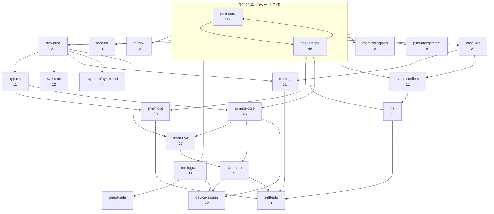
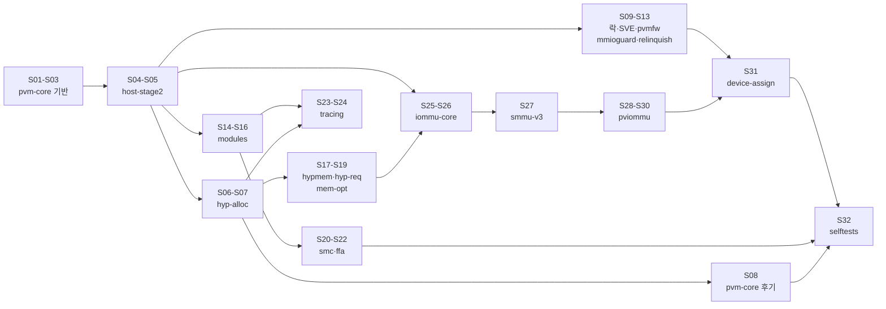

# 6.18 pKVM 머지 대상 토픽 분류와 스택 순서

작성 기준: 2026-08-07. 대상 저장소 `work/pkvm-linux`, 기준 브랜치 `origin/for-android/pkvm-mainline-6.18` (tip `b3b90af8`).
입력 집합은 `work/analysis/all_raw.txt`의 858커밋이다.

## 1. 요약

- `pkvm-6.18-*` 태그는 없다. 그러나 `pkvm-7.1-*` 태그 40개가 원격에 실재하며, 이번에 로컬로 받았다.
  이 태그들은 **선형 스택**을 이루고, 각 태그가 하나의 토픽 배치를 가리킨다. 즉 상류 투고용 토픽 분할의 정답지가 이미 저장소에 있다.
- 858커밋을 **26개 토픽**으로 분류했다. 이 중 머지 대상은 660커밋이고,
  나머지는 `ack-only` 152커밋(defconfig/BUILD.bazel/TEST_MAPPING 등 상류에 없는 파일)과
  `non-pkvm` 46커밋(uid_sys_stats, dma-buf, USB gadget 등 pKVM 무관 Android 캐리오버)이다.
  `미분류`는 1커밋뿐이다.
- 문서 8.1절의 673커밋과는 13커밋 차이가 난다. 원인은 3장에 적었다.
- 토픽 의존 그래프는 단일 사슬이 아니라 **2개 트랙**이다. 코어 pKVM 트랙(486커밋)과 IOMMU 트랙(162커밋)이며,
  IOMMU 트랙은 `pkvm-7.1-*` 스택에 **전혀 포함되지 않는다**. 상류 투고 계획에서 별도로 다뤄야 한다.
- 충돌 위험 핵심 3파일은 토픽 분리가 사실상 불가능한 수준으로 얽혀 있다.
  세 파일 모두 16~17개 토픽이 건드리고, 평균 연속 구간 길이가 1.6~1.9커밋이다.
  제안 순서로 재배열하면 `mem_protect.c` 109커밋 중 95커밋(87%)이 위치를 바꿔야 한다.
- `origin/for-android/pkvm-master-6.18`은 뼈대로 쓸 수 없다.
  mainline과 순서가 사실상 동일하고(Spearman rho 0.9997), 858 중 370커밋만 담고 있으며 IOMMU 트랙 전체가 빠져 있다.
- 최종 분할안은 **32시리즈**다. 코어 24, IOMMU 7, 검증 1이다.

## 2. 1단계: 태그 확인 결과

`git ls-remote --tags origin | grep pkvm`으로 확인했다. `pkvm-6.18-*`는 0개, `pkvm-7.1-*`는 40개다.
40개를 `--filter=blob:none`으로 로컬에 받았고, `git merge-base --is-ancestor`로 조상 관계를 전수 검사했다.

결과: `pkvm-7.1-base`부터 `pkvm-7.1-audit-fixes`까지 38개 태그가 **완전한 선형 사슬**을 이룬다.
`pkvm-7.1-modtracing-v1`만 `pkvm-7.1-thp-infra` 위의 별도 가지다(12커밋).
`pkvm-7.1-gki`와 `pkvm-7.1-sidefixes`는 같은 커밋을 가리킨다.

스택 규모는 다음과 같다.

- `pkvm-7.1-base` 아래 pKVM 구간: 72커밋 (`710592cb`~`a3b98ca1`, 그 아래는 `Merge tag 'v7.1' into android-mainline`)
- `pkvm-7.1-base..pkvm-7.1-audit-fixes`: 292커밋
- `modtracing-v1` 가지: 12커밋
- 합계 **376커밋**

토픽 순서는 아래와 같다(태그 이름 그대로, 스택 아래에서 위로).

```
base -> pvm-core -> tlbi -> sme -> rwlock -> pvmfw -> sve-donate -> mondebug
  -> mmioguard -> mmio-autoenroll -> mem-relinquish -> psci-memprotect
  -> modules-core -> modules-perms -> fgt -> getleaf -> modprot -> modlock -> modearly
  -> hypmem -> coalesce -> hypexport -> smchandlers -> pinpage -> c089817range -> smctrng
  -> cma -> buddyrace -> sve -> spine-complete -> postsnap
  -> ffa-foundation -> hyp-req -> ffa-backhalf -> ffa-blockb -> sidefixes
  -> thp-infra -> audit-fixes -> (modtracing-v1)
```

주의할 점이 둘 있다.

첫째, 태그 범위는 **순수한 단일 토픽이 아니다**. 예를 들어 `pkvm-7.1-smctrng` 구간 18커밋 안에는
`Add missing icache sync before pKVM module loading` 같은 무관한 수정이 섞여 있다.
태그는 "이 작업 창에서 적용된 배치"이지 "이 토픽의 커밋 전부"가 아니다.
그래서 분류에서는 태그를 최우선이 아니라 규칙 다음의 보조 근거로 썼다.

둘째, base 구간 72커밋의 제목은 `ANDROID:` 접두어가 제거되고 상류 투고용으로 재작성돼 있다.
접두어를 벗겨 정규화하면 대응이 붙지만, 문구 자체가 바뀐 경우도 있다.

## 3. 2단계: 토픽 분류

### 3.1 방법

스크립트로 처리했다. 재현 스크립트는 `work/analysis/classify.py`다.

1. 858커밋 각각의 제목과 변경 경로를 뽑았다(`git log --no-walk --name-only --stdin`, 4357행).
2. 접두어(`ANDROID:`, `BACKPORT:`, `SQUASH:` 등)를 벗긴 정규화 제목으로 7.1 스택 376커밋과 대조했다.
   완전 일치 239건, 유사도 0.88 이상 근사 일치 12건, 합계 251건이 붙었다.
3. 나머지는 (제목 정규식 -> 경로 정규식) 순의 우선순위 규칙표로 분류했다. 규칙에 안 맞으면 7.1 태그를 참조하고,
   그래도 안 되면 경로 기반 폴백을 적용했다.
4. 변경 경로가 전부 ACK 전용 파일이면 `ack-only`, 경로와 제목 어디에도 KVM/IOMMU 신호가 없으면 `non-pkvm`으로 뺐다.

### 3.2 결과

<!--SUMMARY-->

머지 대상 = 858 - 152(`ack-only`) - 46(`non-pkvm`) = **660커밋**.

### 3.3 문서 8.1절 673커밋과의 차이

13커밋 차이가 난다. 이번 집계에서 `non-pkvm`으로 뺀 46커밋이 원인으로 보인다.
`ANDROID: uid_sys_stats: ...` 계열 10커밋, `ANDROID: dma-buf: ...` 계열 12커밋,
`ANDROID: mm: Memory health driver` / `ANDROID: dm-bow: remove dm-bow` / `ANDROID: usb: gadget: ...` 등이다.
이들은 T3/T5 경로 필터에는 걸리지만 pKVM과 무관하다.
기존 673 집계는 이 중 일부만 걸러냈을 가능성이 높다. 확정하려면 673 목록 자체를 받아 대조해야 한다.
현 시점에서는 **660을 실측값으로 쓰고, 673과의 13커밋 차이는 미해소로 남긴다**.

### 3.4 미분류

규칙이 하나도 안 붙은 커밋은 1건이다.

- `35ec97b1af6e` `ANDROID: treewide: rename CONFIG_CFI_CLANG to CONFIG_CFI`
  성격: 전 트리 config 심볼 이름 변경. 변경 경로가 `arch/*/configs/*_defconfig` 3개뿐이라 실질은 `ack-only`에 가깝다.
  다만 `treewide` 성격이라 다른 트리 부분에도 영향이 있을 수 있어 억지로 배정하지 않았다.

분류 근거가 약해 별도로 봐야 하는 그룹은 아래 두 개다. 토픽 이름은 붙였지만 신뢰도가 낮다.

- `host-stage2` 45커밋. 제목에 토픽 신호가 없고 `nvhe/mem_protect.c` 또는 `nvhe/setup.c`를 건드린다는 이유만으로 묶였다.
  기능 단위가 아니라 **파일 단위 잔여 버킷**이다. 2021-06부터 2026-03까지 전 기간에 흩어져 있다.
  독립 시리즈로 세우기보다 다른 토픽에 분산 배치해야 할 후보다.
- `pvm-core` 119커밋. 보호 VM 코어 전반을 담는 광역 버킷이다.
  `per-CPU shared page for pKVM hyp requests`(`hyp-req`가 맞음),
  `Resurrect struct kvm_pinned_page`(`mem-opt`가 맞음) 같은 오배정이 눈으로 확인된다. 수동 재검토가 필요하다.

## 4. 3단계: 토픽 의존 순서

### 4.1 그래프



### 4.2 근거

간선마다 근거 커밋을 붙였다. 근거는 "후행 토픽의 커밋이 선행 토픽이 도입한 심볼·자료구조를 쓴다"로 잡았고,
제목에 심볼명이 드러나는 커밋을 골랐다.

| 간선 | 근거 커밋 | 설명 |
|---|---|---|
| `hyp-alloc` -> `hyp-req` | `fa3dec6e84ac` Raise HYP_REQ to topup vCPU memcache | HYP_REQ가 hyp 할당자 topup을 요청한다 |
| `hyp-alloc` -> `sve-sme` | `e73e739da9c5` Use hyp_alloc for pVMs SVE state | pVM SVE 상태를 `hyp_alloc()`으로 잡는다 |
| `hyp-alloc` -> `tracing` | `be06fb229ed7` Use hyp_alloc for hyp tracing internal struct | 트레이싱 내부 구조체를 `hyp_alloc()`으로 잡는다 |
| `hyp-alloc` -> `smmu-v3` | `abe2dbc4cf7c` iommu/arm-smmu-v3-kvm: Use hyp_alloc() for data | SMMUv3 드라이버 데이터를 `hyp_alloc()`으로 잡는다 |
| `hyp-alloc` -> `hypmem/hypexport` | `d77863a245a4` Add order to kvm_hyp_memcache | memcache 자료구조 확장 |
| `hyp-req` -> `mem-opt` | `698d3a45f613` Add hyp request SPLIT / `39b0ca2a6a45`(7.1) Raise PKVM_HYP_REQ_SPLIT on guest fault | THP 분할이 HYP_REQ 채널을 쓴다 |
| `hyp-req` -> `iommu-core` | `14df86cf1929` Add hyp IOMMU requests | IOMMU가 hyp request 프레임워크를 쓴다 |
| `modules` -> `tracing` | `baa928e2706b` Allow trace_hyp_printk() in pKVM modules, `9a9bb98bcc96` Add Ftrace to pKVM modules | 모듈 로더 위에 트레이싱을 얹는다 |
| `modules` -> `smc-handlers` | `e4bd25070e56` Allow 16 host_smc handlers | 모듈이 등록하는 host_smc 핸들러 슬롯 확장 |
| `기반` -> `lock-tlb` | `45f427214078` Convert pKVM 'vm_table_lock' to an rwlock | pvm-core의 vm_table 락을 교체한다 |
| `기반` -> `pvmfw` | `30c1c58d39cf` Always unmap the pvmfw region at stage-2 | 호스트 stage-2 소유권 위에서 동작한다 |
| `host-stage2` -> `iommu-core` | `9f5f69d95b85` Introduce kvm_iommu_ops host_stage2_idmap_complete | 호스트 stage-2 idmap 훅에 걸린다 |
| `iommu-core` -> `smmu-v3` -> `pviommu` | `arm-smmu-v3-kvm-pv` 드라이버가 `arm-smmu-v3-kvm` 위에 올라간다 | 경로 계층이 그대로 의존 방향 |
| `mmioguard` -> `device-assign` | `4621dce621a3` Map MMIO donation as device at EL2 | 장치 MMIO 기증이 MMIO guard 상태 위에 붙는다 |
| `smc-handlers` -> `ffa` | FF-A는 SMCCC 호출 규약 위에 정의된다 | `pkvm-7.1` 스택도 smchandlers를 ffa보다 아래에 둔다 |

### 4.3 순서 확정이 어려운 지점

- **`pvm-core` <-> `host-stage2` 순환.** 둘 다 2021-06-21에 같이 시작하고 서로의 심볼을 쓴다.
  보호 VM 진입/이탈 경로가 호스트 stage-2 소유권 판정을 부르고, 소유권 코드가 `pkvm_hyp_vm` 상태를 본다.
  두 토픽은 하나의 기반 시리즈로 합쳐야 한다.
- **`hyp-alloc`이 `pvm-core`의 앞뒤에 모두 걸린다.** 초기 pvm-core는 memcache 기반이었고,
  나중에 `eda84647ce2b` Use hyp_alloc for pKVM VM hyp structures가 hyp_alloc으로 갈아탄다.
  즉 pvm-core 초기분 -> hyp-alloc -> pvm-core 후기분 순서가 강제된다. pvm-core를 분할해야만 위상 정렬이 성립한다.
- **`hyp-req`가 `hyp-alloc`과 상호 참조한다.** `10a1a025d3b6` Use kvm_hyp_req smccc encoding for hyp_alloc은
  반대 방향(hyp-req -> hyp-alloc)이다. 2026-01의 후기 리팩터링이라 hyp-alloc 후기분으로 밀어야 한다.
- **`modules`와 `smc-handlers`가 양방향이다.** `b5090a9bcc1c` Export pkvm_enable_smc_forwarding()는
  SMC 포워딩을 모듈에 노출한다. 모듈 -> SMC, SMC -> 모듈이 둘 다 있다.

## 5. 4단계: 충돌 위험 핵심 3파일

세 파일 모두 전체 토픽의 3분의 2 이상이 건드린다. 요약은 아래와 같다.

| 파일 | 커밋수 | 건드리는 토픽 수 | 연속 구간(런) 수 | 평균 런 길이 | 제안 순서 대비 역행 커밋 |
|---|---:|---:|---:|---:|---|
| `arch/arm64/kvm/hyp/nvhe/mem_protect.c` | 109 | 17 | 70 | 1.56 | 95 (87%) |
| `arch/arm64/kvm/pkvm.c` | 104 | 16 | 56 | 1.86 | 65 (63%) |
| `arch/arm64/kvm/hyp/nvhe/hyp-main.c` | 91 | 17 | 49 | 1.86 | 67 (74%) |

세 파일의 합집합은 251커밋이다. 합집합을 시간순으로 놓았을 때 서로 교차하는(A...B...A 형태) 토픽 쌍은 **143쌍**이다.
사실상 모든 토픽 쌍이 이 세 파일에서 교차한다.

해석은 이렇다. 어떤 토픽 순서를 잡아도 이 세 파일은 시리즈 경계를 넘나든다.
토픽 단위 재배열은 곧 이 세 파일에 대한 대규모 수동 충돌 해소를 의미한다.
`mem_protect.c`가 가장 나쁘다. 평균 1.56커밋마다 토픽이 바뀐다.

여러 파일을 동시에 건드리는 커밋은 44개다. 셋 모두 건드리는 커밋은 9개다.

| SHA | 날짜 | 토픽 | 제목 |
|---|---|---|---|
| `b55e2390a033` | 2025-03-17 | pvm-core | Introduce hypercall for host-to-guest donations |
| `f972533f5048` | 2025-03-17 | pvm-core | Introduce hypercalls to reclaim guest memory |
| `874cc083d496` | 2025-07-09 | mem-relinquish | Implement MEM_RELINQUISH SMCCC hypercall |
| `0b0ad1d4ced3` | 2022-11-18 | modules | pKVM module loading before deprivilege |
| `ce776af7269b` | 2024-02-26 | hyp-alloc | Rename pKVM memcache to stage2_ |
| `809e13b752dd` | 2025-05-22 | mem-opt | Add host_split_guest for pKVM |
| `a17da90c2d61` | 2024-04-03 | mem-opt | Huge page support for pKVM guest memory reclaim |
| `cb8686a81ecb` | 2025-01-21 | mem-opt | Introduce __pkvm_host_donate_guest_sglist |
| `f1a2590e4b83` | 2024-09-27 | ffa | On guest exit ask Trustzone to relinquish the borrowed pages |

이 9개가 토픽 분리를 가장 어렵게 만드는 지점이다.
셋 다 "호스트-게스트 메모리 이전"이라는 한 가지 동작을 EL1 진입점(`pkvm.c`), HVC 디스패치(`hyp-main.c`),
소유권 판정(`mem_protect.c`) 세 곳에 동시에 심는다. 쪼갤 수 없는 원자 단위로 봐야 한다.

전체 순서표는 부록 B에 있다.

## 6. 5단계: master 브랜치 검증

`origin/for-android/pkvm-master-6.18` (tip `aa5bfcdf56e4`, 2025-11-03)을 제목 정규화로 대조했다.

- 858커밋 중 master에 존재: **370커밋**. 없음: 488커밋.
- 공통 370커밋의 순서 상관: **Spearman rho = 0.9997**. 68265개 쌍 중 역전은 51쌍뿐이다.
- 토픽 런 수: mainline 순서 178, master 순서 179. 사실상 동일하다.

결론: **master는 뼈대로 쓸 수 없다.** 이유는 둘이다.

첫째, master의 선형 순서는 mainline의 선형 순서와 같다. 토픽별로 묶인 브랜치가 아니라
같은 시간순 이력의 더 오래된 스냅샷이다. 재배열 정보가 없다.

둘째, 커버리지가 부족하다. master에 없는 488커밋 중 362커밋은 master tip(2025-11-03)보다 앞선 커밋인데도 없다.
그 내역은 아래와 같다.

| 토픽 | master 미포함(2025-11-03 이전) |
|---|---:|
| ack-only | 152 |
| pviommu | 56 |
| non-pkvm | 44 |
| iommu-core | 26 |
| smmu-v3 | 18 |
| device-assign | 15 |
| 기타 | 51 |

즉 master는 **IOMMU 트랙 전체와 ACK/GKI 잡음을 의도적으로 뺀 브랜치**다.
`grep -ci pviommu`가 master 로그에서 0건, mainline에서 23건이다.
master의 `ANDROID:` IOMMU 커밋은 `759bbbdea6d6` Add hyp IOMMU requests 하나뿐이다.

master에 없는 커밋의 배치안은 이렇다.

- IOMMU 트랙 162커밋: master 순서에 끼워 넣지 말고 별도 트랙으로 뒤에 붙인다(9장 시리즈 S25~S31).
  근거는 4.1절 그래프다. IOMMU 트랙은 `host-stage2`와 `hyp-req`에만 의존하고, 코어 트랙의 나머지에는 의존하지 않는다.
- 2025-11-05 이후 126커밋: 각자 토픽의 마지막 시리즈 꼬리에 붙인다. 대부분 후속 수정이다.
- `ack-only` 152 + `non-pkvm` 46: 투고 대상이 아니다.

따라서 뼈대로 삼을 것은 master가 아니라 **`pkvm-7.1-*` 태그 스택**이다.
그쪽이 실제 토픽 재배열의 결과물이고, 코어 트랙 순서를 그대로 준용할 수 있다.

## 7. 6단계: 시리즈 분할안

시리즈 크기는 상류 관행에 맞춰 25~30패치를 상한으로 잡았다. 큰 토픽은 시간순으로 쪼갰다.

### 7.1 트랙 A: 코어 pKVM (24시리즈, 486커밋)

| # | 시리즈 | 커밋 | 토픽 | 선행 시리즈 |
|---:|---|---:|---|---|
| S01 | pvm-core-a 보호 VM 기반 인프라 | 30 | pvm-core | - |
| S02 | pvm-core-b 게스트 상태 격리 | 30 | pvm-core | S01 |
| S03 | pvm-core-c stage-2/빌드 정리 | 30 | pvm-core | S02 |
| S04 | host-stage2-a 소유권 코어 | 23 | host-stage2 | S01 |
| S05 | host-stage2-b 소유권 확장 | 22 | host-stage2 | S04 |
| S06 | hyp-alloc-a 힙 할당자 도입 | 17 | hyp-alloc | S03, S05 |
| S07 | hyp-alloc-b 할당자 확장·수정 | 17 | hyp-alloc | S06 |
| S08 | pvm-core-d 후기 수정 | 29 | pvm-core | S07 |
| S09 | lock-tlb 락·TLB·FGT | 10 | lock-tlb | S03 |
| S10 | sve-sme | 12 | sve-sme | S07 |
| S11 | pvmfw | 13 | pvmfw | S05 |
| S12 | mmioguard + guest-side | 14 | mmioguard, guest-side | S05 |
| S13 | mem-relinquish + psci-memprotect | 13 | mem-relinquish, psci-memprotect | S05 |
| S14 | modules-a 로더 기반 | 27 | modules | S05 |
| S15 | modules-b 권한·보호 | 27 | modules | S14 |
| S16 | modules-c 조기 로딩·정리 | 27 | modules | S15 |
| S17 | hypmem/hypexport | 7 | hypmem-hypexport | S07 |
| S18 | hyp-req | 11 | hyp-req | S07 |
| S19 | mem-opt CMA·pin·coalesce·THP | 30 | mem-opt | S18 |
| S20 | smc-handlers | 11 | smc-handlers | S16 |
| S21 | ffa-a 기반 | 18 | ffa | S20 |
| S22 | ffa-b 후반 | 17 | ffa | S21 |
| S23 | tracing-a hyp 이벤트·tracefs | 26 | tracing | S07, S16 |
| S24 | tracing-b EL2 Ftrace | 25 | tracing | S23 |

### 7.2 트랙 B: IOMMU (7시리즈, 162커밋)

| # | 시리즈 | 커밋 | 토픽 | 선행 시리즈 |
|---:|---|---:|---|---|
| S25 | iommu-core-a hyp IOMMU 프레임워크 | 23 | iommu-core | S05, S18 |
| S26 | iommu-core-b 도메인·소유권 | 22 | iommu-core | S25 |
| S27 | smmu-v3 | 22 | smmu-v3 | S26, S07 |
| S28 | pviommu-a SMMUv3 PV 드라이버 | 25 | pviommu | S27 |
| S29 | pviommu-b PV 도메인·SG | 25 | pviommu | S28 |
| S30 | pviommu-c 게스트 HVC·pviommu 드라이버 | 23 | pviommu | S29 |
| S31 | device-assign 장치 할당·VFIO | 22 | device-assign | S12, S30 |

### 7.3 트랙 C: 검증 (1시리즈, 12커밋)

| # | 시리즈 | 커밋 | 토픽 | 선행 시리즈 |
|---:|---|---:|---|---|
| S32 | selftests | 12 | selftests, kvm-generic, 미분류 | 전부 |

### 7.4 투고 순서와 트랙 간 관계



트랙 A의 S01~S07이 임계 경로다. 이 7개 시리즈 168커밋이 들어가기 전에는 나머지가 성립하지 않는다.
트랙 B는 S05와 S18만 끝나면 트랙 A와 병렬로 투고할 수 있다.

## 8. 남은 불확실성

1. **673 대 660.** 13커밋 차이를 해소하지 못했다. 기존 673 목록을 받아 이번 660과 SHA 단위로 대조해야 한다.
2. **`host-stage2` 45커밋의 재배치.** 파일 단위 잔여 버킷이라 그대로 시리즈가 되지 않는다.
   커밋 본문을 읽고 다른 토픽으로 분산해야 한다.
3. **`pvm-core` 119커밋의 정밀 분할.** 시간순 4등분은 임시안이다. 실제로는 심볼 의존을 봐야 한다.
   특히 S01~S03의 경계는 `pkvm_hyp_vm` / `pkvm_hyp_vcpu` 도입 시점을 기준으로 다시 잡아야 한다.
4. **7.1 태그 범위의 잡음.** 태그 구간에 무관한 수정이 섞여 있어, 태그를 그대로 시리즈 경계로 쓸 수는 없다.
   본 문서는 태그 순서만 준용하고 구성원은 규칙으로 재산정했다.
5. **심볼 수준 의존 검증 미완.** 4.2절 근거는 커밋 제목에 심볼명이 드러난 경우로 한정했다.
   저장소가 `--filter=blob:none`이라 `git log -S`로 심볼 도입 시점을 전수 추적하려면 blob을 대량으로 받아야 한다.
   전수 검증은 하지 않았다.
6. **7.1 스택은 376커밋, 6.18 대상은 660커밋.** 7.1 스택에 대응이 없는 409커밋이 있다.
   대부분 IOMMU 트랙과 2025-11 이후 커밋이다. 이들의 토픽 배치는 7.1의 검증을 받지 못한 자체 판단이다.

## 부록 A: 토픽별 커밋 목록

<!--TOPICLISTS-->

## 부록 B: 핵심 3파일 시간순 커밋과 토픽

각 표의 "다중" 열은 대상 3파일 중 2개 또는 3개를 동시에 건드리는 커밋을 표시한다.
"(역행)" 표시는 제안 시리즈 순서 기준으로 이미 지나간 토픽으로 되돌아가는 지점이다.

<!--KEY3-->

## 부록 C: 3파일 중 2개 이상을 동시에 건드리는 커밋 (44개)

<!--MULTI-->
